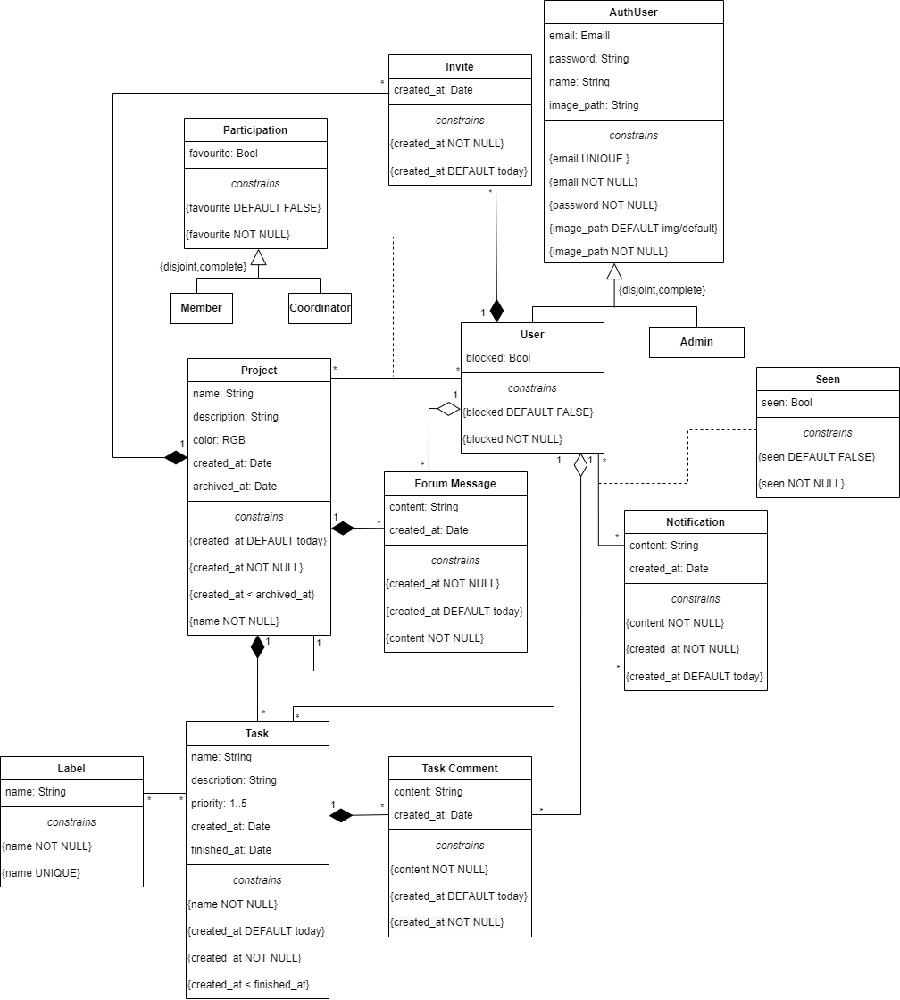

# EBD: Database Specification Component

With the development of toEaseManage we intend to create a useful and acessible platform that helps users to organize projects as well as grow as web developers throughout the curricular unit. 

 ## A4: Conceptual Data Model

For this artefact, we built the UML diagram for toEaseManage showing all of the classes of the attributes for our website. We also mantain a group of business functionalities.

### 1. Class diagram 

UML class diagram containing the classes, associations, multiplicity and constraints.  



### 2. Additional Business Rules

These are the business rules, from the previous component, that can't be explained and applied in the UML Class diagram. Its numbers refer to the previous ones. 

| Identifier | Name                    | Description  |
| ---------- | -----        | -----  | 
| BR01       | Account deletion        | Upon account deletion, all the shared social data must be kept as anonymous author |
| BR04       | Leave project with task | Upon being removed from a project, all the tasks assignments not finished assigned to the member must be deleted |
| BR06       | User Block              | Upon being blocked a User is removed from all his projects |
| BR08       | Member Comments         | A project member can comment on its own assigned or created tasks |

---

### Editor

Beatriz Lopes dos Santos

---

## A5: Relational Schema, validation and schema refinement

For this artefact our main objective was to convert the UML Class diagram to a Relational Schema that follows all the Forms to enhance performance of our databases. 

### 1. Relational Schema

Our relation schema for toEaseManage is presented below in a compact version that only shows the atributtes and some constraints concerning them. Note that some of the constraints refering two atributtes are only shown in the sql version of the schema.  

| Relation reference | Relation Compact Notation |
| ------------------ | ------------------------- |
| R01                | User(<u>id</u>, email __UK NN__, password __NN__, name __NN__, image_path __NN DF__ img/default, blocked __NN DF__ false) |
| R02                | Admin(<u>id</u>, email __UK NN__, password __NN__, name __NN__, image_path __NN DF__ img/default) |
| R03                | Project(<u>id</u>, name __NN__, description, color, created_at __NN DF__ today, archived_at __CK__ archived_at > created_at) |
| R04                | Participation(<u>id</u>, favourite __NN__, role __NN__ __CK__ role __IN__ Role, id_project → Project __NN__, id_user → User __NN__) |
| R05                | Task (<u>id</u>, name __NN__, description, priority __CK__ priority>=1 AND priority<=5, created_at __NN DF__ Today, finished_at __CK__ finished_at > created_at, task_number __NN__, due_date __CK__ due_date > created_at, id_project → Project __NN__, id_user → User) |
| R06                | Label(<u>id</u>, name __NN__, id_project → Project __NN__ ) |
| R07                | TaskLabel(<u>id</u>, id_label → Label __NN__, id_task →Task __NN__) |
| R08                | TaskComment(<u>id</u>, content __NN__, created_at __NN DF__ Today, id_task →Task __NN__, id_user → User __NN__) |
| R09                | ForumMessage(<u>id</u>, content __NN__, created_at __NN DF__ Today, id_project → Project __NN__, id_user → User __NN__) |
| R010               | Invite(<u>id</u>, created_at __NN DF__ Today, id_user → User __NN__, id_project → Project __NN__) |
| R011               | Notification(<u>id</u>, content __NN__, created_at __NN DF__ Today, id_project → Project __NN__) |
| R012               | Seen(<u>id</u>, id_user → User __NN__, id_notification → Notification __NN__, seen __NN DF__ FALSE) |

Legend:
* UK = UNIQUE KEY
* NN = NOT NULL
* DF = DEFAULT
* CK = CHECK

> Justifications for the Generalisations Conversion to Relational Model:

> We add two generalisations to convert to this schema. 

> First the __Participation__ could have two roles, __Coordinator__ and __Member__. This only changed some permisions inside the projects work, but the information that should be kept in the table of Participation is the same for both of them. Because of that, and because the generalisation is complete and disjoint (never allowing other role), we decided that we only should map the __Participation__ table with an atributte that indicates whether the user is a member or coordinator in that project.  

> The second generalisation is from the __AuthUser__ that can either be an __User__ or an __Admin__. We had two options: first, only having the User and Admin tables with repeated information, or having the table AuthUser and then the table user that had one more atributte. We came to a conclusion that, the first was a better option, since we only are going to have a little amount of Admins and when everytime we need to find an User we don't need queries that join the table User with AuthUser. To enhance our decision this generalisation was also complete and disjoint, making sense to convert them this way. 

### 2. Domains

This are domains used in the relational schema above.   

| Domain Name | Domain Specification           |
| ----------- | ------------------------------ |
| Today	      | DATE DEFAULT CURRENT_DATE      |
| Role        | ENUM ('Member', 'Coordinator') |

### 3. Schema validation

For each table of the relational schema we excuted a validation of the Normal Form and the normalization is acomplished. Below we present the functional dependencies, keys an normal form for each table.

| **TABLE R01**   | User |
| --------------  | ---|
| **Keys**        | { id }, { email } |
| **Functional Dependencies:** |
| FD0101          | { id } → {email, password, name, image_path, blocked} |
| FD0102          | { email } → {id, password, name, image_path, blocked} |
| **NORMAL FORM** | BCNF |
| **Justication** | For each functional dependency, the group of atributtes of the left side are keys, therefore, this table is in the BCNF Form. |


| **TABLE R02**   | Admin|
| --------------  | --- |
| **Keys**        | { id }, { email } |
| **Functional Dependencies:** |
| FD0201          | { id } → {email, password, name, image_path} |
| FD0202          | { email } → {id, password, name, image_path}    |  
| **NORMAL FORM** | BCNF |
| **Justication** | For each functional dependency, the group of atributtes of the left side are keys, therefore, this table is in the BCNF Form. |


| **TABLE R03**   | Project |
| --------------  | --- |
| **Keys**        | { id } |
| **Functional Dependencies:** |
| FD0301          | { id } → {name, description, color, created_at, archived_at}  |
| **NORMAL FORM** | BCNF |
| **Justication** | For each functional dependency, the group of atributtes of the left side are keys, therefore, this table is in the BCNF Form. |


| **TABLE R04**   | Participation |
| --------------  | --- |
| **Keys**        | { id } , { id_project, id_user } |
| **Functional Dependencies:** |
| FD0401          | { id } → {favourite, role, id_project, id_user}     |
| FD0402          | { id_project, id_user } → {id, favourite, role } |
| **NORMAL FORM** | BCNF  |
| **Justication** | For each functional dependency, the group of atributtes of the left side are keys, therefore, this table is in the BCNF Form. |


| **TABLE R05**   | Task       |
| --------------  | ---        |
| **Keys**        | { id }, { task_number, id_project } |
| **Functional Dependencies:** |
| FD0501          | { id } → {name, description, priority, created_at, finished_at, task_number, id_project, due_date} |
| FD0502          | { task_number, id_project } → {id, name, description, priority, created_at, finished_at, id_user, due_date}|
| **NORMAL FORM** | BCNF       |
| **Justication** | For each functional dependency, the group of atributtes of the left side are keys, therefore, this table is in the BCNF Form. |


| **TABLE R06**   | Label                       |
| --------------  | ---                         |
| **Keys**        | { id }                      |
| **Functional Dependencies:**                  |
| FD0601          | { id } → {name, id_project} |
| **NORMAL FORM** | BCNF                        |
| **Justication** | For each functional dependency, the group of atributtes of the left side are keys, therefore, this table is in the BCNF Form. |


| **TABLE R07**   | TaskLabel                       |
| --------------  | ---                             |
| **Keys**        | { id }, { id_label, id_task }   |
| **Functional Dependencies:**                      |
| FD0701          | { id } → {id_lable, id_task}    |
| FD0702          | { id_lable, id_task } → {id}    |
| **NORMAL FORM** | BCNF                            |
| **Justication** | For each functional dependency, the group of atributtes of the left side are keys, therefore, this table is in the BCNF Form. |


| **TABLE R08**   | TaskComment                                        |
| --------------  | ---                                                |
| **Keys**        | { id }                                             |
| **Functional Dependencies:**                                         |
| FD0801          | { id } → {content , created_at, id_task, id_user } |
| **NORMAL FORM** | BCNF                                               |
| **Justication** | For each functional dependency, the group of atributtes of the left side are keys, therefore, this table is in the BCNF Form. |


| **TABLE R09**   | ForumMessage                                         |
| --------------  | ---                                                  |
| **Keys**        | { id }                                               |
| **Functional Dependencies:**                                           |
| FD0901          | { id } → { content, created_at, id_project, id_user} |
| **NORMAL FORM** | BCNF                                                 |
| **Justication** | For each functional dependency, the group of atributtes of the left side are keys, therefore, this table is in the BCNF Form. |


| **TABLE R10**   | Invite                                      |
| --------------  | ---                                         |
| **Keys**        | { id } , {id_project, id_user}              |
| **Functional Dependencies:**                                  |
| FD01001         | { id } → { created_at, id_project, id_user} |
| FD01002         | {id_project, id_user} → { id, created_at}   |
| **NORMAL FORM** | BCNF                                        |
| **Justication** | For each functional dependency, the group of atributtes of the left side are keys, therefore, this table is in the BCNF Form. |


| **TABLE R11**   | Notification                                |
| --------------  | ---                                         |
| **Keys**        | { id }                                      |
| **Functional Dependencies:**                                  |
| FD01101         | { id } → { content, created_at, id_project} |
| **NORMAL FORM** | BCNF                                        |  
| **Justication** | For each functional dependency, the group of atributtes of the left side are keys, therefore, this table is in the BCNF Form. |


| **TABLE R12**   | Seen                                        |
| --------------  | ---                                         |
| **Keys**        | { id } , { id_user, id_notification}        |
| **Functional Dependencies:**                                  |
| FD1201          | { id } → { id_user, id_notification, seen}  |
| FD1202          | { id_user, id_notification } → {id, seen}   |  
| **NORMAL FORM** | BCNF                                        |  
| **Justication** | For each functional dependency, the group of atributtes of the left side are keys, therefore, this table is in the BCNF Form. |

---

### Editor

Matilde Oliveira

---

## A6: Indexes, triggers, transactions and database population

This artefact main goal is to create a more solid and prepared database schema for our website. By starting to analyse the database workload (1.) we can make more correct decisions about triggers, transactions and indexes need to boost the performance of our database. 

### 1. Database Workload
 
This is a study and an estimative of the use of our website that is going to be important e some decisions we need to make after this.

| **Relation reference** | **Relation Name** | **Order of magnitude**        | **Estimated growth** |
| ---------------------- | ----------------- | ----------------------------- | -------------------- |
| R01                    | User              | 10 k (tens of thousands)      | 10 (tens) / day      |
| R02                    | Admin             | 1 (units)                     | no growth            |
| R03                    | Project           | 1 k (thousands)               | 1 (units) / day      |
| R04                    | Participation     | 10 k (tens of thousands)      | 1 (units) / day      |
| R05                    | Task              | 10 k (tens of thousands)      | 10 (tens) / day      |
| R06                    | Label             | 1 k (hundreds)                | 1 (units) / day      |
| R07                    | TaskLabel         | 10 k (thousands)              | 10 (units) / day     |
| R08                    | TaskComment       | 100 k (hundreds of thousands) | 100 (hundreds) / day |
| R09                    | ForumMessage      | 100 k (hundreds of thousands) | 100 (hundreds) / day |
| R10                    | Invite            | 100 (hundreds)                | 1 (units) / day      |
| R11                    | Notification      | 100 k (hundreds of thousands) | 100 (hundreds) / day |
| R12                    | Seen              | 100 k (hundreds of thousands) | 100 (hundreds) / day |

### 2. Proposed Indices

Note: SQL automatically creates indexes by key (in this case the tables id), and by unique constraints. So, the performance indexes below are the ones that complete the set of indexes for our database. 

#### 2.1. Performance Indices
 
Based on the workload we predicted for our tables, some indexes below were chosen to boost efficiency of some searching aspects of our database.

| **Index**           | IDX01                                  |
| ---                 | ---                                    |
| **Relation**        | Seen                                   |
| **Attribute**       | id_user, seen                          |
| **Type**            | B-Tree                                 |
| **Cardinality**     | Medium                                 |
| **Clustering**      | No                                     |
| **Justification**   | Table 'Seen' is very large. Seen tabel is frequentely accessed to obtain user's notifications, since we are only seeing notifications by user. Update frequency is medium, because each row of table must be updated only one time, changing the seen atributte value. We choose to create this index based on a b-tree that organizes and orders by id_user and then diferentiates between being or not seen.                                             |
| **SQL code**         | ```CREATE INDEX user_seen ON Seen USING btree (id_user, seen);```||                                                            

| **Index**           | IDX02                                  |
| ---                 | ---                                    |
| **Relation**        | TaskComment                            |
| **Attribute**       | id_task                                |
| **Type**            | Hash                                   |
| **Cardinality**     | Medium                                 |
| **Clustering**      | No                                     |
| **Justification**   | Table 'TaskComment' is very large. Several queries need to frequently filter access to task comments by task, since we are only seeing tasks comments in its task page. Filtering is done by exact match (id_task), thus an hash type index would be best suited since it groups task comments by task. It can be frequently updated, because users have the ability to change its content, though clustering is not an option.                                   |
| **SQL code**         | ```CREATE INDEX task_taskComment ON TaskComment USING hash (id_task);```||                                           

| **Index**           | IDX03                                  |
| ---                 | ---                                    |
| **Relation**        | ForumMessage                           |
| **Attribute**       | id_project                             |
| **Type**            | Hash                                   |
| **Cardinality**     | Medium                                 |
| **Clustering**      | No                                     |
| **Justification**   | Table 'ForumMessage' is very large. Several queries need to frequently filter access to forum messages by project, since we are only seeing forum messages in their project forum. This table can be frequently updated, because users have the ability to edit its content, though clustering is not an option. We came to the conclusion that this index should be an hash table that organizes forum messages by the project where they belong.                     |
| **SQL code**         | ```CREATE INDEX project_message ON ForumMessage USING hash (id_project);```||
       
| **Index**           | IDX04                                  |
| ---                 | ---                                    |
| **Relation**        | Task                                   |
| **Attribute**       | id_project                             |
| **Type**            | Hash                                   |
| **Cardinality**     | High                                   |
| **Clustering**      | No                                     |
| **Justification**   | Table 'Task' is large. Several queries need to frequently filter access to task by their project, since we are only seeing tasks in their project page. Therefore, we decided to use an hash index that arranges the tasks by the project where they belong. It can be frequently updated and new elements are also usually created, so clustering was not a good aproach.    |
| **SQL code**         | ```CREATE INDEX project_task ON Task USING hash (id_project);```||

| **Index**           | IDX05                                  |
| ---                 | ---                                    |
| **Relation**        | Participation                          |   
| **Attribute**       | id_user                                |
| **Type**            | Hash                                   |
| **Cardinality**     | Medium                                 |
| **Clustering**      | No                                     |
| **Justification**   | 'Participation' table is large. Participation tabel is frequentely accessed to obtain user's participation in projects, since we are only seeing the projects of an user in its users page. As it can be constantly updated (favourite atribute, as well as role) it is not a good candidate for clustering, due to the update frequency being high. Hence, the index type chosen was hash, that groups the participation rows from the same user.                         |
| **SQL code**         | ```CREATE INDEX user_participation ON Participation USING hash (id_user);```||
                                                      
#### 2.2. Full-text Search Indices 

toEaseManage website provides full-text search that habilitates the users to search for tasks, projects and users by their names. Below we present the implemented indexes, as well as some justification for its type and other decisions.   

| **Index**           | IDX06                                  |
| ---                 | ---                                    |
| **Relation**        | Users                                  |
| **Attribute**       | name                                   |
| **Type**            | GIN                                    |
| **Clustering**      | No                                     |
| **Justification**   | To search for a specific user based on his name we provide full-text search features to look for him based on matching names. The type of this index is GIN because we do not expect users to change name frequently.                               |
| `SQL code`
                                                    
```sql
ALTER TABLE Users
ADD COLUMN tsvectors TSVECTOR;

CREATE FUNCTION user_search_update() RETURNS TRIGGER AS $$
BEGIN
 IF TG_OP = 'INSERT' THEN
        NEW.tsvectors = (
         setweight(to_tsvector('english', NEW.name), 'A')
        );
 END IF;
 IF TG_OP = 'UPDATE' THEN
         IF (NEW.name <> OLD.name) THEN
           NEW.tsvectors = (
             setweight(to_tsvector('english', NEW.name), 'A') 
           );
         END IF;
 END IF;
 RETURN NEW;
END $$
LANGUAGE plpgsql;

CREATE TRIGGER user_search_update
BEFORE INSERT OR UPDATE ON Users
FOR EACH ROW
EXECUTE PROCEDURE user_search_update();

CREATE INDEX search_name ON Users USING GIN (tsvectors);
```

| **Index**           | IDX07                                  |
| ---                 | ---                                    |
| **Relation**        | Project                                |
| **Attribute**       | name                                   |
| **Type**            | GIN                                    |
| **Clustering**      | No                                     |
| **Justification**   | To provide full-text search features to search for projects based on matching names or related description content we created an index, with type GIN, since the indexed fields (name and description) are not expected to change too often.         |
| `SQL code`  
   
```sql
ALTER TABLE Project
ADD COLUMN tsvectors TSVECTOR;

CREATE FUNCTION project_search_update() RETURNS TRIGGER AS $$
BEGIN
 IF TG_OP = 'INSERT' THEN
        NEW.tsvectors = (
         setweight(to_tsvector('english', NEW.name), 'A') ||
         setweight(to_tsvector('english', NEW.description), 'C')
        );
 END IF;
 IF TG_OP = 'UPDATE' THEN
         IF (NEW.name <> OLD.name OR NEW.description <> OLD.description) THEN
           NEW.tsvectors = (
             setweight(to_tsvector('english', NEW.name), 'A') ||
             setweight(to_tsvector('english', NEW.description), 'C')
           );
         END IF;
 END IF;
 RETURN NEW;
END $$
LANGUAGE plpgsql;

CREATE TRIGGER project_search_update
BEFORE INSERT OR UPDATE ON Project
FOR EACH ROW
EXECUTE PROCEDURE project_search_update();

CREATE INDEX search_project ON Project USING GIN (tsvectors);
```                                              

| **Index**           | IDX08                                  |
| ---                 | ---                                    |
| **Relation**        | Task                                   |
| **Attribute**       | name                                   |
| **Type**            | GIN                                    |
| **Clustering**      | No                                     |
| **Justification**   | Searching tasks for its name and description is easier with full-text search features with an index type GIN, since this atributtes are not expected to change often.   |
| `SQL code`     

```sql
ALTER TABLE Task
ADD COLUMN tsvectors TSVECTOR;

CREATE FUNCTION task_search_update() RETURNS TRIGGER AS $$
BEGIN
 IF TG_OP = 'INSERT' THEN
        NEW.tsvectors = (
         setweight(to_tsvector('english', NEW.name), 'A') ||
         setweight(to_tsvector('english', NEW.description), 'C')
        );
 END IF;
 IF TG_OP = 'UPDATE' THEN
         IF (NEW.name <> OLD.name OR NEW.description <> OLD.description) THEN
           NEW.tsvectors = (
             setweight(to_tsvector('english', NEW.name), 'A') ||
             setweight(to_tsvector('english', NEW.description), 'C')
           );
         END IF;
 END IF;
 RETURN NEW;
END $$
LANGUAGE plpgsql;

CREATE TRIGGER task_search_update
 BEFORE INSERT OR UPDATE ON Task
 FOR EACH ROW
 EXECUTE PROCEDURE task_search_update();

CREATE INDEX search_task ON Task USING GIN (tsvectors);
```  

### 3. Triggers
 
Our triggers below present functionalities that our database needs to have and follow to correctly work upon some user stories or business rules defined in the previous ER. Their description  

| **Trigger**      | TRIGGER01                               |
| ---              | ---------                               |
| **Description**  | Update task number when adding a task   |
| `SQL code`  
                
``` sql
CREATE FUNCTION task_number() RETURNS TRIGGER AS
$BODY$
BEGIN
        NEW.task_number := (SELECT count(*) 
                               FROM Task 
                               WHERE Task.id_project = NEW.id_project);
        RETURN NEW;
END
$BODY$
LANGUAGE plpgsql;

CREATE TRIGGER task_number
        BEFORE INSERT ON Task
        FOR EACH ROW
        EXECUTE PROCEDURE task_number();
```

| **Trigger**      | TRIGGER02  |
| ---              | ---------  |
| **Description**  | Update user's info to anonymous info upon account deletion, reference to business rule BR01.|
| `SQL code`       |            |
``` sql
CREATE FUNCTION user_anonymous() RETURNS TRIGGER AS
$BODY$
BEGIN
        UPDATE Users
        SET name = 'Anonymous', email = 'anonymous' || OLD.id || '@anonymous.pt'
        WHERE OLD.id = Users.id;

        RETURN NULL; -- check if this really dont delete user
END
$BODY$
LANGUAGE plpgsql;

CREATE TRIGGER user_anonymous
        BEFORE DELETE ON Users
        FOR EACH ROW
        EXECUTE PROCEDURE user_anonymous();
```

| **Trigger**      | TRIGGER03   |
| ---              | ---         |
| **Description**  | Remove user assignment to a task when he leaves project, reference to business rule BR04. |
| `SQL code`       |             |
``` sql
CREATE FUNCTION remove_task() RETURNS TRIGGER AS
$BODY$
BEGIN

        UPDATE Task
        SET Task.id_user = NULL
        WHERE OLD.id_user = Task.id_user AND Task.finished_at = NULL;
           
        RETURN VOID;
END
$BODY$
LANGUAGE plpgsql;

CREATE TRIGGER remove_task
        AFTER DELETE ON Participation
        FOR EACH ROW
        EXECUTE PROCEDURE remove_task();
```

| **Trigger**      | TRIGGER04 |
| ---              | ---       |
| **Description**  | Remove user from project when he is blocked, reference to business rule BR06. |
| `SQL code`       |           |
``` sql
CREATE FUNCTION block_user() RETURNS TRIGGER AS
$BODY$
BEGIN
        DELETE FROM Participation
        WHERE Participation.id_user = OLD.id; 
           
        RETURN VOID;
END
$BODY$
LANGUAGE plpgsql;

CREATE TRIGGER block_user
        AFTER UPDATE OF blocked
        ON Users
        FOR EACH ROW
        WHEN (OLD.blocked = FALSE)
        EXECUTE PROCEDURE block_user();
```

| **Trigger**      | TRIGGER05 |
| ---              | ---       |
| **Description**  | Send notification to Project Coordinator and Assigned Member when a task is finished, references FR.601. |
| `SQL code`       |           |
``` sql
CREATE FUNCTION finished_task() RETURNS TRIGGER AS
$BODY$
BEGIN
        
        INSERT INTO Notification (content, id_project)
        VALUES ('Task ' || OLD.task_number || ' completed!', OLD.id_project)
        RETURNING id AS notification_id;

        IF (OLD.id_user IS NOT NULL) THEN 
            INSERT INTO Seen (seen, id_user, id_notification)
            Select False, OLD.id_user, notification_id.id
            FROM notification_id;
        END IF;
        
        INSERT INTO Seen (seen, id_user, id_notification)
		SELECT (False, id_user, notificationid_notification)
		FROM Participation 
		WHERE Participation.id_project = OLD.id_project AND Participation.role = 'Coordinator';
           
        RETURN VOID;

END
$BODY$
LANGUAGE plpgsql;

CREATE TRIGGER notification_finished_task
        AFTER UPDATE OF finished_at 
        ON Task
        FOR EACH ROW
        WHEN (OLD.finished_at = NULL)
        EXECUTE PROCEDURE finished_task();
```

| **Trigger**      | TRIGGER06                                  |
| ---              | ---                                        |
| **Description**  | Notification creation on task assignment, references FR.602.   |
| `SQL code`       |                                            |
``` sql
CREATE FUNCTION assign_task() RETURNS TRIGGER AS
$BODY$
BEGIN
        WITH notification_id AS (INSERT INTO Notification (content, id_project)
        VALUES ('New task ' || NEW.task_number || ' assigned to you!', NEW.id_project)
        RETURNING id)
        
        INSERT INTO Seen (seen, id_user, id_notification)
        VALUES (False, NEW.id_user, notification_id.id);
           
        RETURN VOID;
END
$BODY$
LANGUAGE plpgsql;

CREATE TRIGGER assign_task
        AFTER INSERT OR UPDATE
        ON Task
        FOR EACH ROW
        WHEN (NEW.id_user <> NULL)
        EXECUTE PROCEDURE assign_task();
```

| **Trigger**      | TRIGGER07 |
| ---              | ---       |
| **Description**  | Notification for Project Coordinator when a member accepts invitation, references FR.603.  |
| `SQL code`       |           |
``` sql
CREATE FUNCTION accept_invite() RETURNS TRIGGER AS
$BODY$
BEGIN

        WITH notification_id AS (INSERT INTO Notification (content, id_project)
        VALUES ('New ' || NEW.role || ' in your project!', NEW.id_project)
        RETURNING id)

        INSERT INTO Seen (seen, id_user, id_notification)
		SELECT False, Participation.id_user, notification_id.id
		FROM Participation, notification_id
		WHERE Participation.id_project = NEW.id_project AND Participation.role = 'Coordinator';
           
        RETURN NEW;
END
$BODY$
LANGUAGE plpgsql;

CREATE TRIGGER notification_accept_invite
        AFTER INSERT 
        ON Participation
        FOR EACH ROW
        EXECUTE PROCEDURE accept_invite();
```

| **Trigger**      | TRIGGER08                                                  |
| ---              | ---                                                        |
| **Description**  | Notification for a member when he is invited to a project, references FR.501.  |
| `SQL code`       |                                                            |
``` sql
CREATE FUNCTION notify_invitation() RETURNS TRIGGER AS
$BODY$
BEGIN
        WITH notification_id AS (INSERT INTO Notification (content, id_project)
        VALUES ('Invite to a new project!', NEW.id_project)
        RETURNING id)
        
        INSERT INTO Seen (seen, id_user, id_notification)
        SELECT False, NEW.id_user, notification_id.id
        FROM notification_id;
           
        RETURN NEW;
END
$BODY$
LANGUAGE plpgsql;

CREATE TRIGGER invite_notification
        AFTER INSERT
        ON Invite
        FOR EACH ROW
        EXECUTE PROCEDURE notify_invitation();
```

| **Trigger**      | TRIGGER09                             |
| ---              | ---                                   |
| **Description**  | Add other coordinator to the project, references FR.502.  |
| `SQL code`       |                                       |
``` sql
CREATE FUNCTION coordinator_change() RETURNS TRIGGER AS
$BODY$
BEGIN
        WITH notification_id AS (INSERT INTO Notification (content, id_project)
        VALUES ('Your project has a new Coordinator!', NEW.id_project)
        RETURNING id)
        
        INSERT INTO Seen (seen, id_user, id_notification)
		SELECT False, id_user, notification_id.id
		FROM Participation, notification_id
		WHERE Participation.id_project = NEW.id_project;
           
        RETURN VOID;
END
$BODY$
LANGUAGE plpgsql;

CREATE TRIGGER coordinator_change
        AFTER UPDATE
        ON Participation
        FOR EACH ROW
        WHEN (NEW.role = 'Coordinator' AND OLD.role = 'Member')
        EXECUTE PROCEDURE coordinator_change();
```

| **Trigger**      | TRIGGER10 |
| ---              | ---       |
| **Description**  | Restrict deletion of a coordinator of a project if he is the only coordinator.   |
| `SQL code`       |           |
``` sql
CREATE FUNCTION no_delete_coordinator() RETURNS TRIGGER AS
$BODY$
BEGIN
        IF EXISTS(SELECT *
                   FROM Participation 
                   WHERE Participation.role = 'Coordinator' 
				  		 AND Participation.id_project = OLD.id_project
				 		 AND Participation.id_user <> OLD.id_user) 
		THEN RAISE EXCEPTION 'You can not have a project(%) without a coordinator(%)',OLD.id_project,OLD.id_user;
        END IF;
        RETURN OLD;

END
$BODY$
LANGUAGE plpgsql;

CREATE TRIGGER no_delete_coordinator
        BEFORE DELETE
        ON Participation
        FOR EACH ROW
        WHEN (OLD.role = 'Coordinator')
        EXECUTE PROCEDURE no_delete_coordinator();
```

| **Trigger**      | TRIGGER11 |
| ---              | ---       |
| **Description**  | Restrict invite if the user is already participating. |
| `SQL code`       |           |
``` sql
CREATE FUNCTION no_invite_participant() RETURNS TRIGGER AS
$BODY$
BEGIN
        IF EXISTS(SELECT *
                   FROM Participation 
                   WHERE Participation.id_project = NEW.id_project
			 AND Participation.id_user = NEW.id_user) 
		THEN RAISE EXCEPTION 'You can not invite a participant(%) of the project(%)',NEW.id_user, NEW.id_project ;
        END IF;
        RETURN NEW;

END
$BODY$
LANGUAGE plpgsql;

CREATE TRIGGER no_invite_participant
        BEFORE INSERT
        ON Invite
        FOR EACH ROW
        EXECUTE PROCEDURE no_invite_participant();

```

| **Trigger**      | TRIGGER12                                                                 |
| ---              | ---                                                                       |
| **Description**  | Can only be assigned to a task if a user is participating in the project. |
| `SQL code`       |                                                                           |
``` sql
CREATE FUNCTION task_if_participating() RETURNS TRIGGER AS
$BODY$
BEGIN
        IF NOT EXISTS(SELECT *
                   FROM Participation 
                   WHERE Participation.id_project = NEW.id_project
			 AND Participation.id_user = NEW.id_user) 
		THEN RAISE EXCEPTION 'User(%) not in the project(%)',NEW.id_user, NEW.id_project ;
        END IF;
        RETURN NEW;

END
$BODY$
LANGUAGE plpgsql;

CREATE TRIGGER task_if_participating
        BEFORE INSERT
        ON Task
        FOR EACH ROW
        EXECUTE PROCEDURE task_if_participating();
```

| **Trigger**      | TRIGGER13                                                                 |
| ---              | ---                                                                       |
| **Description**  | Can only comment a task if a user is participating in the project. |
| `SQL code`       |                                                                           |
``` sql
CREATE FUNCTION comment_if_participating() RETURNS TRIGGER AS
$BODY$
BEGIN
        IF NOT EXISTS ( SELECT *
                        FROM Participation, Task
                        WHERE Participation.id_project = Task.id_project
			      AND Participation.id_user = NEW.id_user
                              AND Task.id = NEW.id_task)
		THEN RAISE EXCEPTION 'User(%) can not comment in the task(%)',NEW.id_user, NEW.id_task ;
        END IF;
        RETURN NEW;

END
$BODY$
LANGUAGE plpgsql;

CREATE TRIGGER comment_if_participating
        BEFORE INSERT
        ON TaskComment
        FOR EACH ROW
        EXECUTE PROCEDURE comment_if_participating();
```

| **Trigger**      | TRIGGER14                                                                 |
| ---              | ---                                                                       |
| **Description**  | Can only post a message a user is participating in the project.           |
| `SQL code`       |                                                                           |
``` sql
CREATE FUNCTION message_if_participating() RETURNS TRIGGER AS
$BODY$
BEGIN
        IF NOT EXISTS ( SELECT *
                        FROM Participation
                        WHERE Participation.id_project = NEW.id_project
			      AND Participation.id_user = NEW.id_user)
		THEN RAISE EXCEPTION 'User(%) can not send message in project(%)',NEW.id_user, NEW.id_project;
        END IF;
        RETURN NEW;

END
$BODY$
LANGUAGE plpgsql;

CREATE TRIGGER message_if_participating
        BEFORE INSERT
        ON ForumMessage
        FOR EACH ROW
        EXECUTE PROCEDURE message_if_participating();
```
### 4. Transactions
 
Transactions needed to assure the integrity of the data are included here.1  

| SQL Reference   | Accept invite                       |
| --------------- | ----------------------------------- |
| Justification   | When a invite is accepted it must be deleted and a participation row must be created without any interruption. Since we need to block all the interactions with the tables used, we came to the conclusion that REPETABLE READ is the isolation level  that should be used in this transaction. |
| Isolation level | REPETABLE READ                       |
| `Complete SQL Code`  ||

``` sql
BEGIN TRANSACTION;

SET TRANSACTION ISOLATION LEVEL REPEATABLE READ;

DELETE FROM Invite
WHERE Invite.id_user = $user_id
      AND Invite.id_project = $project_id;

INSERT INTO Participation (role,id_project,id_user)
VALUES ('Member',$project_id,$user_id);

END TRANSACTION;
```

| SQL Reference   | Coordinator assignement             |
| --------------- | ----------------------------------- |
| Justification   | We must turn a member into a coordinator inside a transaction not allowing him to leave the project in the middle of it, only beeing able to leave at the end, if there is another coordinator allocated to the project. Since we only need to change an atribute we must block all the interactions with the row that is being updated. To do this jobs we came to the conclusion that Read Commited is the isolation level for the job         |
| Isolation level | READ COMMITED                       |
| `Complete SQL Code`  ||

``` sql
BEGIN TRANSACTION;

SET TRANSACTION ISOLATION LEVEL READ COMMITED;

UPDATE Participation 
SET Participation.role = 'Coordinator'
WHERE Participation.id_user = $user_id;

END TRANSACTION;
```


## Annex A. SQL Code

### A.1. Database schema

``` sql
DROP TABLE IF EXISTS Participation CASCADE;
DROP TABLE IF EXISTS TaskLabel CASCADE;
DROP TABLE IF EXISTS Label CASCADE;
DROP TABLE IF EXISTS TaskComment CASCADE;
DROP TABLE IF EXISTS ForumMessage CASCADE;
DROP TABLE IF EXISTS Invite CASCADE;
DROP TABLE IF EXISTS Notification CASCADE;
DROP TABLE IF EXISTS Seen CASCADE;
DROP TABLE IF EXISTS Task CASCADE;
DROP TABLE IF EXISTS Users CASCADE;
DROP TABLE IF EXISTS Admin CASCADE;
DROP TABLE IF EXISTS Project CASCADE;

DROP TYPE IF EXISTS Role CASCADE;


-----------------------------------------
-- Types
-----------------------------------------

CREATE TYPE Role AS ENUM ('Member', 'Coordinator') ;

-----------------------------------------
-- Tables
-----------------------------------------


-- Note that a plural 'users' name was adopted because user is a reserved word in PostgreSQL.

CREATE TABLE Users (
    id                     SERIAL PRIMARY KEY,
    email                  TEXT NOT NULL
                           CONSTRAINT user_email_uk UNIQUE,
    password               TEXT NOT NULL,
    name                   TEXT NOT NULL,
    image_path             TEXT NOT NULL DEFAULT './img/default',
    blocked                BOOLEAN NOT NULL DEFAULT false
);

CREATE TABLE Admin (
    id                     SERIAL PRIMARY KEY,
    email                  TEXT NOT NULL
                           CONSTRAINT admin_email_uk UNIQUE,
    password               TEXT NOT NULL,
    name                   TEXT NOT NULL,
    image_path             TEXT NOT NULL DEFAULT 'img/default' 
                           CONSTRAINT a_image_path_uk UNIQUE
);

CREATE TABLE Project (
    id                     SERIAL PRIMARY KEY,
    name                   TEXT NOT NULL,
    description            TEXT,
    color                  TEXT,
    created_at             TIMESTAMP NOT NULL DEFAULT now(),
    archived_at            TIMESTAMP,
    CONSTRAINT project_dates CHECK ((archived_at IS NULL) OR (archived_at > created_at))
);

CREATE TABLE Participation (
    id                     SERIAL PRIMARY KEY,
    favourite              BOOL NOT NULL DEFAULT False,
    role                   Role NOT NULL,
    id_project             INTEGER NOT NULL REFERENCES Project(id) ON DELETE CASCADE ON UPDATE CASCADE, 
    id_user                INTEGER NOT NULL REFERENCES Users(id) ON DELETE CASCADE ON UPDATE CASCADE, 
    CONSTRAINT participation_uk UNIQUE (id_user,id_project) 
);

CREATE TABLE Task (
    id                     SERIAL PRIMARY KEY,
    name                   TEXT NOT NULL,
    description            TEXT,
    priority               INTEGER, 
    created_at             TIMESTAMP NOT NULL DEFAULT now(),
    finished_at            TIMESTAMP,
    task_number            INT NOT NULL,
    due_date               TIMESTAMP,
    id_project             INTEGER NOT NULL REFERENCES Project(id) ON DELETE CASCADE ON UPDATE CASCADE, 
    id_user                INTEGER REFERENCES Users(id) ON DELETE CASCADE ON UPDATE CASCADE, 
    CONSTRAINT task_dates CHECK ((finished_at IS NULL) OR (finished_at > created_at)),
    CONSTRAINT priority_range CHECK ((priority > 0) AND (priority < 6)),
    CONSTRAINT project_task_number UNIQUE (id_project, task_number),
    CONSTRAINT task_due_date CHECK (due_date > created_at)
);

CREATE TABLE Label (
    id                     SERIAL PRIMARY KEY,
    name                   TEXT NOT NULL,
    id_project             INTEGER REFERENCES Project(id) ON DELETE CASCADE ON UPDATE CASCADE
);

CREATE TABLE TaskLabel (
    id                     SERIAL PRIMARY KEY,
    id_task                INTEGER NOT NULL REFERENCES Task(id) ON DELETE CASCADE ON UPDATE CASCADE,
    id_label               INTEGER NOT NULL REFERENCES Label(id) ON DELETE CASCADE ON UPDATE CASCADE,
    CONSTRAINT task_label UNIQUE (id_task, id_label) 
);

CREATE TABLE TaskComment (
    id                     SERIAL PRIMARY KEY,
    content                TEXT NOT NULL,
    created_at             TIMESTAMP NOT NULL DEFAULT now(),
    id_task                INTEGER NOT NULL REFERENCES Task(id) ON DELETE CASCADE ON UPDATE CASCADE, 
    id_user                INTEGER NOT NULL REFERENCES Users(id) ON DELETE CASCADE ON UPDATE CASCADE 
);

CREATE TABLE ForumMessage (
    id                     SERIAL PRIMARY KEY,
    content                TEXT NOT NULL,
    created_at             TIMESTAMP NOT NULL DEFAULT now(),
    id_project             INTEGER NOT NULL REFERENCES Project(id) ON DELETE CASCADE ON UPDATE CASCADE, 
    id_user                INTEGER NOT NULL REFERENCES Users(id) ON DELETE CASCADE ON UPDATE CASCADE   
);

CREATE TABLE Invite (
    id                     SERIAL PRIMARY KEY,
    created_at             TIMESTAMP NOT NULL DEFAULT now(),
    id_user                INTEGER NOT NULL REFERENCES Users(id) ON DELETE CASCADE ON UPDATE CASCADE,
    id_project             INTEGER NOT NULL REFERENCES Project(id) ON DELETE CASCADE ON UPDATE CASCADE,
    CONSTRAINT invite_uk UNIQUE (id_user,id_project) 
);

CREATE TABLE Notification (
    id                     SERIAL PRIMARY KEY,
    content                TEXT NOT NULL,
    created_at             TIMESTAMP NOT NULL DEFAULT now(),
    id_project             INTEGER NOT NULL REFERENCES Project(id) ON DELETE CASCADE ON UPDATE CASCADE
);

CREATE TABLE Seen (
    id                     SERIAL PRIMARY KEY,
    seen                   BOOLEAN NOT NULL DEFAULT False,
    id_user                INTEGER NOT NULL REFERENCES Users(id) ON DELETE CASCADE ON UPDATE CASCADE,
    id_notification        INTEGER NOT NULL REFERENCES Notification(id) ON DELETE CASCADE ON UPDATE CASCADE,
    CONSTRAINT seen_uk UNIQUE (id_user,id_notification) 
);


-----------------------------------------
-- INDEXES
-----------------------------------------

DROP INDEX IF EXISTS user_seen;
DROP INDEX IF EXISTS task_taskComment;
DROP INDEX IF EXISTS project_message;
DROP INDEX IF EXISTS project_task;
DROP INDEX IF EXISTS user_participation;

DROP INDEX IF EXISTS search_name;
DROP INDEX IF EXISTS search_project;
DROP INDEX IF EXISTS search_task;

DROP TRIGGER IF EXISTS user_search_update ON Users;
DROP TRIGGER IF EXISTS project_search_update ON Project;
DROP TRIGGER IF EXISTS task_search_update ON Task; 

DROP FUNCTION IF EXISTS user_search_update();
DROP FUNCTION IF EXISTS project_search_update();
DROP FUNCTION IF EXISTS task_search_update();

-- Index 1
CREATE INDEX user_seen ON Seen USING btree (id_user, seen);

-- Index 2
CREATE INDEX task_taskComment ON TaskComment USING hash (id_task);

-- Index 3
CREATE INDEX project_message ON ForumMessage USING hash (id_project);

-- Index 4
CREATE INDEX project_task ON Task USING hash (id_project);

-- Index 5
CREATE INDEX user_participation ON Participation USING hash (id_user);

-- FTS INDEXES

-- Index 6
ALTER TABLE Users
ADD COLUMN tsvectors TSVECTOR;

CREATE FUNCTION user_search_update() RETURNS TRIGGER AS $$
BEGIN
 IF TG_OP = 'INSERT' THEN
        NEW.tsvectors = (
         setweight(to_tsvector('english', NEW.name), 'A')
        );
 END IF;
 IF TG_OP = 'UPDATE' THEN
         IF (NEW.name <> OLD.name) THEN
           NEW.tsvectors = (
             setweight(to_tsvector('english', NEW.name), 'A') 
           );
         END IF;
 END IF;
 RETURN NEW;
END $$
LANGUAGE plpgsql;

CREATE TRIGGER user_search_update
BEFORE INSERT OR UPDATE ON Users
FOR EACH ROW
EXECUTE PROCEDURE user_search_update();

CREATE INDEX search_name ON Users USING GIN (tsvectors);

-- Index 7
ALTER TABLE Project
ADD COLUMN tsvectors TSVECTOR;

CREATE FUNCTION project_search_update() RETURNS TRIGGER AS $$
BEGIN
 IF TG_OP = 'INSERT' THEN
        NEW.tsvectors = (
         setweight(to_tsvector('english', NEW.name), 'A') ||
         setweight(to_tsvector('english', NEW.description), 'C')
        );
 END IF;
 IF TG_OP = 'UPDATE' THEN
         IF (NEW.name <> OLD.name OR NEW.description <> OLD.description) THEN
           NEW.tsvectors = (
             setweight(to_tsvector('english', NEW.name), 'A') ||
             setweight(to_tsvector('english', NEW.description), 'C')
           );
         END IF;
 END IF;
 RETURN NEW;
END $$
LANGUAGE plpgsql;

CREATE TRIGGER project_search_update
 BEFORE INSERT OR UPDATE ON Project
 FOR EACH ROW
 EXECUTE PROCEDURE project_search_update();

CREATE INDEX search_project ON Project USING GIN (tsvectors);

-- Index 8
ALTER TABLE Task
ADD COLUMN tsvectors TSVECTOR;

CREATE FUNCTION task_search_update() RETURNS TRIGGER AS $$
BEGIN
 IF TG_OP = 'INSERT' THEN
        NEW.tsvectors = (
         setweight(to_tsvector('english', NEW.name), 'A') ||
         setweight(to_tsvector('english', NEW.description), 'C')
        );
 END IF;
 IF TG_OP = 'UPDATE' THEN
         IF (NEW.name <> OLD.name OR NEW.description <> OLD.description) THEN
           NEW.tsvectors = (
             setweight(to_tsvector('english', NEW.name), 'A') ||
             setweight(to_tsvector('english', NEW.description), 'C')
           );
         END IF;
 END IF;
 RETURN NEW;
END $$
LANGUAGE plpgsql;

CREATE TRIGGER task_search_update
 BEFORE INSERT OR UPDATE ON Task
 FOR EACH ROW
 EXECUTE PROCEDURE task_search_update();

CREATE INDEX search_task ON Task USING GIN (tsvectors);


-----------------------------------------
-- TRIGGERS and UDFs
-----------------------------------------

DROP FUNCTION IF EXISTS task_number();
DROP FUNCTION IF EXISTS user_anonymous();
DROP FUNCTION IF EXISTS remove_task();
DROP FUNCTION IF EXISTS block_user();
DROP FUNCTION IF EXISTS finished_task();
DROP FUNCTION IF EXISTS assign_task();
DROP FUNCTION IF EXISTS accept_invite();
DROP FUNCTION IF EXISTS notify_invitation();
DROP FUNCTION IF EXISTS coordinator_change();
DROP FUNCTION IF EXISTS no_delete_coordinator();
DROP FUNCTION IF EXISTS no_invite_participant();
DROP FUNCTION IF EXISTS task_if_participating();
DROP FUNCTION IF EXISTS comment_if_participating();
DROP FUNCTION IF EXISTS message_if_participating();

DROP TRIGGER IF EXISTS task_number ON Task;
DROP TRIGGER IF EXISTS user_anonymous ON Users;
DROP TRIGGER IF EXISTS remove_task ON Participation;
DROP TRIGGER IF EXISTS block_user ON Users;
DROP TRIGGER IF EXISTS notification_finished_task ON Task;
DROP TRIGGER IF EXISTS assign_task ON Task;
DROP TRIGGER IF EXISTS notification_accept_invite ON Participation;
DROP TRIGGER IF EXISTS invite_notification ON Invite;
DROP TRIGGER IF EXISTS coordinator_change ON Participation;
DROP TRIGGER IF EXISTS no_delete_coordinator ON Participation;
DROP TRIGGER IF EXISTS no_invite_participant ON Invite;
DROP TRIGGER IF EXISTS task_if_participating ON Task;
DROP TRIGGER IF EXISTS comment_if_participating ON TaskComment;
DROP TRIGGER IF EXISTS message_if_participating ON ForumMessage;

-- Trigger 1

CREATE FUNCTION task_number() RETURNS TRIGGER AS
$BODY$
BEGIN
        NEW.task_number := (SELECT count(*) 
                               FROM Task 
                               WHERE Task.id_project = NEW.id_project);
        RETURN NEW;
END
$BODY$
LANGUAGE plpgsql;

CREATE TRIGGER task_number
        BEFORE INSERT ON Task
        FOR EACH ROW
        EXECUTE PROCEDURE task_number();


-- Trigger 2

CREATE FUNCTION user_anonymous() RETURNS TRIGGER AS
$BODY$
BEGIN
        UPDATE Users
        SET name = 'Anonymous', email = 'anonymous' || OLD.id || '@anonymous.pt'
        WHERE OLD.id = Users.id;

        RETURN NULL; -- check if this really dont delete user
END
$BODY$
LANGUAGE plpgsql;

CREATE TRIGGER user_anonymous
        BEFORE DELETE ON Users
        FOR EACH ROW
        EXECUTE PROCEDURE user_anonymous();


-- Trigger 3

CREATE FUNCTION remove_task() RETURNS TRIGGER AS
$BODY$
BEGIN

        UPDATE Task
        SET Task.id_user = NULL
        WHERE OLD.id_user = Task.id_user AND Task.finished_at = NULL;
           
        RETURN VOID;
END
$BODY$
LANGUAGE plpgsql;

CREATE TRIGGER remove_task
        AFTER DELETE ON Participation
        FOR EACH ROW
        EXECUTE PROCEDURE remove_task();


-- Trigger 4

CREATE FUNCTION block_user() RETURNS TRIGGER AS
$BODY$
BEGIN
        DELETE FROM Participation
        WHERE Participation.id_user = OLD.id; 
           
        RETURN VOID;
END
$BODY$
LANGUAGE plpgsql;

CREATE TRIGGER block_user
        AFTER UPDATE OF blocked
        ON Users
        FOR EACH ROW
        WHEN (OLD.blocked = FALSE)
        EXECUTE PROCEDURE block_user();


-- Trigger 5

CREATE FUNCTION finished_task() RETURNS TRIGGER AS
$BODY$
BEGIN
        
        INSERT INTO Notification (content, id_project)
        VALUES ('Task ' || OLD.task_number || ' completed!', OLD.id_project)
        RETURNING id AS notification_id;

        IF (OLD.id_user IS NOT NULL) THEN 
            INSERT INTO Seen (seen, id_user, id_notification)
            Select False, OLD.id_user, notification_id.id
            FROM notification_id;
        END IF;
        
        INSERT INTO Seen (seen, id_user, id_notification)
		SELECT (False, id_user, notificationid_notification)
		FROM Participation 
		WHERE Participation.id_project = OLD.id_project AND Participation.role = 'Coordinator';
           
        RETURN VOID;

END
$BODY$
LANGUAGE plpgsql;

CREATE TRIGGER notification_finished_task
        AFTER UPDATE OF finished_at 
        ON Task
        FOR EACH ROW
        WHEN (OLD.finished_at = NULL)
        EXECUTE PROCEDURE finished_task();

-- Trigger 6

CREATE FUNCTION assign_task() RETURNS TRIGGER AS
$BODY$
BEGIN
        WITH notification_id AS (INSERT INTO Notification (content, id_project)
        VALUES ('New task ' || NEW.task_number || ' assigned to you!', NEW.id_project)
        RETURNING id)
        
        INSERT INTO Seen (seen, id_user, id_notification)
        VALUES (False, NEW.id_user, notification_id.id);
           
        RETURN VOID;
END
$BODY$
LANGUAGE plpgsql;

CREATE TRIGGER assign_task
        AFTER INSERT OR UPDATE
        ON Task
        FOR EACH ROW
        WHEN (NEW.id_user <> NULL)
        EXECUTE PROCEDURE assign_task();

-- Trigger 7

CREATE FUNCTION accept_invite() RETURNS TRIGGER AS
$BODY$
BEGIN

        WITH notification_id AS (INSERT INTO Notification (content, id_project)
        VALUES ('New ' || NEW.role || ' in your project!', NEW.id_project)
        RETURNING id)

        INSERT INTO Seen (seen, id_user, id_notification)
		SELECT False, Participation.id_user, notification_id.id
		FROM Participation, notification_id
		WHERE Participation.id_project = NEW.id_project AND Participation.role = 'Coordinator';
           
        RETURN NEW;
END
$BODY$
LANGUAGE plpgsql;

CREATE TRIGGER notification_accept_invite
        AFTER INSERT 
        ON Participation
        FOR EACH ROW
        EXECUTE PROCEDURE accept_invite();

-- Trigger 8

CREATE FUNCTION notify_invitation() RETURNS TRIGGER AS
$BODY$
BEGIN
        WITH notification_id AS (INSERT INTO Notification (content, id_project)
        VALUES ('Invite to a new project!', NEW.id_project)
        RETURNING id)
        
        INSERT INTO Seen (seen, id_user, id_notification)
        SELECT False, NEW.id_user, notification_id.id
        FROM notification_id;
           
        RETURN NEW;
END
$BODY$
LANGUAGE plpgsql;

CREATE TRIGGER invite_notification
        AFTER INSERT
        ON Invite
        FOR EACH ROW
        EXECUTE PROCEDURE notify_invitation();

-- Trigger 9

CREATE FUNCTION coordinator_change() RETURNS TRIGGER AS
$BODY$
BEGIN
        WITH notification_id AS (INSERT INTO Notification (content, id_project)
        VALUES ('Your project has a new Coordinator!', NEW.id_project)
        RETURNING id)
        
        INSERT INTO Seen (seen, id_user, id_notification)
		SELECT False, id_user, notification_id.id
		FROM Participation, notification_id
		WHERE Participation.id_project = NEW.id_project;
           
        RETURN VOID;
END
$BODY$
LANGUAGE plpgsql;

CREATE TRIGGER coordinator_change
        AFTER UPDATE
        ON Participation
        FOR EACH ROW
        WHEN (NEW.role = 'Coordinator' AND OLD.role = 'Member')
        EXECUTE PROCEDURE coordinator_change();

-- Trigger 10

CREATE FUNCTION no_delete_coordinator() RETURNS TRIGGER AS
$BODY$
BEGIN
        IF EXISTS(SELECT *
                   FROM Participation 
                   WHERE Participation.role = 'Coordinator' 
				  		 AND Participation.id_project = OLD.id_project
				 		 AND Participation.id_user <> OLD.id_user) 
		THEN RAISE EXCEPTION 'You can not have a project(%) without a coordinator(%)',OLD.id_project,OLD.id_user;
        END IF;
        RETURN OLD;

END
$BODY$
LANGUAGE plpgsql;

CREATE TRIGGER no_delete_coordinator
        BEFORE DELETE
        ON Participation
        FOR EACH ROW
        WHEN (OLD.role = 'Coordinator')
        EXECUTE PROCEDURE no_delete_coordinator();


-- Trigger 11

CREATE FUNCTION no_invite_participant() RETURNS TRIGGER AS
$BODY$
BEGIN
        IF EXISTS(SELECT *
                   FROM Participation 
                   WHERE Participation.id_project = NEW.id_project
			 AND Participation.id_user = NEW.id_user) 
		THEN RAISE EXCEPTION 'You can not invite a participant(%) of the project(%)',NEW.id_user, NEW.id_project ;
        END IF;
        RETURN NEW;

END
$BODY$
LANGUAGE plpgsql;

CREATE TRIGGER no_invite_participant
        BEFORE INSERT
        ON Invite
        FOR EACH ROW
        EXECUTE PROCEDURE no_invite_participant();


-- Trigger 12

CREATE FUNCTION task_if_participating() RETURNS TRIGGER AS
$BODY$
BEGIN
        IF NOT EXISTS(SELECT *
                   FROM Participation 
                   WHERE Participation.id_project = NEW.id_project
			 AND Participation.id_user = NEW.id_user) 
		THEN RAISE EXCEPTION 'User(%) not in the project(%)',NEW.id_user, NEW.id_project ;
        END IF;
        RETURN NEW;

END
$BODY$
LANGUAGE plpgsql;

CREATE TRIGGER task_if_participating
        BEFORE INSERT
        ON Task
        FOR EACH ROW
        EXECUTE PROCEDURE task_if_participating();

-- Trigger 13

CREATE FUNCTION comment_if_participating() RETURNS TRIGGER AS
$BODY$
BEGIN
        IF NOT EXISTS ( SELECT *
                        FROM Participation, Task
                        WHERE Participation.id_project = Task.id_project
			      AND Participation.id_user = NEW.id_user
                              AND Task.id = NEW.id_task)
		THEN RAISE EXCEPTION 'User(%) can not comment in the task(%)',NEW.id_user, NEW.id_task ;
        END IF;
        RETURN NEW;

END
$BODY$
LANGUAGE plpgsql;

CREATE TRIGGER comment_if_participating
        BEFORE INSERT
        ON TaskComment
        FOR EACH ROW
        EXECUTE PROCEDURE comment_if_participating();


-- Trigger 14

CREATE FUNCTION message_if_participating() RETURNS TRIGGER AS
$BODY$
BEGIN
        IF NOT EXISTS ( SELECT *
                        FROM Participation
                        WHERE Participation.id_project = NEW.id_project
			      AND Participation.id_user = NEW.id_user)
		THEN RAISE EXCEPTION 'User(%) can not send message in project(%)',NEW.id_user, NEW.id_project;
        END IF;
        RETURN NEW;

END
$BODY$
LANGUAGE plpgsql;

CREATE TRIGGER message_if_participating
        BEFORE INSERT
        ON ForumMessage
        FOR EACH ROW
        EXECUTE PROCEDURE message_if_participating();

```

### A.2. Database population

``` sql
insert into Admin (id, email, password, name) values (1, 'admin@admin.com', 'dFOpt7DPBRn', 'Admin');


insert into Users (id, email, password, name) values (1, 'mferries0@yellowpages.com', 't6AyMFhWp', 'Mahalia Ferries');
insert into Users (id, email, password, name) values (2, 'aoakly1@gmpg.org', 'vKfzRx', 'Abby Oakly');
insert into Users (id, email, password, name) values (3, 'sbennallck2@is.gd', 'zkzjLzNkMX7', 'Shirl Bennallck');
insert into Users (id, email, password, name) values (4, 'ewestrip3@ebay.com', 'DWSrN8Wy7vBk', 'Eamon Westrip');
insert into Users (id, email, password, name) values (5, 'esutlieff4@prlog.org', 'h7gjfpCl', 'Eliot Sutlieff');
insert into Users (id, email, password, name) values (6, 'aormesher5@blogs.com', 'nTCjBU7', 'Albie Ormesher');
insert into Users (id, email, password, name) values (7, 'jwatts6@t-online.de', '5KSKOIDC', 'Jae Watts');
insert into Users (id, email, password, name) values (8, 'fbaudet7@irs.gov', '1K8K295ZP', 'Fritz Baudet');
insert into Users (id, email, password, name) values (9, 'jbosden8@constantcontact.com', 'ndshiZExJPwu', 'Jess Bosden');
insert into Users (id, email, password, name) values (10, 'gwigmore9@vkontakte.ru', 'kZ6FN2Js4vA2', 'Gertrud Wigmore');
insert into Users (id, email, password, name) values (11, 'wpauleta@a8.net', 's79LaZP9bB', 'Winthrop Paulet');
insert into Users (id, email, password, name) values (12, 'abonseyb@over-blog.com', 'oF2qatkV', 'Antonietta Bonsey');
insert into Users (id, email, password, name) values (13, 'cmithonc@jimdo.com', 'GlTyJMNXb', 'Carmelle Mithon');
insert into Users (id, email, password, name) values (14, 'djanderad@cdbaby.com', 'UDtKnEVn1a43', 'Daffie Jandera');
insert into Users (id, email, password, name) values (15, 'rnorthidgee@yellowpages.com', 'hurXQn', 'Rahel Northidge');
insert into Users (id, email, password, name) values (16, 'ahawkettf@yellowpages.com', 'UkHyPxW', 'Adriena Hawkett');
insert into Users (id, email, password, name) values (17, 'mtortoishellg@auda.org.au', 'Yw3chJIiaz93', 'Milena Tortoishell');
insert into Users (id, email, password, name) values (18, 'tmcatamneyh@mail.ru', 'G3d0MapX', 'Thor McAtamney');
insert into Users (id, email, password, name) values (19, 'didelli@weebly.com', 'zSojWNZQ9qPx', 'Devland Idell');
insert into Users (id, email, password, name) values (20, 'gmenicombj@mysql.com', '56hrMRPGnn', 'Gwyneth Menicomb');
insert into Users (id, email, password, name) values (21, 'eseldonk@taobao.com', 'iD23Ld5V02', 'Enrico Seldon');
insert into Users (id, email, password, name) values (22, 'bburetl@edublogs.org', 'QrlCoJP8', 'Batholomew Buret');
insert into Users (id, email, password, name) values (23, 'dilchenkom@wufoo.com', 'bxU6dz5486', 'Deirdre Ilchenko');
insert into Users (id, email, password, name) values (24, 'fdarwoodn@cloudflare.com', 'u7KOIKRs29', 'Fairleigh Darwood');
insert into Users (id, email, password, name) values (25, 'mmcmonnieso@mozilla.com', 'k4APJq1', 'Marijo McMonnies');
insert into Users (id, email, password, name) values (26, 'gdubarryp@barnesandnoble.com', 'swmR53EP', 'Georgia Dubarry');
insert into Users (id, email, password, name) values (27, 'iapplefordq@lulu.com', '4IyBOW', 'Ingeborg Appleford');
insert into Users (id, email, password, name) values (28, 'ckeunemannr@canalblog.com', 'z60NdVoPM', 'Celinka Keunemann');
insert into Users (id, email, password, name) values (29, 'lmottleys@ow.ly', 'Og517j', 'Lorelle Mottley');
insert into Users (id, email, password, name) values (30, 'tgoraccit@pbs.org', 'jFjJgpMdla', 'Teriann Goracci');
insert into Users (id, email, password, name) values (31, 'rjakoviljevicu@state.gov', 't5p2WAKufKW', 'Robers Jakoviljevic');
insert into Users (id, email, password, name) values (32, 'pnicelyv@wiley.com', 'F7V9d2', 'Persis Nicely');
insert into Users (id, email, password, name) values (33, 'thayesmanw@hc360.com', 'AKoQDC', 'Therese Hayesman');
insert into Users (id, email, password, name) values (34, 'lchallenerx@smh.com.au', 'bXKdqW5Kfn5', 'Linoel Challener');
insert into Users (id, email, password, name) values (35, 'xellerbecky@nih.gov', 'LB0XcKer', 'Xerxes Ellerbeck');
insert into Users (id, email, password, name) values (36, 'amauchlenz@earthlink.net', 'gqtm6R', 'Audrye Mauchlen');
insert into Users (id, email, password, name) values (37, 'ldrinkhall10@latimes.com', 'oe9tzb5WLyj', 'Lanita Drinkhall');
insert into Users (id, email, password, name) values (38, 'ffranciskiewicz11@dell.com', 'ihxXrv8U', 'Fawnia Franciskiewicz');
insert into Users (id, email, password, name) values (39, 'santyshev12@wiley.com', 'JcoZBq3bpt2', 'Sebastiano Antyshev');
insert into Users (id, email, password, name) values (40, 'aedmett13@slashdot.org', 'h4Od5AmfxFC1', 'Alikee Edmett');
insert into Users (id, email, password, name) values (41, 'rkruszelnicki14@ifeng.com', '7YZ3goP0', 'Rubina Kruszelnicki');
insert into Users (id, email, password, name) values (42, 'abedding15@blinklist.com', 'hEI6T3Jp', 'Adda Bedding');
insert into Users (id, email, password, name) values (43, 'mtomalin16@msn.com', 't9oc6Yl', 'Michaeline Tomalin');
insert into Users (id, email, password, name) values (44, 'bclarage17@booking.com', 'gNw0iwSKnPLO', 'Belita Clarage');
insert into Users (id, email, password, name) values (45, 'bslyme18@blinklist.com', '4JeOHib7oWc', 'Brandon Slyme');
insert into Users (id, email, password, name) values (46, 'celsworth19@gnu.org', 'AVS4FkPl', 'Cart Elsworth');
insert into Users (id, email, password, name) values (47, 'rde1a@scribd.com', 'gZOw0V5eJq', 'Roarke de Almeida');
insert into Users (id, email, password, name) values (48, 'mlanchbury1b@about.com', '7oYV6ap72y', 'Monica Lanchbury');
insert into Users (id, email, password, name) values (49, 'gstading1c@hhs.gov', 'hvmqaw3Da2m', 'Garreth Stading');
insert into Users (id, email, password, name) values (50, 'kgarrettson1d@cnn.com', 'TSfUeXs5H', 'Katleen Garrettson');
insert into Users (id, email, password, name) values (51, 'mdaulby1e@chronoengine.com', '6O84qc8WVBx', 'Mendel Daulby');
insert into Users (id, email, password, name) values (52, 'lpaiton1f@posterous.com', '2tjc9ckwmL', 'Lurline Paiton');
insert into Users (id, email, password, name) values (53, 'akornyshev1g@aboutads.info', 'eCITZlKsp0q', 'Armstrong Kornyshev');
insert into Users (id, email, password, name) values (54, 'yhuard1h@europa.eu', 'tSlaQ8MS6', 'Ysabel Huard');
insert into Users (id, email, password, name) values (55, 'crichardson1i@histats.com', 'IbK6Nq', 'Claus Richardson');
insert into Users (id, email, password, name) values (56, 'rst1j@indiegogo.com', 'pfeeEyuwH', 'Roley St. Hill');
insert into Users (id, email, password, name) values (57, 'sposthill1k@yelp.com', 'EGprDAVL0IY', 'Spenser Posthill');
insert into Users (id, email, password, name) values (58, 'mgunson1l@wisc.edu', 'ckct0S', 'Mandi Gunson');
insert into Users (id, email, password, name) values (59, 'melstub1m@gmpg.org', '6GPtCP', 'Mickie Elstub');
insert into Users (id, email, password, name) values (60, 'dmycock1n@smh.com.au', 'WcbU0EAV', 'Dorey Mycock');
insert into Users (id, email, password, name) values (61, 'kbothe1o@sourceforge.net', 'VnywCG', 'Kiley Bothe');
insert into Users (id, email, password, name) values (62, 'wwalter1p@upenn.edu', 'OgIRLiHRso1C', 'Wendi Walter');
insert into Users (id, email, password, name) values (63, 'hkeighly1q@amazon.co.jp', 'r5Z8Snkle', 'Hakeem Keighly');
insert into Users (id, email, password, name) values (64, 'gmurfin1r@sourceforge.net', 'cckqkAzCK', 'Grethel Murfin');
insert into Users (id, email, password, name) values (65, 'rtear1s@mashable.com', '5dMc2Ghz', 'Rebbecca Tear');
insert into Users (id, email, password, name) values (66, 'khathaway1t@gov.uk', 'ffPM5G', 'Kinsley Hathaway');
insert into Users (id, email, password, name) values (67, 'mweeke1u@mayoclinic.com', 'SzYYVqRGSvd', 'Mayor Weeke');
insert into Users (id, email, password, name) values (68, 'gburk1v@epa.gov', 'cHoldOFbrDJ', 'Gilberto Burk');
insert into Users (id, email, password, name) values (69, 'folanda1w@phpbb.com', '4IGV759j9puM', 'Fionna Olanda');
insert into Users (id, email, password, name) values (70, 'bcherrie1x@umn.edu', 'rYpxgA9o', 'Birch Cherrie');
insert into Users (id, email, password, name) values (71, 'cluto1y@wisc.edu', 'SMM5R36ruUon', 'Cristina Luto');
insert into Users (id, email, password, name) values (72, 'dquarton1z@fotki.com', '0sXgHZyk9jI', 'Deva Quarton');
insert into Users (id, email, password, name) values (73, 'gjosiah20@pinterest.com', 'mKN26mJhE', 'Genevra Josiah');
insert into Users (id, email, password, name) values (74, 'dduval21@tinyurl.com', 'vpNmz9y', 'Delila Duval');
insert into Users (id, email, password, name) values (75, 'ldaulby22@storify.com', 'cuzUDg7', 'Lorene Daulby');
insert into Users (id, email, password, name) values (76, 'rlibbie23@digg.com', 'Z3hfkWgA5', 'Ruby Libbie');
insert into Users (id, email, password, name) values (77, 'lstrangeway24@redcross.org', 'YPmh396r', 'Leonhard Strangeway');
insert into Users (id, email, password, name) values (78, 'dgresham25@cbc.ca', '716ZTR', 'Dixie Gresham');
insert into Users (id, email, password, name) values (79, 'cmeynell26@mapy.cz', 'kECqL6yMUa', 'Cecelia Meynell');
insert into Users (id, email, password, name) values (80, 'whonacker27@tripod.com', 'CAv0UjSOg', 'Winnah Honacker');
insert into Users (id, email, password, name) values (81, 'pdimitrescu28@networksolutions.com', 'mkUoSy', 'Penelopa Dimitrescu');
insert into Users (id, email, password, name) values (82, 'ckulas29@sina.com.cn', 'y8dj0FKnI004', 'Carolan Kulas');
insert into Users (id, email, password, name) values (83, 'mpetren2a@prlog.org', '7CcUymz7s', 'Marcellina Petren');
insert into Users (id, email, password, name) values (84, 'ktallowin2b@shinystat.com', 'yPy6zH', 'Katya Tallowin');
insert into Users (id, email, password, name) values (85, 'nflarity2c@vinaora.com', 'maLbQkf0', 'Nefen Flarity');
insert into Users (id, email, password, name) values (86, 'pinnes2d@icq.com', 'jjim49zyd9WO', 'Pablo Innes');
insert into Users (id, email, password, name) values (87, 'lwimms2e@a8.net', 'Rej0Kn', 'Leticia Wimms');
insert into Users (id, email, password, name) values (88, 'jmattingly2f@unblog.fr', 'iqETtBsLL', 'Julia Mattingly');
insert into Users (id, email, password, name) values (89, 'eberthe2g@netlog.com', 'DeuE5iqkZJ6', 'Esmaria Berthe');
insert into Users (id, email, password, name) values (90, 'nhallas2h@dion.ne.jp', 'Ha0HRA', 'Nikita Hallas');
insert into Users (id, email, password, name) values (91, 'mbottelstone2i@symantec.com', 'O8v33AF', 'Maddi Bottelstone');
insert into Users (id, email, password, name) values (92, 'nnapolione2j@weibo.com', 'fGWz04BS', 'Nerta Napolione');
insert into Users (id, email, password, name) values (93, 'dforryan2k@deliciousdays.com', '5D4t8R5', 'Derril Forryan');
insert into Users (id, email, password, name) values (94, 'lbeavors2l@msu.edu', 'kY5L0YLmX', 'Link Beavors');
insert into Users (id, email, password, name) values (95, 'gclelland2m@comcast.net', 'RHzy8CWmYXc', 'Gaylord Clelland');
insert into Users (id, email, password, name) values (96, 'baspenlon2n@webmd.com', 'gmGlnyEsYLu', 'Beret Aspenlon');
insert into Users (id, email, password, name) values (97, 'rardley2o@fda.gov', 'm7Xgh3SRg4x', 'Robby Ardley');
insert into Users (id, email, password, name) values (98, 'mheggs2p@scientificamerican.com', 'oV3oOUBo', 'Maryellen Heggs');
insert into Users (id, email, password, name) values (99, 'mthemann2q@un.org', 'c978cHPO3x', 'Maritsa Themann');
insert into Users (id, email, password, name) values (100, 'abosward2r@shareasale.com', 'fDJqmf2', 'Audie Bosward');


insert into Project (id, name, description, color, created_at) values (1, 'disintermediate dynamic schemas', 'sed ante vivamus tortor duis mattis egestas metus aenean fermentum donec ut mauris eget massa tempor convallis nulla neque libero convallis eget eleifend luctus', null, '2018-04-18');
insert into Project (id, name, description, color, created_at) values (2, 'incentivize magnetic experiences', 'felis ut at dolor quis odio consequat varius integer ac leo pellentesque ultrices mattis odio donec', '#bcdbe5', '2021-03-24');
insert into Project (id, name, description, color, created_at) values (3, 'transform end-to-end infrastructures', 'augue vestibulum rutrum rutrum neque aenean auctor gravida sem praesent id massa id nisl venenatis lacinia aenean sit amet justo morbi ut odio cras', null, '2018-04-18');
insert into Project (id, name, description, color, created_at) values (4, 'syndicate innovative infomediaries', 'cursus vestibulum proin eu mi nulla ac enim in tempor turpis nec euismod scelerisque quam turpis adipiscing lorem vitae mattis nibh ligula nec', '#b1d8d3', '2017-06-23');
insert into Project (id, name, description, color, created_at) values (5, 'e-enable scalable technologies', 'sagittis dui vel nisl duis ac nibh fusce lacus purus', '#3fbcdd', '2020-01-24');
insert into Project (id, name, description, color, created_at) values (6, 'cultivate robust applications', 'quis turpis eget elit sodales scelerisque mauris sit amet eros suspendisse accumsan tortor quis', '#f5b3c8', '2020-11-23');
insert into Project (id, name, description, color, created_at) values (7, 'empower killer web services', 'justo morbi ut odio cras mi pede malesuada in imperdiet et commodo vulputate justo in blandit ultrices enim lorem ipsum dolor sit amet consectetuer adipiscing', '#3c0dd4', '2018-01-25');
insert into Project (id, name, description, color, created_at) values (8, 'engage cross-media supply-chains', 'placerat ante nulla justo aliquam quis turpis eget elit sodales scelerisque mauris sit amet eros', null, '2021-02-21');
insert into Project (id, name, description, color, created_at) values (9, 'recontextualize synergistic deliverables', 'lorem ipsum dolor sit amet consectetuer adipiscing elit proin risus praesent lectus vestibulum quam sapien varius ut', '#c2f9df', '2018-11-03');
insert into Project (id, name, description, color, created_at) values (10, 'seize customized metrics', 'nam congue risus semper porta volutpat quam pede lobortis ligula sit amet eleifend pede libero quis orci nullam molestie nibh in lectus', '#636f99', '2021-10-17');
insert into Project (id, name, description, color, created_at) values (11, 'mesh one-to-one markets', 'vitae consectetuer eget rutrum at lorem integer tincidunt ante vel ipsum praesent blandit lacinia erat vestibulum sed magna at nunc', null, '2020-03-02');
insert into Project (id, name, description, color, created_at) values (12, 'expedite intuitive e-commerce', 'turpis adipiscing lorem vitae mattis nibh ligula nec sem duis aliquam convallis nunc proin at', '#f0f8dc', '2018-01-02');
insert into Project (id, name, description, color, created_at) values (13, 'leverage killer synergies', 'eu mi nulla ac enim in tempor turpis nec euismod scelerisque quam turpis adipiscing lorem vitae mattis nibh ligula nec sem duis aliquam convallis nunc', null, '2020-09-07');
insert into Project (id, name, description, color, created_at) values (14, 'monetize 24/7 technologies', 'sagittis sapien cum sociis natoque penatibus et magnis dis parturient montes nascetur ridiculus mus etiam vel augue vestibulum rutrum rutrum neque aenean auctor gravida', '#5ef159', '2021-08-28');
insert into Project (id, name, description, color, created_at) values (15, 'deploy granular platforms', 'consequat morbi a ipsum integer a nibh in quis justo maecenas rhoncus aliquam lacus morbi', '#023712', '2021-07-22');
insert into Project (id, name, description, color, created_at) values (16, 'cultivate value-added users', 'tincidunt eu felis fusce posuere felis sed lacus morbi sem mauris laoreet ut rhoncus', '#ae8e31', '2018-01-20');
insert into Project (id, name, description, color, created_at) values (17, 'repurpose innovative content', 'turpis enim blandit mi in porttitor pede justo eu massa donec', null, '2020-06-14');
insert into Project (id, name, description, color, created_at) values (18, 'utilize open-source users', 'proin eu mi nulla ac enim in tempor turpis nec euismod scelerisque quam turpis adipiscing lorem vitae mattis nibh ligula nec sem', '#2a4b49', '2018-03-17');
insert into Project (id, name, description, color, created_at) values (19, 'leverage bricks-and-clicks models', 'nisi nam ultrices libero non mattis pulvinar nulla pede ullamcorper augue a suscipit nulla elit ac nulla sed vel enim sit amet nunc', '#a347a0', '2017-06-23');
insert into Project (id, name, description, color, created_at) values (20, 'engage transparent functionalities', 'donec pharetra magna vestibulum aliquet ultrices erat tortor sollicitudin mi sit', null, '2017-12-13');
insert into Project (id, name, description, color, created_at) values (21, 'revolutionize turn-key users', 'nulla nunc purus phasellus in felis donec semper sapien a libero nam dui proin leo odio porttitor', null, '2017-05-02');
insert into Project (id, name, description, color, created_at) values (22, 'whiteboard mission-critical markets', 'at velit vivamus vel nulla eget eros elementum pellentesque quisque porta volutpat erat quisque erat eros viverra eget congue eget', '#ae1576', '2018-04-06');
insert into Project (id, name, description, color, created_at) values (23, 'exploit viral e-business', 'in hac habitasse platea dictumst morbi vestibulum velit id pretium iaculis diam erat fermentum justo nec condimentum neque sapien placerat ante nulla justo aliquam', '#e0eef3', '2020-10-09');
insert into Project (id, name, description, color, created_at) values (24, 'empower e-business users', 'ipsum primis in faucibus orci luctus et ultrices posuere cubilia curae', '#2143a6', '2018-05-03');
insert into Project (id, name, description, color, created_at) values (25, 'iterate innovative bandwidth', 'id massa id nisl venenatis lacinia aenean sit amet justo morbi ut odio cras mi pede malesuada in imperdiet', '#84a31a', '2021-01-16');
insert into Project (id, name, description, color, created_at) values (26, 'grow seamless deliverables', 'condimentum neque sapien placerat ante nulla justo aliquam quis turpis eget elit sodales scelerisque mauris', '#4e6373', '2019-11-03');
insert into Project (id, name, description, color, created_at) values (27, 'matrix rich e-services', 'ut nunc vestibulum ante ipsum primis in faucibus orci luctus', null, '2021-08-12');
insert into Project (id, name, description, color, created_at) values (28, 'benchmark magnetic schemas', 'venenatis non sodales sed tincidunt eu felis fusce posuere felis sed lacus morbi sem mauris laoreet ut rhoncus aliquet pulvinar sed', '#89219b', '2018-06-20');
insert into Project (id, name, description, color, created_at) values (29, 'envisioneer e-business e-tailers', 'nulla nisl nunc nisl duis bibendum felis sed interdum venenatis turpis enim blandit mi in porttitor pede justo eu massa donec dapibus', null, '2018-04-07');
insert into Project (id, name, description, color, created_at) values (30, 'grow granular ROI', 'ut volutpat sapien arcu sed augue aliquam erat volutpat in congue etiam justo etiam', null, '2020-03-06');
insert into Project (id, name, description, color, created_at) values (31, 'visualize impactful networks', 'amet sapien dignissim vestibulum vestibulum ante ipsum primis in faucibus orci luctus', '#7258a2', '2020-04-14');
insert into Project (id, name, description, color, created_at) values (32, 'disintermediate global e-markets', 'et ultrices posuere cubilia curae mauris viverra diam vitae quam suspendisse', '#4e0718', '2019-12-02');
insert into Project (id, name, description, color, created_at) values (33, 'evolve intuitive functionalities', 'lacinia nisi venenatis tristique fusce congue diam id ornare imperdiet sapien urna pretium nisl ut volutpat sapien arcu sed', null, '2018-10-11');
insert into Project (id, name, description, color, created_at) values (34, 'grow extensible experiences', 'ac nulla sed vel enim sit amet nunc viverra dapibus nulla suscipit ligula in lacus curabitur', '#df867a', '2018-10-11');
insert into Project (id, name, description, color, created_at) values (35, 'integrate extensible niches', 'amet eleifend pede libero quis orci nullam molestie nibh in lectus pellentesque at nulla suspendisse potenti cras in purus eu magna vulputate', '#c87745', '2020-11-08');
insert into Project (id, name, description, color, created_at) values (36, 'transition end-to-end relationships', 'vivamus in felis eu sapien cursus vestibulum proin eu mi nulla ac enim in tempor turpis nec euismod scelerisque quam turpis adipiscing lorem vitae', '#685d34', '2018-05-09');
insert into Project (id, name, description, color, created_at) values (37, 'target cross-platform web services', 'mattis nibh ligula nec sem duis aliquam convallis nunc proin at turpis a pede', '#f91a55', '2017-03-25');
insert into Project (id, name, description, color, created_at) values (38, 'engage user-centric applications', 'eget massa tempor convallis nulla neque libero convallis eget eleifend luctus ultricies', '#4ef32a', '2019-08-25');
insert into Project (id, name, description, color, created_at) values (39, 'reintermediate revolutionary web-readiness', 'nisi volutpat eleifend donec ut dolor morbi vel lectus in quam fringilla rhoncus mauris enim leo', null, '2019-02-27');
insert into Project (id, name, description, color, created_at) values (40, 'facilitate end-to-end infrastructures', 'ut dolor morbi vel lectus in quam fringilla rhoncus mauris enim leo rhoncus sed vestibulum sit', '#2f919f', '2021-04-20');
insert into Project (id, name, description, color, created_at) values (41, 'seize B2B e-tailers', 'nulla integer pede justo lacinia eget tincidunt eget tempus vel pede morbi porttitor lorem id ligula suspendisse ornare consequat lectus in est', null, '2017-05-07');
insert into Project (id, name, description, color, created_at) values (42, 'syndicate one-to-one architectures', 'vulputate nonummy maecenas tincidunt lacus at velit vivamus vel nulla eget eros elementum pellentesque quisque', '#1805c5', '2018-07-10');
insert into Project (id, name, description, color, created_at) values (43, 'disintermediate turn-key technologies', 'donec posuere metus vitae ipsum aliquam non mauris morbi non lectus aliquam sit amet diam in magna bibendum imperdiet nullam orci pede venenatis non', '#10a967', '2018-01-28');
insert into Project (id, name, description, color, created_at) values (44, 'innovate next-generation functionalities', 'quis turpis eget elit sodales scelerisque mauris sit amet eros suspendisse accumsan tortor', '#7ae10d', '2021-07-07');
insert into Project (id, name, description, color, created_at) values (45, 'brand end-to-end infrastructures', 'ac tellus semper interdum mauris ullamcorper purus sit amet nulla quisque arcu', null, '2018-08-28');
insert into Project (id, name, description, color, created_at) values (46, 'benchmark seamless synergies', 'felis fusce posuere felis sed lacus morbi sem mauris laoreet ut rhoncus aliquet pulvinar sed nisl nunc rhoncus dui vel sem sed sagittis', null, '2017-09-29');
insert into Project (id, name, description, color, created_at) values (47, 'empower cross-platform bandwidth', 'amet nunc viverra dapibus nulla suscipit ligula in lacus curabitur at ipsum ac tellus semper interdum mauris ullamcorper purus sit amet nulla quisque arcu libero', '#8d3141', '2019-09-04');
insert into Project (id, name, description, color, created_at) values (48, 'e-enable intuitive metrics', 'curabitur at ipsum ac tellus semper interdum mauris ullamcorper purus sit amet nulla quisque arcu libero', '#94b02a', '2021-11-11');
insert into Project (id, name, description, color, created_at) values (49, 'deliver best-of-breed convergence', 'varius nulla facilisi cras non velit nec nisi vulputate nonummy maecenas tincidunt', '#196d5e', '2020-08-17');
insert into Project (id, name, description, color, created_at) values (50, 'expedite holistic deliverables', 'enim sit amet nunc viverra dapibus nulla suscipit ligula in lacus curabitur at ipsum ac tellus semper interdum mauris ullamcorper purus sit amet', '#e9cdf8', '2021-07-18');


insert into Participation (id, favourite, role, id_project, id_user) values (1, true, 'Member', 1, 1);
insert into Participation (id, favourite, role, id_project, id_user) values (2, true, 'Member', 2, 2);
insert into Participation (id, favourite, role, id_project, id_user) values (3, true, 'Member', 3, 3);
insert into Participation (id, favourite, role, id_project, id_user) values (4, true, 'Member', 4, 4);
insert into Participation (id, favourite, role, id_project, id_user) values (5, true, 'Member', 5, 5);
insert into Participation (id, favourite, role, id_project, id_user) values (6, true, 'Member', 6, 6);
insert into Participation (id, favourite, role, id_project, id_user) values (7, true, 'Member', 7, 7);
insert into Participation (id, favourite, role, id_project, id_user) values (8, true, 'Member', 8, 8);
insert into Participation (id, favourite, role, id_project, id_user) values (9, false, 'Member', 9, 9);
insert into Participation (id, favourite, role, id_project, id_user) values (10, true, 'Member', 10, 10);
insert into Participation (id, favourite, role, id_project, id_user) values (11, false, 'Member', 11, 11);
insert into Participation (id, favourite, role, id_project, id_user) values (12, true, 'Member', 12, 12);
insert into Participation (id, favourite, role, id_project, id_user) values (13, true, 'Coordinator', 13, 13);
insert into Participation (id, favourite, role, id_project, id_user) values (14, true, 'Member', 14, 14);
insert into Participation (id, favourite, role, id_project, id_user) values (15, false, 'Coordinator', 15, 15);
insert into Participation (id, favourite, role, id_project, id_user) values (16, true, 'Member', 16, 16);
insert into Participation (id, favourite, role, id_project, id_user) values (17, true, 'Member', 17, 17);
insert into Participation (id, favourite, role, id_project, id_user) values (18, true, 'Coordinator', 18, 18);
insert into Participation (id, favourite, role, id_project, id_user) values (19, true, 'Member', 19, 19);
insert into Participation (id, favourite, role, id_project, id_user) values (20, false, 'Member', 20, 20);
insert into Participation (id, favourite, role, id_project, id_user) values (21, true, 'Coordinator', 21, 21);
insert into Participation (id, favourite, role, id_project, id_user) values (22, false, 'Member', 22, 22);
insert into Participation (id, favourite, role, id_project, id_user) values (23, false, 'Coordinator', 23, 23);
insert into Participation (id, favourite, role, id_project, id_user) values (24, false, 'Member', 24, 24);
insert into Participation (id, favourite, role, id_project, id_user) values (25, true, 'Member', 25, 25);
insert into Participation (id, favourite, role, id_project, id_user) values (26, false, 'Member', 26, 26);
insert into Participation (id, favourite, role, id_project, id_user) values (27, true, 'Member', 27, 27);
insert into Participation (id, favourite, role, id_project, id_user) values (28, true, 'Member', 28, 28);
insert into Participation (id, favourite, role, id_project, id_user) values (29, true, 'Coordinator', 29, 29);
insert into Participation (id, favourite, role, id_project, id_user) values (30, false, 'Member', 30, 30);
insert into Participation (id, favourite, role, id_project, id_user) values (31, false, 'Member', 31, 31);
insert into Participation (id, favourite, role, id_project, id_user) values (32, false, 'Member', 32, 32);
insert into Participation (id, favourite, role, id_project, id_user) values (33, true, 'Member', 33, 33);
insert into Participation (id, favourite, role, id_project, id_user) values (34, true, 'Member', 34, 67);
insert into Participation (id, favourite, role, id_project, id_user) values (35, true, 'Member', 35, 35);
insert into Participation (id, favourite, role, id_project, id_user) values (36, false, 'Member', 36, 36);
insert into Participation (id, favourite, role, id_project, id_user) values (37, false, 'Member', 37, 37);
insert into Participation (id, favourite, role, id_project, id_user) values (38, false, 'Member', 38, 38);
insert into Participation (id, favourite, role, id_project, id_user) values (39, false, 'Coordinator', 39, 39);
insert into Participation (id, favourite, role, id_project, id_user) values (40, false, 'Coordinator', 40, 40);
insert into Participation (id, favourite, role, id_project, id_user) values (41, false, 'Member', 41, 41);
insert into Participation (id, favourite, role, id_project, id_user) values (42, false, 'Member', 42, 42);
insert into Participation (id, favourite, role, id_project, id_user) values (43, false, 'Coordinator', 43, 43);
insert into Participation (id, favourite, role, id_project, id_user) values (44, true, 'Member', 44, 44);
insert into Participation (id, favourite, role, id_project, id_user) values (45, false, 'Coordinator', 45, 45);
insert into Participation (id, favourite, role, id_project, id_user) values (46, false, 'Member', 46, 46);
insert into Participation (id, favourite, role, id_project, id_user) values (47, false, 'Coordinator', 47, 47);
insert into Participation (id, favourite, role, id_project, id_user) values (48, false, 'Member', 48, 48);
insert into Participation (id, favourite, role, id_project, id_user) values (49, true, 'Member', 49, 49);
insert into Participation (id, favourite, role, id_project, id_user) values (50, true, 'Member', 50, 50);
insert into Participation (id, favourite, role, id_project, id_user) values (51, false, 'Coordinator', 1, 51);
insert into Participation (id, favourite, role, id_project, id_user) values (52, false, 'Member', 2, 52);
insert into Participation (id, favourite, role, id_project, id_user) values (53, false, 'Coordinator', 3, 53);
insert into Participation (id, favourite, role, id_project, id_user) values (54, false, 'Member', 4, 54);
insert into Participation (id, favourite, role, id_project, id_user) values (55, false, 'Member', 5, 55);
insert into Participation (id, favourite, role, id_project, id_user) values (56, false, 'Member', 6, 56);
insert into Participation (id, favourite, role, id_project, id_user) values (57, false, 'Coordinator', 7, 57);
insert into Participation (id, favourite, role, id_project, id_user) values (58, false, 'Member', 8, 58);
insert into Participation (id, favourite, role, id_project, id_user) values (59, true, 'Member', 9, 59);
insert into Participation (id, favourite, role, id_project, id_user) values (60, false, 'Member', 10, 60);
insert into Participation (id, favourite, role, id_project, id_user) values (61, false, 'Member', 11, 61);
insert into Participation (id, favourite, role, id_project, id_user) values (62, true, 'Coordinator', 12, 62);
insert into Participation (id, favourite, role, id_project, id_user) values (63, true, 'Member', 13, 63);
insert into Participation (id, favourite, role, id_project, id_user) values (64, false, 'Member', 14, 64);
insert into Participation (id, favourite, role, id_project, id_user) values (65, true, 'Member', 15, 65);
insert into Participation (id, favourite, role, id_project, id_user) values (66, false, 'Member', 16, 66);
insert into Participation (id, favourite, role, id_project, id_user) values (67, false, 'Member', 17, 67);
insert into Participation (id, favourite, role, id_project, id_user) values (68, false, 'Member', 18, 68);
insert into Participation (id, favourite, role, id_project, id_user) values (69, true, 'Member', 19, 69);
insert into Participation (id, favourite, role, id_project, id_user) values (70, false, 'Member', 20, 70);
insert into Participation (id, favourite, role, id_project, id_user) values (71, true, 'Member', 21, 71);
insert into Participation (id, favourite, role, id_project, id_user) values (72, false, 'Member', 22, 72);
insert into Participation (id, favourite, role, id_project, id_user) values (73, true, 'Member', 23, 73);
insert into Participation (id, favourite, role, id_project, id_user) values (74, false, 'Member', 24, 74);
insert into Participation (id, favourite, role, id_project, id_user) values (75, false, 'Member', 25, 75);
insert into Participation (id, favourite, role, id_project, id_user) values (76, true, 'Member', 26, 76);
insert into Participation (id, favourite, role, id_project, id_user) values (77, true, 'Coordinator', 27, 77);
insert into Participation (id, favourite, role, id_project, id_user) values (78, false, 'Member', 28, 78);
insert into Participation (id, favourite, role, id_project, id_user) values (79, false, 'Member', 29, 79);
insert into Participation (id, favourite, role, id_project, id_user) values (80, true, 'Member', 30, 80);
insert into Participation (id, favourite, role, id_project, id_user) values (81, false, 'Member', 31, 81);
insert into Participation (id, favourite, role, id_project, id_user) values (82, false, 'Coordinator', 32, 82);
insert into Participation (id, favourite, role, id_project, id_user) values (83, false, 'Member', 33, 83);
insert into Participation (id, favourite, role, id_project, id_user) values (84, false, 'Coordinator', 34, 84);
insert into Participation (id, favourite, role, id_project, id_user) values (85, false, 'Member', 35, 85);
insert into Participation (id, favourite, role, id_project, id_user) values (86, true, 'Member', 36, 86);
insert into Participation (id, favourite, role, id_project, id_user) values (87, true, 'Member', 37, 87);
insert into Participation (id, favourite, role, id_project, id_user) values (88, false, 'Member', 38, 88);
insert into Participation (id, favourite, role, id_project, id_user) values (89, true, 'Coordinator', 39, 89);
insert into Participation (id, favourite, role, id_project, id_user) values (90, true, 'Member', 40, 90);
insert into Participation (id, favourite, role, id_project, id_user) values (91, true, 'Member', 41, 91);
insert into Participation (id, favourite, role, id_project, id_user) values (92, false, 'Member', 42, 92);
insert into Participation (id, favourite, role, id_project, id_user) values (93, true, 'Member', 43, 93);
insert into Participation (id, favourite, role, id_project, id_user) values (94, true, 'Member', 44, 94);
insert into Participation (id, favourite, role, id_project, id_user) values (95, true, 'Member', 45, 95);
insert into Participation (id, favourite, role, id_project, id_user) values (96, true, 'Coordinator', 46, 96);
insert into Participation (id, favourite, role, id_project, id_user) values (97, false, 'Member', 47, 97);
insert into Participation (id, favourite, role, id_project, id_user) values (98, false, 'Member', 48, 98);
insert into Participation (id, favourite, role, id_project, id_user) values (99, true, 'Member', 49, 99);
insert into Participation (id, favourite, role, id_project, id_user) values (100, false, 'Member', 50, 100);
insert into Participation (id, favourite, role, id_project, id_user) values (101, false, 'Member', 1, 10);
insert into Participation (id, favourite, role, id_project, id_user) values (102, true, 'Coordinator', 2, 20);
insert into Participation (id, favourite, role, id_project, id_user) values (103, true, 'Coordinator', 3, 30);
insert into Participation (id, favourite, role, id_project, id_user) values (104, false, 'Member', 4, 40);
insert into Participation (id, favourite, role, id_project, id_user) values (105, true, 'Member', 5, 50);
insert into Participation (id, favourite, role, id_project, id_user) values (106, true, 'Member', 6, 60);
insert into Participation (id, favourite, role, id_project, id_user) values (107, true, 'Member', 7, 70);
insert into Participation (id, favourite, role, id_project, id_user) values (108, true, 'Member', 8, 80);
insert into Participation (id, favourite, role, id_project, id_user) values (109, false, 'Member', 9, 90);
insert into Participation (id, favourite, role, id_project, id_user) values (110, false, 'Member', 10, 100);
insert into Participation (id, favourite, role, id_project, id_user) values (111, true, 'Member', 11, 1);
insert into Participation (id, favourite, role, id_project, id_user) values (112, true, 'Member', 12, 1);
insert into Participation (id, favourite, role, id_project, id_user) values (113, true, 'Member', 13, 1);
insert into Participation (id, favourite, role, id_project, id_user) values (114, false, 'Member', 14, 4);
insert into Participation (id, favourite, role, id_project, id_user) values (115, true, 'Coordinator', 15, 5);
insert into Participation (id, favourite, role, id_project, id_user) values (116, true, 'Member', 16, 6);
insert into Participation (id, favourite, role, id_project, id_user) values (117, false, 'Coordinator', 17, 7);
insert into Participation (id, favourite, role, id_project, id_user) values (118, false, 'Member', 18, 8);
insert into Participation (id, favourite, role, id_project, id_user) values (119, true, 'Member', 19, 9);
insert into Participation (id, favourite, role, id_project, id_user) values (120, false, 'Coordinator', 20, 2);
insert into Participation (id, favourite, role, id_project, id_user) values (121, false, 'Member', 21, 2);
insert into Participation (id, favourite, role, id_project, id_user) values (122, false, 'Member', 22, 2);
insert into Participation (id, favourite, role, id_project, id_user) values (123, false, 'Member', 23, 3);
insert into Participation (id, favourite, role, id_project, id_user) values (124, false, 'Member', 24, 4);
insert into Participation (id, favourite, role, id_project, id_user) values (125, false, 'Coordinator', 25, 5);
insert into Participation (id, favourite, role, id_project, id_user) values (126, false, 'Member', 26, 6);
insert into Participation (id, favourite, role, id_project, id_user) values (127, false, 'Member', 27, 7);
insert into Participation (id, favourite, role, id_project, id_user) values (128, false, 'Member', 28, 8);
insert into Participation (id, favourite, role, id_project, id_user) values (129, true, 'Member', 29, 9);
insert into Participation (id, favourite, role, id_project, id_user) values (130, false, 'Member', 30, 3);
insert into Participation (id, favourite, role, id_project, id_user) values (131, true, 'Member', 31, 3);
insert into Participation (id, favourite, role, id_project, id_user) values (132, true, 'Member', 32, 3);
insert into Participation (id, favourite, role, id_project, id_user) values (133, true, 'Member', 33, 3);
insert into Participation (id, favourite, role, id_project, id_user) values (134, true, 'Member', 34, 4);
insert into Participation (id, favourite, role, id_project, id_user) values (135, false, 'Member', 35, 5);
insert into Participation (id, favourite, role, id_project, id_user) values (136, true, 'Coordinator', 36, 6);
insert into Participation (id, favourite, role, id_project, id_user) values (137, false, 'Member', 37, 7);
insert into Participation (id, favourite, role, id_project, id_user) values (138, true, 'Member', 38, 3);
insert into Participation (id, favourite, role, id_project, id_user) values (139, false, 'Member', 39, 9);
insert into Participation (id, favourite, role, id_project, id_user) values (140, false, 'Member', 40, 4);
insert into Participation (id, favourite, role, id_project, id_user) values (141, true, 'Coordinator', 41, 4);
insert into Participation (id, favourite, role, id_project, id_user) values (142, true, 'Member', 42, 4);
insert into Participation (id, favourite, role, id_project, id_user) values (143, false, 'Member', 43, 4);
insert into Participation (id, favourite, role, id_project, id_user) values (144, true, 'Member', 44, 4);
insert into Participation (id, favourite, role, id_project, id_user) values (145, true, 'Coordinator', 45, 4);
insert into Participation (id, favourite, role, id_project, id_user) values (146, true, 'Member', 46, 6);
insert into Participation (id, favourite, role, id_project, id_user) values (147, true, 'Member', 47, 7);
insert into Participation (id, favourite, role, id_project, id_user) values (148, true, 'Member', 48, 8);
insert into Participation (id, favourite, role, id_project, id_user) values (149, true, 'Member', 49, 9);
insert into Participation (id, favourite, role, id_project, id_user) values (150, true, 'Coordinator', 50, 5);
insert into Participation (id, favourite, role, id_project, id_user) values (151, false, 'Coordinator', 1, 5);
insert into Participation (id, favourite, role, id_project, id_user) values (152, true, 'Coordinator', 2, 5);
insert into Participation (id, favourite, role, id_project, id_user) values (153, true, 'Coordinator', 3, 5);
insert into Participation (id, favourite, role, id_project, id_user) values (154, false, 'Member', 4, 5);
insert into Participation (id, favourite, role, id_project, id_user) values (155, false, 'Member', 5, 6);
insert into Participation (id, favourite, role, id_project, id_user) values (156, true, 'Member', 6, 5);
insert into Participation (id, favourite, role, id_project, id_user) values (157, true, 'Member', 7, 5);
insert into Participation (id, favourite, role, id_project, id_user) values (158, false, 'Coordinator', 8, 5);
insert into Participation (id, favourite, role, id_project, id_user) values (159, false, 'Member', 9, 5);
insert into Participation (id, favourite, role, id_project, id_user) values (160, false, 'Member', 10, 5);
insert into Participation (id, favourite, role, id_project, id_user) values (161, false, 'Member', 22, 1);
insert into Participation (id, favourite, role, id_project, id_user) values (162, true, 'Member', 12, 42);
insert into Participation (id, favourite, role, id_project, id_user) values (163, false, 'Member', 13, 53);
insert into Participation (id, favourite, role, id_project, id_user) values (164, true, 'Member', 14, 54);
insert into Participation (id, favourite, role, id_project, id_user) values (165, true, 'Member', 15,75);
insert into Participation (id, favourite, role, id_project, id_user) values (166, false, 'Coordinator', 16, 86);
insert into Participation (id, favourite, role, id_project, id_user) values (167, true, 'Member', 17, 37);
insert into Participation (id, favourite, role, id_project, id_user) values (168, false, 'Coordinator', 18, 38);
insert into Participation (id, favourite, role, id_project, id_user) values (169, false, 'Member', 19, 49);
insert into Participation (id, favourite, role, id_project, id_user) values (170, true, 'Coordinator', 20, 40);
insert into Participation (id, favourite, role, id_project, id_user) values (171, true, 'Member', 21, 51);
insert into Participation (id, favourite, role, id_project, id_user) values (172, true, 'Member', 22, 12);
insert into Participation (id, favourite, role, id_project, id_user) values (173, true, 'Member', 13, 73);
insert into Participation (id, favourite, role, id_project, id_user) values (174, false, 'Coordinator', 24, 14);
insert into Participation (id, favourite, role, id_project, id_user) values (175, true, 'Member', 25, 55);
insert into Participation (id, favourite, role, id_project, id_user) values (176, false, 'Member', 26, 16);
insert into Participation (id, favourite, role, id_project, id_user) values (177, true, 'Member', 27, 67);
insert into Participation (id, favourite, role, id_project, id_user) values (178, true, 'Coordinator', 28, 18);
insert into Participation (id, favourite, role, id_project, id_user) values (179, true, 'Member', 29, 89);
insert into Participation (id, favourite, role, id_project, id_user) values (180, true, 'Member', 30, 10);
insert into Participation (id, favourite, role, id_project, id_user) values (181, true, 'Member', 31, 21);
insert into Participation (id, favourite, role, id_project, id_user) values (182, true, 'Member', 32, 62);
insert into Participation (id, favourite, role, id_project, id_user) values (183, false, 'Coordinator', 33, 13);
insert into Participation (id, favourite, role, id_project, id_user) values (184, true, 'Coordinator', 34, 34);
insert into Participation (id, favourite, role, id_project, id_user) values (185, true, 'Coordinator', 35, 55);
insert into Participation (id, favourite, role, id_project, id_user) values (186, false, 'Member', 36, 76);
insert into Participation (id, favourite, role, id_project, id_user) values (187, true, 'Coordinator', 37, 17);
insert into Participation (id, favourite, role, id_project, id_user) values (188, false, 'Member', 38, 68);
insert into Participation (id, favourite, role, id_project, id_user) values (189, true, 'Member', 39, 19);
insert into Participation (id, favourite, role, id_project, id_user) values (190, false, 'Member', 40, 60);
insert into Participation (id, favourite, role, id_project, id_user) values (191, true, 'Member', 41, 71);
insert into Participation (id, favourite, role, id_project, id_user) values (192, true, 'Member', 42, 71);
insert into Participation (id, favourite, role, id_project, id_user) values (193, false, 'Coordinator', 43, 63);
insert into Participation (id, favourite, role, id_project, id_user) values (194, false, 'Member', 44, 14);
insert into Participation (id, favourite, role, id_project, id_user) values (195, true, 'Member', 45, 65);
insert into Participation (id, favourite, role, id_project, id_user) values (196, true, 'Member', 46, 16);
insert into Participation (id, favourite, role, id_project, id_user) values (197, false, 'Coordinator', 47, 77);
insert into Participation (id, favourite, role, id_project, id_user) values (198, false, 'Member', 48, 78);
insert into Participation (id, favourite, role, id_project, id_user) values (199, false, 'Member', 49, 19);
insert into Participation (id, favourite, role, id_project, id_user) values (200, false, 'Coordinator', 50, 30);


insert into Task (id, name, priority, created_at, id_project, id_user) values (1, 'Cross-group human-resource encryption', 2, '2021-10-26', 1, 1);
insert into Task (id, name, priority, created_at, id_project, id_user) values (2, 'Persevering radical time-frame', 3, '2018-11-20', 2, 2);
insert into Task (id, name, priority, created_at, id_project, id_user) values (3, 'Phased asymmetric data-warehouse', 3, '2020-01-13', 3, 3);
insert into Task (id, name, priority, created_at, id_project, id_user) values (4, 'Down-sized logistical function', 2, '2021-07-29', 4, 4);
insert into Task (id, name, priority, created_at, id_project, id_user) values (5, 'Robust transitional firmware', 1, '2020-07-29', 5, 5);
insert into Task (id, name, priority, created_at, id_project, id_user) values (6, 'Quality-focused radical installation', 3, '2020-03-08', 6, 6);
insert into Task (id, name, priority, created_at, id_project, id_user) values (7, 'Fundamental empowering intranet', 5, '2020-11-17', 7, 7);
insert into Task (id, name, priority, created_at, id_project, id_user) values (8, 'Cross-platform system-worthy task-force', 4, '2021-11-06', 8, 8);
insert into Task (id, name, priority, created_at, id_project, id_user) values (9, 'Integrated well-modulated functionalities', 2, '2020-01-22', 9, 9);
insert into Task (id, name, priority, created_at, id_project, id_user) values (10, 'Customer-focused 3rd generation ability', 2, '2020-08-28', 10, 10);
insert into Task (id, name, priority, created_at, id_project, id_user) values (11, 'Organized methodical toolset', 5, '2020-04-28', 11, 11);
insert into Task (id, name, priority, created_at, id_project, id_user) values (12, 'Visionary 24 hour time-frame', 2, '2019-03-17', 12, 12);
insert into Task (id, name, priority, created_at, id_project, id_user) values (13, 'Mandatory high-level migration', 5, '2020-07-12', 13, 13);
insert into Task (id, name, priority, created_at, id_project, id_user) values (14, 'Object-based interactive methodology', 3, '2020-08-09', 14, 14);
insert into Task (id, name, priority, created_at, id_project, id_user) values (15, 'Fully-configurable 5th generation monitoring', 1, '2020-08-21', 15, 15);
insert into Task (id, name, priority, created_at, id_project, id_user) values (16, 'Seamless composite support', 3, '2020-04-21', 16, 16);
insert into Task (id, name, priority, created_at, id_project, id_user) values (17, 'Devolved fault-tolerant internet solution', 3, '2021-03-10', 17, 17);
insert into Task (id, name, priority, created_at, id_project, id_user) values (18, 'Reactive full-range customer loyalty', 2, '2019-10-01', 18, 18);
insert into Task (id, name, priority, created_at, id_project, id_user) values (19, 'Stand-alone 4th generation contingency', 5, '2021-07-02', 19, 19);
insert into Task (id, name, priority, created_at, id_project, id_user) values (20, 'Reactive multi-state encoding', 1, '2019-06-14', 20, 20);
insert into Task (id, name, priority, created_at, id_project, id_user) values (21, 'Robust tertiary system engine', 3, '2020-09-13', 21, 21);
insert into Task (id, name, priority, created_at, id_project, id_user) values (22, 'Synchronised foreground task-force', 5, '2021-09-30', 22, 22);
insert into Task (id, name, priority, created_at, id_project, id_user) values (23, 'Multi-channelled executive help-desk', 2, '2019-07-25', 23, 23);
insert into Task (id, name, priority, created_at, id_project, id_user) values (24, 'Cloned regional open system', 4, '2018-11-30', 24, 24);
insert into Task (id, name, priority, created_at, id_project, id_user) values (25, 'Fundamental background capability', 3, '2021-04-05', 25, 25);
insert into Task (id, name, priority, created_at, id_project, id_user) values (26, 'Realigned interactive productivity', 3, '2018-11-04', 26, 26);
insert into Task (id, name, priority, created_at, id_project, id_user) values (27, 'Grass-roots uniform archive', 2, '2019-10-01', 27, 27);
insert into Task (id, name, priority, created_at, id_project, id_user) values (28, 'Ergonomic maximized structure', 2, '2019-10-27', 28, 28);
insert into Task (id, name, priority, created_at, id_project, id_user) values (29, 'Exclusive asynchronous application', 4, '2021-09-26', 29, 29);
insert into Task (id, name, priority, created_at, id_project, id_user) values (30, 'Right-sized optimal contingency', 1, '2021-10-06', 30, 30);
insert into Task (id, name, priority, created_at, id_project, id_user) values (31, 'Profound methodical middleware', 3, '2019-12-03', 31, 31);
insert into Task (id, name, priority, created_at, id_project, id_user) values (32, 'Future-proofed regional ability', 1, '2019-12-31', 32, 32);
insert into Task (id, name, priority, created_at, id_project, id_user) values (33, 'Upgradable eco-centric approach', 4, '2020-09-06', 33, 33);
insert into Task (id, name, priority, created_at, id_project, id_user) values (34, 'Object-based intermediate throughput', 1, '2021-07-15', 34, 34);
insert into Task (id, name, priority, created_at, id_project, id_user) values (35, 'Multi-lateral interactive moderator', 4, '2021-09-14', 35, 35);
insert into Task (id, name, priority, created_at, id_project, id_user) values (36, 'Centralized neutral extranet', 4, '2020-10-17', 36, 36);
insert into Task (id, name, priority, created_at, id_project, id_user) values (37, 'Extended regional application', 4, '2020-10-19', 37, 37);
insert into Task (id, name, priority, created_at, id_project, id_user) values (38, 'Exclusive regional collaboration', 5, '2021-03-26', 38, 38);
insert into Task (id, name, priority, created_at, id_project, id_user) values (39, 'Enterprise-wide attitude-oriented access', 2, '2019-03-05', 39, 39);
insert into Task (id, name, priority, created_at, id_project, id_user) values (40, 'User-centric bottom-line framework', 2, '2019-08-23', 40, 40);
insert into Task (id, name, priority, created_at, id_project, id_user) values (41, 'Synchronised full-range functionalities', 1, '2020-08-27', 41, 41);
insert into Task (id, name, priority, created_at, id_project, id_user) values (42, 'Persistent stable database', 5, '2019-06-15', 42, 42);
insert into Task (id, name, priority, created_at, id_project, id_user) values (43, 'Ameliorated scalable adapter', 4, '2018-12-24', 43, 43);
insert into Task (id, name, priority, created_at, id_project, id_user) values (44, 'Stand-alone human-resource service-desk', 3, '2018-09-29', 44, 44);
insert into Task (id, name, priority, created_at, id_project, id_user) values (45, 'Innovative empowering structure', 3, '2020-10-26', 45, 45);
insert into Task (id, name, priority, created_at, id_project, id_user) values (46, 'Monitored value-added conglomeration', 5, '2018-09-30', 46, 46);
insert into Task (id, name, priority, created_at, id_project, id_user) values (47, 'Inverse incremental complexity', 2, '2021-09-12', 47, 47);
insert into Task (id, name, priority, created_at, id_project, id_user) values (48, 'Down-sized responsive toolset', 5, '2019-09-25', 48, 48);
insert into Task (id, name, priority, created_at, id_project, id_user) values (49, 'Robust mission-critical hardware', 2, '2020-12-29', 49, 49);
insert into Task (id, name, priority, created_at, id_project, id_user) values (50, 'Profit-focused background infrastructure', 3, '2019-09-25', 50, 50);
insert into Task (id, name, priority, created_at, id_project, id_user) values (51, 'Grass-roots exuding local area network', 1, '2018-11-11', 1, 51);
insert into Task (id, name, priority, created_at, id_project, id_user) values (52, 'User-friendly 6th generation customer loyalty', 3, '2020-12-21', 2, 52);
insert into Task (id, name, priority, created_at, id_project, id_user) values (53, 'Up-sized optimizing project', 5, '2019-04-03', 3, 53);
insert into Task (id, name, priority, created_at, id_project, id_user) values (54, 'Synergistic fresh-thinking interface', 2, '2020-10-01', 4, 54);
insert into Task (id, name, priority, created_at, id_project, id_user) values (55, 'Function-based methodical capability', 2, '2020-10-07', 5, 55);
insert into Task (id, name, priority, created_at, id_project, id_user) values (56, 'Mandatory asynchronous definition', 4, '2019-07-18', 6, 56);
insert into Task (id, name, priority, created_at, id_project, id_user) values (57, 'Pre-emptive mission-critical algorithm', 2, '2021-02-27', 7, 57);
insert into Task (id, name, priority, created_at, id_project, id_user) values (58, 'Reverse-engineered actuating Graphic Interface', 2, '2020-05-25', 8, 58);
insert into Task (id, name, priority, created_at, id_project, id_user) values (59, 'Realigned zero administration access', 3, '2019-11-23', 9, 59);
insert into Task (id, name, priority, created_at, id_project, id_user) values (60, 'Multi-lateral human-resource productivity', 3, '2020-10-05', 10, 60);
insert into Task (id, name, priority, created_at, id_project, id_user) values (61, 'Universal upward-trending project', 3, '2019-09-26', 11, 61);
insert into Task (id, name, priority, created_at, id_project, id_user) values (62, 'Triple-buffered optimal intranet', 2, '2021-07-02', 12, 62);
insert into Task (id, name, priority, created_at, id_project, id_user) values (63, 'Fully-configurable coherent model', 2, '2020-02-15', 13, 63);
insert into Task (id, name, priority, created_at, id_project, id_user) values (64, 'Multi-lateral logistical synergy', 2, '2021-07-22', 14, 64);
insert into Task (id, name, priority, created_at, id_project, id_user) values (65, 'Open-source encompassing hardware', 1, '2018-12-06', 15, 65);
insert into Task (id, name, priority, created_at, id_project, id_user) values (66, 'Phased composite database', 2, '2019-10-23', 16, 66);
insert into Task (id, name, priority, created_at, id_project, id_user) values (67, 'Focused impactful customer loyalty', 3, '2019-03-01', 17, 67);
insert into Task (id, name, priority, created_at, id_project, id_user) values (68, 'Object-based next generation benchmark', 5, '2020-04-23', 18, 68);
insert into Task (id, name, priority, created_at, id_project, id_user) values (69, 'Enterprise-wide bifurcated core', 2, '2018-12-02', 19, 69);
insert into Task (id, name, priority, created_at, id_project, id_user) values (70, 'Managed stable Graphic Interface', 1, '2021-07-04', 20, 70);
insert into Task (id, name, priority, created_at, id_project, id_user) values (71, 'Devolved well-modulated concept', 2, '2020-03-16', 21, 71);
insert into Task (id, name, priority, created_at, id_project, id_user) values (72, 'Open-source maximized access', 3, '2020-07-20', 22, 72);
insert into Task (id, name, priority, created_at, id_project, id_user) values (73, 'Cloned asynchronous migration', 3, '2020-10-06', 23, 73);
insert into Task (id, name, priority, created_at, id_project, id_user) values (74, 'Face to face systemic definition', 3, '2019-10-28', 24, 74);
insert into Task (id, name, priority, created_at, id_project, id_user) values (75, 'Re-contextualized exuding time-frame', 3, '2019-04-26', 25, 75);
insert into Task (id, name, priority, created_at, id_project, id_user) values (76, 'Enhanced motivating emulation', 3, '2021-09-11', 26, 76);
insert into Task (id, name, priority, created_at, id_project, id_user) values (77, 'Multi-layered homogeneous info-mediaries', 3, '2020-07-13', 27, 77);
insert into Task (id, name, priority, created_at, id_project, id_user) values (78, 'Quality-focused multi-tasking productivity', 5, '2020-04-06', 28, 78);
insert into Task (id, name, priority, created_at, id_project, id_user) values (79, 'Configurable 24/7 core', 4, '2019-04-01', 29, 79);
insert into Task (id, name, priority, created_at, id_project, id_user) values (80, 'Optimized discrete circuit', 2, '2020-10-25', 30, 80);
insert into Task (id, name, priority, created_at, id_project, id_user) values (81, 'Phased leading edge function', 5, '2021-01-05', 31, 81);
insert into Task (id, name, priority, created_at, id_project, id_user) values (82, 'Organic motivating capability', 1, '2019-11-03', 32, 82);
insert into Task (id, name, priority, created_at, id_project, id_user) values (83, 'Up-sized national productivity', 1, '2021-11-16', 33, 83);
insert into Task (id, name, priority, created_at, id_project, id_user) values (84, 'Multi-tiered bandwidth-monitored toolset', 3, '2019-10-18', 34, 84);
insert into Task (id, name, priority, created_at, id_project, id_user) values (85, 'Upgradable multi-tasking toolset', 5, '2019-08-05', 35, 85);
insert into Task (id, name, priority, created_at, id_project, id_user) values (86, 'Distributed asymmetric strategy', 5, '2019-10-06', 36, 86);
insert into Task (id, name, priority, created_at, id_project, id_user) values (87, 'Cloned demand-driven time-frame', 3, '2019-12-03', 37, 87);
insert into Task (id, name, priority, created_at, id_project, id_user) values (88, 'Object-based systemic system engine', 1, '2020-09-21', 38, 88);
insert into Task (id, name, priority, created_at, id_project, id_user) values (89, 'Object-based contextually-based attitude', 2, '2021-06-21', 39, 89);
insert into Task (id, name, priority, created_at, id_project, id_user) values (90, 'Profit-focused disintermediate pricing structure', 4, '2021-05-06', 40, 90);
insert into Task (id, name, priority, created_at, id_project, id_user) values (91, 'Realigned 24 hour framework', 4, '2021-05-18', 41, 91);
insert into Task (id, name, priority, created_at, id_project, id_user) values (92, 'Switchable interactive task-force', 2, '2019-03-31', 42, 92);
insert into Task (id, name, priority, created_at, id_project, id_user) values (93, 'Multi-lateral 24 hour moderator', 4, '2019-07-25', 43, 93);
insert into Task (id, name, priority, created_at, id_project, id_user) values (94, 'Virtual systemic time-frame', 5, '2021-06-03', 44, 94);
insert into Task (id, name, priority, created_at, id_project, id_user) values (95, 'Distributed transitional matrix', 3, '2020-11-11', 45, 95);
insert into Task (id, name, priority, created_at, id_project, id_user) values (96, 'Automated tangible focus group', 2, '2019-12-27', 46, 96);
insert into Task (id, name, priority, created_at, id_project, id_user) values (97, 'Balanced 24 hour functionalities', 1, '2019-05-06', 47, 97);
insert into Task (id, name, priority, created_at, id_project, id_user) values (98, 'Synergistic asymmetric circuit', 5, '2020-07-16', 48, 98);
insert into Task (id, name, priority, created_at, id_project, id_user) values (99, 'Versatile interactive portal', 3, '2020-05-23', 49, 99);
insert into Task (id, name, priority, created_at, id_project, id_user) values (100, 'Polarised multi-state artificial intelligence', 4, '2019-07-27', 50, 100);
insert into Task (id, name, priority, created_at, id_project, id_user) values (101, 'Persevering coherent extranet', 5, '2020-01-02', 1, 1);
insert into Task (id, name, priority, created_at, id_project, id_user) values (102, 'Seamless bi-directional software', 2, '2020-03-09', 2, 2);
insert into Task (id, name, priority, created_at, id_project, id_user) values (103, 'Up-sized contextually-based framework', 3, '2019-02-15', 3, 3);
insert into Task (id, name, priority, created_at, id_project, id_user) values (104, 'Face to face needs-based time-frame', 3, '2019-07-12', 4, 4);
insert into Task (id, name, priority, created_at, id_project, id_user) values (105, 'Synergistic scalable migration', 3, '2021-08-23', 5, 5);
insert into Task (id, name, priority, created_at, id_project, id_user) values (106, 'Assimilated heuristic paradigm', 3, '2019-01-28', 6, 6);
insert into Task (id, name, priority, created_at, id_project, id_user) values (107, 'Up-sized secondary system engine', 5, '2021-09-15', 7, 7);
insert into Task (id, name, priority, created_at, id_project, id_user) values (108, 'Universal reciprocal paradigm', 2, '2019-08-21', 8, 8);
insert into Task (id, name, priority, created_at, id_project, id_user) values (109, 'Team-oriented well-modulated extranet', 2, '2020-07-20', 9, 9);
insert into Task (id, name, priority, created_at, id_project, id_user) values (110, 'Configurable mobile system engine', 3, '2018-11-30', 10, 10);
insert into Task (id, name, priority, created_at, id_project, id_user) values (111, 'Reduced client-driven alliance', 5, '2021-08-26', 11, 11);
insert into Task (id, name, priority, created_at, id_project, id_user) values (112, 'Balanced well-modulated workforce', 3, '2018-09-06', 12, 12);
insert into Task (id, name, priority, created_at, id_project, id_user) values (113, 'De-engineered multi-tasking time-frame', 3, '2021-08-18', 13, 13);
insert into Task (id, name, priority, created_at, id_project, id_user) values (114, 'Integrated zero administration capability', 2, '2021-07-22', 14, 14);
insert into Task (id, name, priority, created_at, id_project, id_user) values (115, 'Synergistic transitional throughput', 5, '2020-12-29', 15, 15);
insert into Task (id, name, priority, created_at, id_project, id_user) values (116, 'Fundamental dynamic synergy', 3, '2021-08-22', 16, 16);
insert into Task (id, name, priority, created_at, id_project, id_user) values (117, 'User-friendly content-based circuit', 1, '2020-03-22', 17, 17);
insert into Task (id, name, priority, created_at, id_project, id_user) values (118, 'Adaptive logistical analyzer', 1, '2021-02-07', 18, 18);
insert into Task (id, name, priority, created_at, id_project, id_user) values (119, 'Sharable empowering firmware', 3, '2019-11-22', 19, 19);
insert into Task (id, name, priority, created_at, id_project, id_user) values (120, 'Adaptive responsive moderator', 2, '2020-07-18', 20, 20);
insert into Task (id, name, priority, created_at, id_project, id_user) values (121, 'Inverse background emulation', 2, '2019-06-27', 21, 21);
insert into Task (id, name, priority, created_at, id_project, id_user) values (122, 'Face to face executive initiative', 5, '2018-12-26', 22, 22);
insert into Task (id, name, priority, created_at, id_project, id_user) values (123, 'Organized systemic circuit', 4, '2018-12-12', 23, 23);
insert into Task (id, name, priority, created_at, id_project, id_user) values (124, 'Reduced contextually-based policy', 2, '2021-05-03', 24, 24);
insert into Task (id, name, priority, created_at, id_project, id_user) values (125, 'Virtual regional open system', 5, '2020-03-04', 25, 25);
insert into Task (id, name, priority, created_at, id_project, id_user) values (126, 'Multi-tiered well-modulated forecast', 2, '2021-03-23', 26, 26);
insert into Task (id, name, priority, created_at, id_project, id_user) values (127, 'Down-sized context-sensitive help-desk', 3, '2019-01-08', 27, 27);
insert into Task (id, name, priority, created_at, id_project, id_user) values (128, 'Cross-platform tertiary model', 3, '2019-11-28', 28, 28);
insert into Task (id, name, priority, created_at, id_project, id_user) values (129, 'De-engineered systematic structure', 1, '2020-06-02', 29, 29);
insert into Task (id, name, priority, created_at, id_project, id_user) values (130, 'Open-source 6th generation moderator', 3, '2021-10-16', 30, 30);
insert into Task (id, name, priority, created_at, id_project, id_user) values (131, 'Enterprise-wide bandwidth-monitored core', 4, '2021-08-13', 31, 31);
insert into Task (id, name, priority, created_at, id_project, id_user) values (132, 'Programmable multi-tasking encoding', 1, '2020-09-13', 32, 32);
insert into Task (id, name, priority, created_at, id_project, id_user) values (133, 'Customizable optimizing help-desk', 2, '2020-03-20', 33, 33);
insert into Task (id, name, priority, created_at, id_project, id_user) values (134, 'User-friendly motivating help-desk', 3, '2021-04-01', 34, 34);
insert into Task (id, name, priority, created_at, id_project, id_user) values (135, 'Cloned reciprocal system engine', 1, '2019-08-22', 35, 35);
insert into Task (id, name, priority, created_at, id_project, id_user) values (136, 'Organic multimedia protocol', 5, '2020-12-06', 36, 36);
insert into Task (id, name, priority, created_at, id_project, id_user) values (137, 'Synergistic stable help-desk', 1, '2018-11-14', 37, 37);
insert into Task (id, name, priority, created_at, id_project, id_user) values (138, 'Multi-tiered real-time portal', 2, '2021-05-08', 38, 38);
insert into Task (id, name, priority, created_at, id_project, id_user) values (139, 'Re-contextualized empowering analyzer', 5, '2021-11-25', 39, 39);
insert into Task (id, name, priority, created_at, id_project, id_user) values (140, 'Assimilated multi-tasking help-desk', 5, '2018-11-29', 40, 40);
insert into Task (id, name, priority, created_at, id_project, id_user) values (141, 'Exclusive exuding hub', 5, '2019-08-05', 41, 41);
insert into Task (id, name, priority, created_at, id_project, id_user) values (142, 'Operative leading edge complexity', 5, '2020-10-09', 42, 42);
insert into Task (id, name, priority, created_at, id_project, id_user) values (143, 'Optimized actuating architecture', 4, '2019-03-07', 43, 43);
insert into Task (id, name, priority, created_at, id_project, id_user) values (144, 'Multi-channelled asymmetric local area network', 1, '2019-11-28', 44, 44);
insert into Task (id, name, priority, created_at, id_project, id_user) values (145, 'Realigned needs-based database', 5, '2021-10-25', 45, 45);
insert into Task (id, name, priority, created_at, id_project, id_user) values (146, 'Cloned fault-tolerant open architecture', 4, '2021-11-14', 46, 46);
insert into Task (id, name, priority, created_at, id_project, id_user) values (147, 'Devolved bottom-line hardware', 3, '2019-02-21', 47, 47);
insert into Task (id, name, priority, created_at, id_project, id_user) values (148, 'Cross-group next generation implementation', 3, '2020-09-27', 48, 48);
insert into Task (id, name, priority, created_at, id_project, id_user) values (149, 'Persistent methodical circuit', 2, '2020-03-31', 49, 49);
insert into Task (id, name, priority, created_at, id_project, id_user) values (150, 'Devolved 4th generation function', 4, '2020-09-21', 50, 50);
insert into Task (id, name, priority, created_at, id_project, id_user) values (151, 'Customizable composite throughput', 3, '2018-11-01', 1, 51);
insert into Task (id, name, priority, created_at, id_project, id_user) values (152, 'Customer-focused grid-enabled open architecture', 5, '2020-05-10', 2, 52);
insert into Task (id, name, priority, created_at, id_project, id_user) values (153, 'Future-proofed needs-based pricing structure', 1, '2020-10-17', 3, 53);
insert into Task (id, name, priority, created_at, id_project, id_user) values (154, 'Profound contextually-based archive', 2, '2019-11-28', 4, 54);
insert into Task (id, name, priority, created_at, id_project, id_user) values (155, 'Reverse-engineered full-range challenge', 1, '2021-04-07', 5, 55);
insert into Task (id, name, priority, created_at, id_project, id_user) values (156, 'Inverse fresh-thinking customer loyalty', 4, '2020-08-21', 6, 56);
insert into Task (id, name, priority, created_at, id_project, id_user) values (157, 'Distributed background concept', 5, '2021-07-03', 7, 57);
insert into Task (id, name, priority, created_at, id_project, id_user) values (158, 'Reactive leading edge array', 3, '2018-11-02', 8, 58);
insert into Task (id, name, priority, created_at, id_project, id_user) values (159, 'Assimilated empowering local area network', 2, '2020-08-27', 9, 59);
insert into Task (id, name, priority, created_at, id_project, id_user) values (160, 'Adaptive demand-driven productivity', 2, '2019-12-26', 10, 60);
insert into Task (id, name, priority, created_at, id_project, id_user) values (161, 'Proactive client-server website', 4, '2019-04-29', 11, 61);
insert into Task (id, name, priority, created_at, id_project, id_user) values (162, 'Vision-oriented needs-based frame', 4, '2019-04-19', 12, 62);
insert into Task (id, name, priority, created_at, id_project, id_user) values (163, 'Mandatory contextually-based architecture', 1, '2021-11-22', 13, 63);
insert into Task (id, name, priority, created_at, id_project, id_user) values (164, 'Optional leading edge paradigm', 5, '2020-01-09', 14, 64);
insert into Task (id, name, priority, created_at, id_project, id_user) values (165, 'De-engineered attitude-oriented time-frame', 2, '2019-10-05', 15, 65);
insert into Task (id, name, priority, created_at, id_project, id_user) values (166, 'Phased scalable service-desk', 4, '2019-06-16', 16, 66);
insert into Task (id, name, priority, created_at, id_project, id_user) values (167, 'Monitored real-time matrices', 3, '2020-04-02', 17, 67);
insert into Task (id, name, priority, created_at, id_project, id_user) values (168, 'Ergonomic transitional benchmark', 3, '2020-12-21', 18, 68);
insert into Task (id, name, priority, created_at, id_project, id_user) values (169, 'Robust user-facing internet solution', 2, '2020-11-13', 19, 69);
insert into Task (id, name, priority, created_at, id_project, id_user) values (170, 'Re-engineered demand-driven contingency', 4, '2021-07-13', 20, 70);
insert into Task (id, name, priority, created_at, id_project, id_user) values (171, 'Optional responsive software', 4, '2020-02-11', 21, 71);
insert into Task (id, name, priority, created_at, id_project, id_user) values (172, 'Future-proofed incremental productivity', 2, '2021-04-20', 22, 72);
insert into Task (id, name, priority, created_at, id_project, id_user) values (173, 'Quality-focused demand-driven success', 4, '2019-07-04', 23, 73);
insert into Task (id, name, priority, created_at, id_project, id_user) values (174, 'Multi-channelled explicit throughput', 4, '2019-03-21', 24, 74);
insert into Task (id, name, priority, created_at, id_project, id_user) values (175, 'Optional regional framework', 3, '2018-10-08', 25, 75);
insert into Task (id, name, priority, created_at, id_project, id_user) values (176, 'Networked maximized attitude', 4, '2018-11-26', 26, 76);
insert into Task (id, name, priority, created_at, id_project, id_user) values (177, 'Configurable content-based software', 2, '2018-10-02', 27, 77);
insert into Task (id, name, priority, created_at, id_project, id_user) values (178, 'Multi-lateral mobile attitude', 2, '2020-03-06', 28, 78);
insert into Task (id, name, priority, created_at, id_project, id_user) values (179, 'Digitized maximized policy', 4, '2019-05-03', 29, 79);
insert into Task (id, name, priority, created_at, id_project, id_user) values (180, 'Stand-alone multimedia help-desk', 5, '2019-04-07', 30, 80);
insert into Task (id, name, priority, created_at, id_project, id_user) values (181, 'Open-source attitude-oriented standardization', 5, '2018-12-30', 31, 81);
insert into Task (id, name, priority, created_at, id_project, id_user) values (182, 'Profound multimedia local area network', 5, '2020-04-01', 32, 82);
insert into Task (id, name, priority, created_at, id_project, id_user) values (183, 'Reduced holistic emulation', 5, '2019-07-06', 33, 83);
insert into Task (id, name, priority, created_at, id_project, id_user) values (184, 'Enhanced client-server analyzer', 5, '2019-11-11', 34, 67);
insert into Task (id, name, priority, created_at, id_project, id_user) values (185, 'Customer-focused systemic concept', 2, '2020-11-23', 35, 55);
insert into Task (id, name, priority, created_at, id_project, id_user) values (186, 'Cloned intermediate workforce', 4, '2021-10-19', 36, 76);
insert into Task (id, name, priority, created_at, id_project, id_user) values (187, 'Up-sized client-driven local area network', 3, '2020-02-22', 37, 17);
insert into Task (id, name, priority, created_at, id_project, id_user) values (188, 'Phased actuating software', 3, '2019-03-10', 38, 68);
insert into Task (id, name, priority, created_at, id_project, id_user) values (189, 'Intuitive 6th generation knowledge user', 4, '2018-10-24', 39, 19);
insert into Task (id, name, priority, created_at, id_project, id_user) values (190, 'Stand-alone content-based parallelism', 1, '2019-09-21', 40, 60);
insert into Task (id, name, priority, created_at, id_project, id_user) values (191, 'Adaptive dedicated complexity', 2, '2019-12-03', 41, 71);
insert into Task (id, name, priority, created_at, id_project, id_user) values (192, 'Reverse-engineered fresh-thinking methodology', 2, '2021-08-31', 42, 71);
insert into Task (id, name, priority, created_at, id_project, id_user) values (193, 'Managed needs-based methodology', 5, '2020-05-28', 43, 63);
insert into Task (id, name, priority, created_at, id_project, id_user) values (194, 'Phased 3rd generation workforce', 1, '2020-05-06', 44, 14);
insert into Task (id, name, priority, created_at, id_project, id_user) values (195, 'Vision-oriented tangible intranet', 4, '2020-12-19', 45, 65);
insert into Task (id, name, priority, created_at, id_project, id_user) values (196, 'Exclusive zero tolerance hub', 4, '2021-07-26', 46, 16);
insert into Task (id, name, priority, created_at, id_project, id_user) values (197, 'Pre-emptive asymmetric infrastructure', 4, '2019-03-11', 47, 77);
insert into Task (id, name, priority, created_at, id_project, id_user) values (198, 'Fundamental bandwidth-monitored circuit', 4, '2019-07-20', 48, 78);
insert into Task (id, name, priority, created_at, id_project, id_user) values (199, 'De-engineered leading edge architecture', 1, '2021-09-27', 49, 19);
insert into Task (id, name, priority, created_at, id_project, id_user) values (200, 'Object-based well-modulated superstructure', 4, '2020-03-17', 50, 50);
insert into Task (id, name, priority, created_at, id_project, id_user) values (201, 'Realigned content-based open architecture', 1, '2020-02-21', 1, 51);
insert into Task (id, name, priority, created_at, id_project, id_user) values (202, 'Compatible didactic array', 5, '2021-08-01', 2, 52);
insert into Task (id, name, priority, created_at, id_project, id_user) values (203, 'Cross-group modular hierarchy', 4, '2020-04-30', 3, 53);
insert into Task (id, name, priority, created_at, id_project, id_user) values (204, 'Progressive non-volatile moratorium', 4, '2020-03-08', 4, 54);
insert into Task (id, name, priority, created_at, id_project, id_user) values (205, 'Robust context-sensitive moderator', 2, '2019-10-28', 5, 55);
insert into Task (id, name, priority, created_at, id_project, id_user) values (206, 'Visionary dynamic structure', 1, '2019-12-24', 6, 56);
insert into Task (id, name, priority, created_at, id_project, id_user) values (207, 'Multi-lateral motivating hierarchy', 3, '2018-08-18', 7, 57);
insert into Task (id, name, priority, created_at, id_project, id_user) values (208, 'Vision-oriented 24 hour orchestration', 4, '2020-03-25', 8, 58);
insert into Task (id, name, priority, created_at, id_project, id_user) values (209, 'Streamlined mobile approach', 4, '2019-08-14', 9, 59);
insert into Task (id, name, priority, created_at, id_project, id_user) values (210, 'Universal uniform methodology', 1, '2018-09-22', 10, 60);
insert into Task (id, name, priority, created_at, id_project, id_user) values (211, 'Seamless attitude-oriented policy', 4, '2020-08-26', 11, 61);
insert into Task (id, name, priority, created_at, id_project, id_user) values (212, 'Pre-emptive bottom-line hierarchy', 4, '2019-09-14', 12, 62);
insert into Task (id, name, priority, created_at, id_project, id_user) values (213, 'Team-oriented object-oriented analyzer', 3, '2019-09-16', 13, 63);
insert into Task (id, name, priority, created_at, id_project, id_user) values (214, 'Configurable zero administration strategy', 1, '2018-09-27', 14, 64);
insert into Task (id, name, priority, created_at, id_project, id_user) values (215, 'Front-line zero administration firmware', 3, '2019-09-25', 15, 65);
insert into Task (id, name, priority, created_at, id_project, id_user) values (216, 'Assimilated web-enabled approach', 5, '2020-08-13', 16, 66);
insert into Task (id, name, priority, created_at, id_project, id_user) values (217, 'Configurable zero administration collaboration', 1, '2021-09-29', 17, 67);
insert into Task (id, name, priority, created_at, id_project, id_user) values (218, 'Proactive human-resource complexity', 3, '2021-11-13', 18, 68);
insert into Task (id, name, priority, created_at, id_project, id_user) values (219, 'Public-key zero administration hub', 3, '2019-10-19', 19, 69);
insert into Task (id, name, priority, created_at, id_project, id_user) values (220, 'Adaptive executive help-desk', 1, '2021-10-01', 20, 70);
insert into Task (id, name, priority, created_at, id_project, id_user) values (221, 'De-engineered dedicated superstructure', 5, '2019-08-05', 21, 71);
insert into Task (id, name, priority, created_at, id_project, id_user) values (222, 'Phased mobile throughput', 2, '2021-10-20', 22, 72);
insert into Task (id, name, priority, created_at, id_project, id_user) values (223, 'Proactive hybrid model', 2, '2021-02-13', 23, 73);
insert into Task (id, name, priority, created_at, id_project, id_user) values (224, 'Seamless maximized collaboration', 2, '2018-10-31', 24, 74);
insert into Task (id, name, priority, created_at, id_project, id_user) values (225, 'Centralized homogeneous solution', 4, '2020-11-09', 25, 75);
insert into Task (id, name, priority, created_at, id_project, id_user) values (226, 'Fundamental even-keeled customer loyalty', 2, '2019-02-24', 26, 76);
insert into Task (id, name, priority, created_at, id_project, id_user) values (227, 'Integrated disintermediate knowledge base', 2, '2020-10-22', 27, 77);
insert into Task (id, name, priority, created_at, id_project, id_user) values (228, 'Organic non-volatile customer loyalty', 1, '2018-09-23', 28, 78);
insert into Task (id, name, priority, created_at, id_project, id_user) values (229, 'Synergized secondary encryption', 1, '2021-11-15', 29, 79);
insert into Task (id, name, priority, created_at, id_project, id_user) values (230, 'Organic background matrix', 5, '2021-04-04', 30, 80);
insert into Task (id, name, priority, created_at, id_project, id_user) values (231, 'Cross-group web-enabled matrices', 1, '2019-04-02', 31, 81);
insert into Task (id, name, priority, created_at, id_project, id_user) values (232, 'Vision-oriented leading edge analyzer', 1, '2019-12-16', 32, 82);
insert into Task (id, name, priority, created_at, id_project, id_user) values (233, 'Seamless dynamic infrastructure', 4, '2019-05-24', 33, 83);
insert into Task (id, name, priority, created_at, id_project, id_user) values (234, 'Digitized dynamic support', 2, '2019-07-30', 34, 84);
insert into Task (id, name, priority, created_at, id_project, id_user) values (235, 'Self-enabling user-facing framework', 2, '2020-09-02', 35, 85);
insert into Task (id, name, priority, created_at, id_project, id_user) values (236, 'Multi-lateral grid-enabled firmware', 3, '2019-04-03', 36, 86);
insert into Task (id, name, priority, created_at, id_project, id_user) values (237, 'Automated object-oriented Graphic Interface', 5, '2020-10-19', 37, 87);
insert into Task (id, name, priority, created_at, id_project, id_user) values (238, 'Open-architected cohesive hub', 2, '2021-02-13', 38, 88);
insert into Task (id, name, priority, created_at, id_project, id_user) values (239, 'Versatile cohesive workforce', 2, '2021-07-29', 39, 89);
insert into Task (id, name, priority, created_at, id_project, id_user) values (240, 'Exclusive explicit Graphic Interface', 5, '2020-08-27', 40, 90);
insert into Task (id, name, priority, created_at, id_project, id_user) values (241, 'Up-sized content-based pricing structure', 4, '2019-09-11', 41, 91);
insert into Task (id, name, priority, created_at, id_project, id_user) values (242, 'Open-source leading edge monitoring', 2, '2019-06-07', 42, 92);
insert into Task (id, name, priority, created_at, id_project, id_user) values (243, 'Future-proofed holistic forecast', 3, '2020-07-09', 43, 93);
insert into Task (id, name, priority, created_at, id_project, id_user) values (244, 'Robust value-added encoding', 5, '2021-08-07', 44, 94);
insert into Task (id, name, priority, created_at, id_project, id_user) values (245, 'Centralized reciprocal support', 1, '2021-08-04', 45, 95);
insert into Task (id, name, priority, created_at, id_project, id_user) values (246, 'Open-source transitional knowledge user', 4, '2021-06-04', 46, 96);
insert into Task (id, name, priority, created_at, id_project, id_user) values (247, 'Assimilated full-range product', 3, '2020-03-24', 47, 97);
insert into Task (id, name, priority, created_at, id_project, id_user) values (248, 'Multi-layered hybrid moratorium', 2, '2019-12-13', 48, 98);
insert into Task (id, name, priority, created_at, id_project, id_user) values (249, 'Universal maximized encryption', 2, '2018-11-12', 49, 99);
insert into Task (id, name, priority, created_at, id_project, id_user) values (250, 'Upgradable optimal infrastructure', 3, '2021-09-28', 50, 100);


insert into Label (id, name, id_project) values (1, 'Drywall & Acoustical (FED)', 1);
insert into Label (id, name, id_project) values (2, 'Fire Sprinkler System', 2);
insert into Label (id, name, id_project) values (3, 'Landscaping & Irrigation', 3);
insert into Label (id, name, id_project) values (4, 'Epoxy Flooring', 4);
insert into Label (id, name, id_project) values (5, 'Ornamental Railings', 5);
insert into Label (id, name, id_project) values (6, 'Retaining Wall and Brick Pavers', 6);
insert into Label (id, name, id_project) values (7, 'Framing (Steel)', 7);
insert into Label (id, name, id_project) values (8, 'Soft Flooring and Base', 8);
insert into Label (id, name, id_project) values (9, 'Masonry', 9);
insert into Label (id, name, id_project) values (10, 'Roofing (Metal)', 10);
insert into Label (id, name, id_project) values (11, 'Fire Sprinkler System', 11);
insert into Label (id, name, id_project) values (12, 'Electrical and Fire Alarm', 12);
insert into Label (id, name, id_project) values (13, 'Termite Control', 13);
insert into Label (id, name, id_project) values (14, 'Structural & Misc Steel Erection', 14);
insert into Label (id, name, id_project) values (15, 'Glass & Glazing', 15);
insert into Label (id, name, id_project) values (16, 'Construction Clean and Final Clean', 16);
insert into Label (id, name, id_project) values (17, 'Structural & Misc Steel Erection', 17);
insert into Label (id, name, id_project) values (18, 'Drywall & Acoustical (FED)', 18);
insert into Label (id, name, id_project) values (19, 'Structural and Misc Steel (Fabrication)', 19);
insert into Label (id, name, id_project) values (20, 'Roofing (Metal)', 20);
insert into Label (id, name, id_project) values (21, 'Sitework & Site Utilities', 21);
insert into Label (id, name, id_project) values (22, 'Soft Flooring and Base', 22);
insert into Label (id, name, id_project) values (23, 'Structural & Misc Steel Erection', 23);
insert into Label (id, name, id_project) values (24, 'Fire Protection', 24);
insert into Label (id, name, id_project) values (25, 'Rebar & Wire Mesh Install', 25);
insert into Label (id, name, id_project) values (26, 'Wall Protection', 26);
insert into Label (id, name, id_project) values (27, 'EIFS', 27);
insert into Label (id, name, id_project) values (28, 'Fire Protection', 28);
insert into Label (id, name, id_project) values (29, 'Drywall & Acoustical (MOB)', 29);
insert into Label (id, name, id_project) values (30, 'Prefabricated Aluminum Metal Canopies', 30);
insert into Label (id, name, id_project) values (31, 'Structural and Misc Steel (Fabrication)', 31);
insert into Label (id, name, id_project) values (32, 'Ornamental Railings', 32);
insert into Label (id, name, id_project) values (33, 'Drilled Shafts', 33);
insert into Label (id, name, id_project) values (34, 'Fire Protection', 34);
insert into Label (id, name, id_project) values (35, 'Drywall & Acoustical (MOB)', 35);
insert into Label (id, name, id_project) values (36, 'Roofing (Metal)', 36);
insert into Label (id, name, id_project) values (37, 'Temp Fencing, Decorative Fencing and Gates', 37);
insert into Label (id, name, id_project) values (38, 'Retaining Wall and Brick Pavers', 38);
insert into Label (id, name, id_project) values (39, 'Prefabricated Aluminum Metal Canopies', 39);
insert into Label (id, name, id_project) values (40, 'Temp Fencing, Decorative Fencing and Gates', 40);
insert into Label (id, name, id_project) values (41, 'Fire Sprinkler System', 41);
insert into Label (id, name, id_project) values (42, 'Epoxy Flooring', 42);
insert into Label (id, name, id_project) values (43, 'Wall Protection', 43);
insert into Label (id, name, id_project) values (44, 'Framing (Steel)', 44);
insert into Label (id, name, id_project) values (45, 'Casework', 45);
insert into Label (id, name, id_project) values (46, 'Rebar & Wire Mesh Install', 46);
insert into Label (id, name, id_project) values (47, 'Fire Sprinkler System', 47);
insert into Label (id, name, id_project) values (48, 'Fire Sprinkler System', 48);
insert into Label (id, name, id_project) values (49, 'Exterior Signage', 49);
insert into Label (id, name, id_project) values (50, 'Structural & Misc Steel Erection', 50);
insert into Label (id, name, id_project) values (51, 'Hard Tile & Stone', 1);
insert into Label (id, name, id_project) values (52, 'Wall Protection', 2);
insert into Label (id, name, id_project) values (53, 'Drywall & Acoustical (FED)', 3);
insert into Label (id, name, id_project) values (54, 'Drywall & Acoustical (MOB)', 4);
insert into Label (id, name, id_project) values (55, 'Wall Protection', 5);
insert into Label (id, name, id_project) values (56, 'Elevator', 6);
insert into Label (id, name, id_project) values (57, 'Masonry', 7);
insert into Label (id, name, id_project) values (58, 'Masonry', 8);
insert into Label (id, name, id_project) values (59, 'Fire Sprinkler System', 9);
insert into Label (id, name, id_project) values (60, 'Sitework & Site Utilities', 10);
insert into Label (id, name, id_project) values (61, 'Drilled Shafts', 11);
insert into Label (id, name, id_project) values (62, 'Roofing (Asphalt)', 12);
insert into Label (id, name, id_project) values (63, 'Retaining Wall and Brick Pavers', 13);
insert into Label (id, name, id_project) values (64, 'Masonry & Precast', 14);
insert into Label (id, name, id_project) values (65, 'Hard Tile & Stone', 15);
insert into Label (id, name, id_project) values (66, 'Sitework & Site Utilities', 16);
insert into Label (id, name, id_project) values (67, 'Waterproofing & Caulking', 17);
insert into Label (id, name, id_project) values (68, 'Rebar & Wire Mesh Install', 18);
insert into Label (id, name, id_project) values (69, 'Rebar & Wire Mesh Install', 19);
insert into Label (id, name, id_project) values (70, 'Fire Protection', 20);
insert into Label (id, name, id_project) values (71, 'Roofing (Asphalt)', 21);
insert into Label (id, name, id_project) values (72, 'Painting & Vinyl Wall Covering', 22);
insert into Label (id, name, id_project) values (73, 'Termite Control', 23);
insert into Label (id, name, id_project) values (74, 'Structural & Misc Steel Erection', 24);
insert into Label (id, name, id_project) values (75, 'Drywall & Acoustical (FED)', 25);
insert into Label (id, name, id_project) values (76, 'Painting & Vinyl Wall Covering', 26);
insert into Label (id, name, id_project) values (77, 'Exterior Signage', 27);
insert into Label (id, name, id_project) values (78, 'Drywall & Acoustical (MOB)', 28);
insert into Label (id, name, id_project) values (79, 'Termite Control', 29);
insert into Label (id, name, id_project) values (80, 'Roofing (Metal)', 30);
insert into Label (id, name, id_project) values (81, 'Epoxy Flooring', 31);
insert into Label (id, name, id_project) values (82, 'EIFS', 32);
insert into Label (id, name, id_project) values (83, 'Drywall & Acoustical (MOB)', 33);
insert into Label (id, name, id_project) values (84, 'Electrical', 34);
insert into Label (id, name, id_project) values (85, 'Wall Protection', 35);
insert into Label (id, name, id_project) values (86, 'Construction Clean and Final Clean', 36);
insert into Label (id, name, id_project) values (87, 'Ornamental Railings', 37);
insert into Label (id, name, id_project) values (88, 'Masonry', 38);
insert into Label (id, name, id_project) values (89, 'Waterproofing & Caulking', 39);
insert into Label (id, name, id_project) values (90, 'Doors, Frames & Hardware', 40);
insert into Label (id, name, id_project) values (91, 'Rebar & Wire Mesh Install', 41);
insert into Label (id, name, id_project) values (92, 'Overhead Doors', 42);
insert into Label (id, name, id_project) values (93, 'Temp Fencing, Decorative Fencing and Gates', 43);
insert into Label (id, name, id_project) values (94, 'Elevator', 44);
insert into Label (id, name, id_project) values (95, 'Temp Fencing, Decorative Fencing and Gates', 45);
insert into Label (id, name, id_project) values (96, 'Wall Protection', 46);
insert into Label (id, name, id_project) values (97, 'Plumbing & Medical Gas', 47);
insert into Label (id, name, id_project) values (98, 'Soft Flooring and Base', 48);
insert into Label (id, name, id_project) values (99, 'EIFS', 49);
insert into Label (id, name, id_project) values (100, 'Ornamental Railings', 50);

insert into TaskLabel (id, id_task, id_label) values (1, 6, 1);
insert into TaskLabel (id, id_task, id_label) values (2, 7, 2);
insert into TaskLabel (id, id_task, id_label) values (3, 11, 3);
insert into TaskLabel (id, id_task, id_label) values (4, 15, 4);
insert into TaskLabel (id, id_task, id_label) values (5, 16, 5);
insert into TaskLabel (id, id_task, id_label) values (6, 19, 6);
insert into TaskLabel (id, id_task, id_label) values (7, 22, 7);
insert into TaskLabel (id, id_task, id_label) values (8, 23, 8);
insert into TaskLabel (id, id_task, id_label) values (9, 27, 9);
insert into TaskLabel (id, id_task, id_label) values (10, 30, 10);
insert into TaskLabel (id, id_task, id_label) values (11, 31, 11);
insert into TaskLabel (id, id_task, id_label) values (12, 35, 12);
insert into TaskLabel (id, id_task, id_label) values (13, 38, 13);
insert into TaskLabel (id, id_task, id_label) values (14, 39, 14);
insert into TaskLabel (id, id_task, id_label) values (15, 44, 15);
insert into TaskLabel (id, id_task, id_label) values (16, 46, 16);
insert into TaskLabel (id, id_task, id_label) values (17, 51, 17);
insert into TaskLabel (id, id_task, id_label) values (18, 52, 18);
insert into TaskLabel (id, id_task, id_label) values (19, 54, 19);
insert into TaskLabel (id, id_task, id_label) values (20, 59, 20);
insert into TaskLabel (id, id_task, id_label) values (21, 65, 21);
insert into TaskLabel (id, id_task, id_label) values (22, 69, 22);
insert into TaskLabel (id, id_task, id_label) values (23, 72, 23);
insert into TaskLabel (id, id_task, id_label) values (24, 74, 24);
insert into TaskLabel (id, id_task, id_label) values (25, 75, 25);
insert into TaskLabel (id, id_task, id_label) values (26, 77, 26);
insert into TaskLabel (id, id_task, id_label) values (27, 78, 27);
insert into TaskLabel (id, id_task, id_label) values (28, 79, 28);
insert into TaskLabel (id, id_task, id_label) values (29, 82, 29);
insert into TaskLabel (id, id_task, id_label) values (30, 85, 30);
insert into TaskLabel (id, id_task, id_label) values (31, 87, 31);
insert into TaskLabel (id, id_task, id_label) values (32, 91, 33);
insert into TaskLabel (id, id_task, id_label) values (33, 92, 34);
insert into TaskLabel (id, id_task, id_label) values (34, 96, 35);
insert into TaskLabel (id, id_task, id_label) values (35, 98, 36);
insert into TaskLabel (id, id_task, id_label) values (36, 102, 37);
insert into TaskLabel (id, id_task, id_label) values (37, 104, 38);
insert into TaskLabel (id, id_task, id_label) values (38, 106, 39);
insert into TaskLabel (id, id_task, id_label) values (39, 109, 40);
insert into TaskLabel (id, id_task, id_label) values (40, 110, 41);
insert into TaskLabel (id, id_task, id_label) values (41, 112, 42);
insert into TaskLabel (id, id_task, id_label) values (42, 114, 43);
insert into TaskLabel (id, id_task, id_label) values (43, 115, 44);
insert into TaskLabel (id, id_task, id_label) values (44, 116, 45);
insert into TaskLabel (id, id_task, id_label) values (45, 121, 46);
insert into TaskLabel (id, id_task, id_label) values (46, 122, 47);
insert into TaskLabel (id, id_task, id_label) values (47, 128, 48);
insert into TaskLabel (id, id_task, id_label) values (48, 132, 49);
insert into TaskLabel (id, id_task, id_label) values (49, 133, 50);
insert into TaskLabel (id, id_task, id_label) values (50, 134, 51);


insert into TaskComment (id, content, id_task, id_user) values (1, 'blandit nam nulla integer pede justo lacinia eget tincidunt eget tempus vel', 3, 3);
insert into TaskComment (id, content, id_task, id_user) values (2, 'fusce lacus purus aliquet at feugiat non pretium quis lectus suspendisse potenti in eleifend', 8, 8);
insert into TaskComment (id, content, id_task, id_user) values (3, 'hac habitasse platea dictumst aliquam augue quam sollicitudin vitae consectetuer eget rutrum at lorem integer', 9, 9);
insert into TaskComment (id, content, id_task, id_user) values (4, 'massa tempor convallis nulla neque libero convallis eget eleifend luctus ultricies eu nibh', 10, 10);
insert into TaskComment (id, content, id_task, id_user) values (5, 'convallis tortor risus dapibus augue vel accumsan tellus nisi eu orci mauris lacinia', 18, 18);
insert into TaskComment (id, content, id_task, id_user) values (6, 'quis orci eget orci vehicula condimentum curabitur in libero ut', 19, 19);
insert into TaskComment (id, content, id_task, id_user) values (7, 'mattis nibh ligula nec sem duis aliquam convallis nunc proin', 20, 20);
insert into TaskComment (id, content, id_task, id_user) values (8, 'eget tempus vel pede morbi porttitor lorem id ligula suspendisse ornare consequat lectus in', 21, 21);
insert into TaskComment (id, content, id_task, id_user) values (9, 'sit amet sem fusce consequat nulla nisl nunc nisl duis', 22, 22);
insert into TaskComment (id, content, id_task, id_user) values (10, 'vestibulum quam sapien varius ut blandit non interdum in ante vestibulum ante ipsum primis in', 26, 26);
insert into TaskComment (id, content, id_task, id_user) values (11, 'accumsan felis ut at dolor quis odio consequat varius integer ac leo', 27, 27);
insert into TaskComment (id, content, id_task, id_user) values (12, 'elementum ligula vehicula consequat morbi a ipsum integer a nibh in quis justo maecenas rhoncus', 30, 30);
insert into TaskComment (id, content, id_task, id_user) values (13, 'interdum mauris ullamcorper purus sit amet nulla quisque arcu libero rutrum ac lobortis vel dapibus', 35, 35);
insert into TaskComment (id, content, id_task, id_user) values (14, 'nisl nunc rhoncus dui vel sem sed sagittis nam congue risus semper porta volutpat', 38, 38);
insert into TaskComment (id, content, id_task, id_user) values (15, 'id turpis integer aliquet massa id lobortis convallis tortor risus dapibus augue', 39, 39);
insert into TaskComment (id, content, id_task, id_user) values (16, 'nibh fusce lacus purus aliquet at feugiat non pretium quis lectus suspendisse', 41, 41);
insert into TaskComment (id, content, id_task, id_user) values (17, 'lacus curabitur at ipsum ac tellus semper interdum mauris ullamcorper purus sit amet', 43, 43);
insert into TaskComment (id, content, id_task, id_user) values (18, 'sit amet nunc viverra dapibus nulla suscipit ligula in lacus', 47, 47);
insert into TaskComment (id, content, id_task, id_user) values (19, 'ipsum integer a nibh in quis justo maecenas rhoncus aliquam', 48, 48);
insert into TaskComment (id, content, id_task, id_user) values (20, 'diam cras pellentesque volutpat dui maecenas tristique est et tempus semper est quam pharetra magna', 50, 50);
insert into TaskComment (id, content, id_task, id_user) values (21, 'venenatis non sodales sed tincidunt eu felis fusce posuere felis sed lacus morbi sem mauris', 55, 55);
insert into TaskComment (id, content, id_task, id_user) values (22, 'pulvinar sed nisl nunc rhoncus dui vel sem sed sagittis', 56, 56);
insert into TaskComment (id, content, id_task, id_user) values (23, 'sed sagittis nam congue risus semper porta volutpat quam pede lobortis ligula', 58, 58);
insert into TaskComment (id, content, id_task, id_user) values (24, 'commodo vulputate justo in blandit ultrices enim lorem ipsum dolor sit amet', 60, 60);
insert into TaskComment (id, content, id_task, id_user) values (25, 'sit amet consectetuer adipiscing elit proin interdum mauris non ligula pellentesque ultrices phasellus', 61, 11);
insert into TaskComment (id, content, id_task, id_user) values (26, 'dolor sit amet consectetuer adipiscing elit proin risus praesent lectus vestibulum quam sapien varius', 62, 12);
insert into TaskComment (id, content, id_task, id_user) values (27, 'id ornare imperdiet sapien urna pretium nisl ut volutpat sapien arcu', 63, 13);
insert into TaskComment (id, content, id_task, id_user) values (28, 'duis faucibus accumsan odio curabitur convallis duis consequat dui nec nisi', 64, 14);
insert into TaskComment (id, content, id_task, id_user) values (29, 'in est risus auctor sed tristique in tempus sit amet sem fusce consequat nulla', 65, 15);
insert into TaskComment (id, content, id_task, id_user) values (30, 'ultrices vel augue vestibulum ante ipsum primis in faucibus orci luctus et', 68, 18);
insert into TaskComment (id, content, id_task, id_user) values (31, 'sed sagittis nam congue risus semper porta volutpat quam pede lobortis ligula sit', 70, 20);
insert into TaskComment (id, content, id_task, id_user) values (32, 'elit proin risus praesent lectus vestibulum quam sapien varius ut blandit non interdum in ante', 75, 25);
insert into TaskComment (id, content, id_task, id_user) values (33, 'sapien a libero nam dui proin leo odio porttitor id consequat in consequat', 79, 29);
insert into TaskComment (id, content, id_task, id_user) values (34, 'orci vehicula condimentum curabitur in libero ut massa volutpat convallis morbi odio odio elementum eu', 83, 33);
insert into TaskComment (id, content, id_task, id_user) values (35, 'suspendisse potenti nullam porttitor lacus at turpis donec posuere metus vitae ipsum', 84, 34);
insert into TaskComment (id, content, id_task, id_user) values (36, 'in tempor turpis nec euismod scelerisque quam turpis adipiscing lorem vitae mattis', 88, 38);
insert into TaskComment (id, content, id_task, id_user) values (37, 'odio donec vitae nisi nam ultrices libero non mattis pulvinar nulla', 89, 39);
insert into TaskComment (id, content, id_task, id_user) values (38, 'lorem quisque ut erat curabitur gravida nisi at nibh in hac habitasse platea', 90, 40);
insert into TaskComment (id, content, id_task, id_user) values (39, 'penatibus et magnis dis parturient montes nascetur ridiculus mus etiam vel augue vestibulum rutrum', 94, 44);
insert into TaskComment (id, content, id_task, id_user) values (40, 'bibendum felis sed interdum venenatis turpis enim blandit mi in', 100, 50);
insert into TaskComment (id, content, id_task, id_user) values (41, 'lobortis convallis tortor risus dapibus augue vel accumsan tellus nisi eu', 105, 5);
insert into TaskComment (id, content, id_task, id_user) values (42, 'fermentum justo nec condimentum neque sapien placerat ante nulla justo aliquam', 108, 8);
insert into TaskComment (id, content, id_task, id_user) values (43, 'viverra eget congue eget semper rutrum nulla nunc purus phasellus in', 110, 10);
insert into TaskComment (id, content, id_task, id_user) values (44, 'morbi sem mauris laoreet ut rhoncus aliquet pulvinar sed nisl nunc rhoncus dui vel', 116, 16);
insert into TaskComment (id, content, id_task, id_user) values (45, 'nibh in hac habitasse platea dictumst aliquam augue quam sollicitudin vitae', 117, 17);
insert into TaskComment (id, content, id_task, id_user) values (46, 'vestibulum ante ipsum primis in faucibus orci luctus et ultrices posuere cubilia', 118, 18);
insert into TaskComment (id, content, id_task, id_user) values (47, 'ipsum dolor sit amet consectetuer adipiscing elit proin risus praesent lectus vestibulum', 119, 19);
insert into TaskComment (id, content, id_task, id_user) values (48, 'habitasse platea dictumst etiam faucibus cursus urna ut tellus nulla ut', 120, 20);
insert into TaskComment (id, content, id_task, id_user) values (49, 'ultrices posuere cubilia curae nulla dapibus dolor vel est donec', 123, 23);
insert into TaskComment (id, content, id_task, id_user) values (50, 'tortor quis turpis sed ante vivamus tortor duis mattis egestas', 127, 27);


insert into ForumMessage (id, content, created_at, id_project, id_user) values (1, 'pede malesuada in imperdiet et commodo vulputate justo', '2021-10-23', 1, 1);
insert into ForumMessage (id, content, created_at, id_project, id_user) values (2, 'eros viverra eget congue eget semper', '2020-10-23', 2, 2);
insert into ForumMessage (id, content, created_at, id_project, id_user) values (3, 'dapibus dolor vel est donec odio justo sollicitudin ut suscipit', '2021-01-27', 3, 3);
insert into ForumMessage (id, content, created_at, id_project, id_user) values (4, 'fusce lacus purus aliquet at feugiat non', '2020-02-12', 4, 4);
insert into ForumMessage (id, content, created_at, id_project, id_user) values (5, 'cursus urna ut tellus nulla ut erat id mauris', '2020-03-06', 5, 5);
insert into ForumMessage (id, content, created_at, id_project, id_user) values (6, 'lacus morbi sem mauris laoreet', '2021-08-18', 6, 6);
insert into ForumMessage (id, content, created_at, id_project, id_user) values (7, 'cras non velit nec nisi vulputate nonummy maecenas tincidunt lacus', '2020-09-12', 7, 7);
insert into ForumMessage (id, content, created_at, id_project, id_user) values (8, 'accumsan tellus nisi eu orci mauris', '2021-10-20', 8, 8);
insert into ForumMessage (id, content, created_at, id_project, id_user) values (9, 'tristique fusce congue diam id', '2021-06-08', 9, 9);
insert into ForumMessage (id, content, created_at, id_project, id_user) values (10, 'convallis morbi odio odio elementum eu', '2020-10-30', 10, 10);
insert into ForumMessage (id, content, created_at, id_project, id_user) values (11, 'morbi quis tortor id nulla', '2021-04-26', 11, 11);
insert into ForumMessage (id, content, created_at, id_project, id_user) values (12, 'vestibulum vestibulum ante ipsum primis in faucibus orci luctus', '2021-09-20', 12, 12);
insert into ForumMessage (id, content, created_at, id_project, id_user) values (13, 'volutpat in congue etiam justo etiam pretium iaculis justo in', '2020-08-30', 13, 13);
insert into ForumMessage (id, content, created_at, id_project, id_user) values (14, 'sit amet cursus id turpis integer', '2020-07-14', 14, 14);
insert into ForumMessage (id, content, created_at, id_project, id_user) values (15, 'vulputate ut ultrices vel augue vestibulum', '2020-10-07', 15, 15);
insert into ForumMessage (id, content, created_at, id_project, id_user) values (16, 'congue etiam justo etiam pretium', '2021-01-22', 16, 16);
insert into ForumMessage (id, content, created_at, id_project, id_user) values (17, 'suspendisse accumsan tortor quis turpis sed ante vivamus tortor duis', '2021-04-28', 17, 17);
insert into ForumMessage (id, content, created_at, id_project, id_user) values (18, 'risus semper porta volutpat quam pede lobortis ligula sit', '2021-07-24', 18, 18);
insert into ForumMessage (id, content, created_at, id_project, id_user) values (19, 'est et tempus semper est quam pharetra magna ac', '2021-05-17', 19, 19);
insert into ForumMessage (id, content, created_at, id_project, id_user) values (20, 'semper rutrum nulla nunc purus phasellus in felis donec', '2021-06-19', 20, 20);
insert into ForumMessage (id, content, created_at, id_project, id_user) values (21, 'lorem vitae mattis nibh ligula', '2020-11-24', 21, 21);
insert into ForumMessage (id, content, created_at, id_project, id_user) values (22, 'at dolor quis odio consequat', '2020-03-02', 22, 22);
insert into ForumMessage (id, content, created_at, id_project, id_user) values (23, 'donec dapibus duis at velit', '2020-12-19', 23, 23);
insert into ForumMessage (id, content, created_at, id_project, id_user) values (24, 'quam fringilla rhoncus mauris enim leo rhoncus sed vestibulum', '2021-11-09', 24, 24);
insert into ForumMessage (id, content, created_at, id_project, id_user) values (25, 'cursus urna ut tellus nulla ut erat id', '2021-11-16', 25, 25);
insert into ForumMessage (id, content, created_at, id_project, id_user) values (26, 'sit amet sem fusce consequat nulla nisl', '2020-12-13', 26, 26);
insert into ForumMessage (id, content, created_at, id_project, id_user) values (27, 'ultrices mattis odio donec vitae', '2020-11-18', 27, 27);
insert into ForumMessage (id, content, created_at, id_project, id_user) values (28, 'ipsum primis in faucibus orci luctus et ultrices posuere cubilia', '2020-08-12', 28, 28);
insert into ForumMessage (id, content, created_at, id_project, id_user) values (29, 'tortor sollicitudin mi sit amet', '2020-03-20', 29, 29);
insert into ForumMessage (id, content, created_at, id_project, id_user) values (30, 'quis lectus suspendisse potenti in eleifend quam a', '2020-02-26', 30, 30);
insert into ForumMessage (id, content, created_at, id_project, id_user) values (31, 'auctor sed tristique in tempus sit amet', '2021-09-23', 31, 31);
insert into ForumMessage (id, content, created_at, id_project, id_user) values (32, 'libero nullam sit amet turpis elementum ligula vehicula consequat morbi', '2020-08-10', 32, 32);
insert into ForumMessage (id, content, created_at, id_project, id_user) values (33, 'lorem ipsum dolor sit amet consectetuer adipiscing elit proin interdum', '2020-10-18', 33, 33);
insert into ForumMessage (id, content, created_at, id_project, id_user) values (34, 'bibendum imperdiet nullam orci pede venenatis', '2020-04-20', 34, 34);
insert into ForumMessage (id, content, created_at, id_project, id_user) values (35, 'augue aliquam erat volutpat in congue etiam justo etiam', '2021-05-05', 35, 35);
insert into ForumMessage (id, content, created_at, id_project, id_user) values (36, 'ac diam cras pellentesque volutpat', '2021-10-01', 36, 36);
insert into ForumMessage (id, content, created_at, id_project, id_user) values (37, 'hac habitasse platea dictumst maecenas', '2021-02-07', 37, 37);
insert into ForumMessage (id, content, created_at, id_project, id_user) values (38, 'velit donec diam neque vestibulum eget vulputate', '2020-04-15', 38, 38);
insert into ForumMessage (id, content, created_at, id_project, id_user) values (39, 'nisl duis ac nibh fusce lacus purus aliquet at feugiat', '2021-04-15', 39, 39);
insert into ForumMessage (id, content, created_at, id_project, id_user) values (40, 'fusce consequat nulla nisl nunc', '2020-10-03', 40, 40);
insert into ForumMessage (id, content, created_at, id_project, id_user) values (41, 'diam neque vestibulum eget vulputate ut', '2021-08-28', 41, 41);
insert into ForumMessage (id, content, created_at, id_project, id_user) values (42, 'tempor turpis nec euismod scelerisque quam turpis adipiscing lorem', '2020-04-28', 42, 42);
insert into ForumMessage (id, content, created_at, id_project, id_user) values (43, 'mi in porttitor pede justo', '2020-09-17', 43, 43);
insert into ForumMessage (id, content, created_at, id_project, id_user) values (44, 'justo aliquam quis turpis eget', '2020-03-26', 44, 44);
insert into ForumMessage (id, content, created_at, id_project, id_user) values (45, 'odio in hac habitasse platea dictumst maecenas ut massa', '2020-06-10', 45, 45);
insert into ForumMessage (id, content, created_at, id_project, id_user) values (46, 'nulla elit ac nulla sed vel', '2021-04-11', 46, 46);
insert into ForumMessage (id, content, created_at, id_project, id_user) values (47, 'in est risus auctor sed', '2021-07-11', 47, 47);
insert into ForumMessage (id, content, created_at, id_project, id_user) values (48, 'amet turpis elementum ligula vehicula consequat', '2020-04-16', 48, 48);
insert into ForumMessage (id, content, created_at, id_project, id_user) values (49, 'velit id pretium iaculis diam erat fermentum', '2021-04-08', 49, 49);
insert into ForumMessage (id, content, created_at, id_project, id_user) values (50, 'porttitor lacus at turpis donec posuere', '2020-08-02', 50, 50);
insert into ForumMessage (id, content, created_at, id_project, id_user) values (51, 'gravida nisi at nibh in hac', '2021-08-17', 1, 51);
insert into ForumMessage (id, content, created_at, id_project, id_user) values (52, 'tristique est et tempus semper', '2020-06-16', 2, 52);
insert into ForumMessage (id, content, created_at, id_project, id_user) values (53, 'ornare consequat lectus in est risus auctor sed tristique', '2021-11-10', 3, 53);
insert into ForumMessage (id, content, created_at, id_project, id_user) values (54, 'faucibus cursus urna ut tellus nulla ut', '2021-01-29', 4, 54);
insert into ForumMessage (id, content, created_at, id_project, id_user) values (55, 'cras non velit nec nisi vulputate nonummy', '2020-05-07', 5, 55);
insert into ForumMessage (id, content, created_at, id_project, id_user) values (56, 'quis odio consequat varius integer ac leo pellentesque ultrices', '2020-09-08', 6, 56);
insert into ForumMessage (id, content, created_at, id_project, id_user) values (57, 'eleifend luctus ultricies eu nibh', '2020-04-21', 7, 57);
insert into ForumMessage (id, content, created_at, id_project, id_user) values (58, 'fusce congue diam id ornare imperdiet sapien urna pretium nisl', '2020-11-26', 8, 58);
insert into ForumMessage (id, content, created_at, id_project, id_user) values (59, 'aliquam erat volutpat in congue etiam', '2020-09-29', 9, 59);
insert into ForumMessage (id, content, created_at, id_project, id_user) values (60, 'integer ac neque duis bibendum', '2020-05-26', 10, 60);
insert into ForumMessage (id, content, created_at, id_project, id_user) values (61, 'sed augue aliquam erat volutpat in congue', '2020-11-13', 11, 61);
insert into ForumMessage (id, content, created_at, id_project, id_user) values (62, 'aliquam quis turpis eget elit sodales scelerisque', '2020-06-14', 12, 62);
insert into ForumMessage (id, content, created_at, id_project, id_user) values (63, 'consequat lectus in est risus auctor sed tristique in tempus', '2021-01-16', 13, 63);
insert into ForumMessage (id, content, created_at, id_project, id_user) values (64, 'in quis justo maecenas rhoncus aliquam lacus morbi quis', '2021-05-03', 14, 64);
insert into ForumMessage (id, content, created_at, id_project, id_user) values (65, 'neque sapien placerat ante nulla', '2020-04-06', 15, 65);
insert into ForumMessage (id, content, created_at, id_project, id_user) values (66, 'eros vestibulum ac est lacinia nisi venenatis tristique fusce congue', '2020-12-08', 16, 66);
insert into ForumMessage (id, content, created_at, id_project, id_user) values (67, 'augue quam sollicitudin vitae consectetuer eget rutrum at', '2021-09-17', 17, 67);
insert into ForumMessage (id, content, created_at, id_project, id_user) values (68, 'lacus at turpis donec posuere metus vitae ipsum aliquam', '2021-08-04', 18, 68);
insert into ForumMessage (id, content, created_at, id_project, id_user) values (69, 'proin risus praesent lectus vestibulum quam sapien varius ut', '2021-10-11', 19, 69);
insert into ForumMessage (id, content, created_at, id_project, id_user) values (70, 'lectus pellentesque eget nunc donec quis orci eget', '2020-02-14', 20, 70);
insert into ForumMessage (id, content, created_at, id_project, id_user) values (71, 'est quam pharetra magna ac consequat', '2021-09-04', 21, 71);
insert into ForumMessage (id, content, created_at, id_project, id_user) values (72, 'sapien iaculis congue vivamus metus arcu', '2020-03-09', 22, 72);
insert into ForumMessage (id, content, created_at, id_project, id_user) values (73, 'montes nascetur ridiculus mus etiam vel augue vestibulum', '2021-06-20', 23, 73);
insert into ForumMessage (id, content, created_at, id_project, id_user) values (74, 'non mattis pulvinar nulla pede ullamcorper augue', '2020-08-05', 24, 74);
insert into ForumMessage (id, content, created_at, id_project, id_user) values (75, 'fermentum justo nec condimentum neque sapien placerat ante', '2021-10-14', 25, 75);
insert into ForumMessage (id, content, created_at, id_project, id_user) values (76, 'bibendum felis sed interdum venenatis turpis enim', '2021-03-19', 26, 76);
insert into ForumMessage (id, content, created_at, id_project, id_user) values (77, 'lacus morbi quis tortor id nulla ultrices aliquet maecenas', '2020-09-09', 27, 77);
insert into ForumMessage (id, content, created_at, id_project, id_user) values (78, 'enim leo rhoncus sed vestibulum sit amet cursus id', '2020-05-15', 28, 78);
insert into ForumMessage (id, content, created_at, id_project, id_user) values (79, 'luctus tincidunt nulla mollis molestie lorem quisque ut erat', '2021-05-11', 29, 79);
insert into ForumMessage (id, content, created_at, id_project, id_user) values (80, 'mattis odio donec vitae nisi nam ultrices libero', '2020-02-03', 30, 80);
insert into ForumMessage (id, content, created_at, id_project, id_user) values (81, 'eu orci mauris lacinia sapien quis libero nullam sit amet', '2020-02-27', 31, 81);
insert into ForumMessage (id, content, created_at, id_project, id_user) values (82, 'erat fermentum justo nec condimentum neque sapien placerat ante', '2021-01-02', 32, 82);
insert into ForumMessage (id, content, created_at, id_project, id_user) values (83, 'faucibus orci luctus et ultrices posuere cubilia', '2020-01-30', 33, 83);
insert into ForumMessage (id, content, created_at, id_project, id_user) values (84, 'nulla ac enim in tempor turpis', '2021-11-26', 34, 84);
insert into ForumMessage (id, content, created_at, id_project, id_user) values (85, 'rutrum nulla tellus in sagittis dui vel nisl duis ac', '2020-11-16', 35, 85);
insert into ForumMessage (id, content, created_at, id_project, id_user) values (86, 'in quis justo maecenas rhoncus aliquam lacus morbi quis', '2020-11-12', 36, 86);
insert into ForumMessage (id, content, created_at, id_project, id_user) values (87, 'lorem ipsum dolor sit amet', '2020-03-30', 37, 87);
insert into ForumMessage (id, content, created_at, id_project, id_user) values (88, 'nulla elit ac nulla sed vel enim sit amet', '2020-02-15', 38, 88);
insert into ForumMessage (id, content, created_at, id_project, id_user) values (89, 'eu tincidunt in leo maecenas pulvinar lobortis est', '2021-10-10', 39, 89);
insert into ForumMessage (id, content, created_at, id_project, id_user) values (90, 'volutpat quam pede lobortis ligula sit', '2020-01-09', 40, 90);
insert into ForumMessage (id, content, created_at, id_project, id_user) values (91, 'ut erat id mauris vulputate elementum nullam varius nulla facilisi', '2020-06-14', 41, 91);
insert into ForumMessage (id, content, created_at, id_project, id_user) values (92, 'id mauris vulputate elementum nullam varius nulla facilisi cras', '2020-01-18', 42, 92);
insert into ForumMessage (id, content, created_at, id_project, id_user) values (93, 'vulputate vitae nisl aenean lectus pellentesque eget nunc donec', '2021-02-21', 43, 93);
insert into ForumMessage (id, content, created_at, id_project, id_user) values (94, 'quis tortor id nulla ultrices aliquet maecenas leo', '2021-01-27', 44, 94);
insert into ForumMessage (id, content, created_at, id_project, id_user) values (95, 'quisque erat eros viverra eget congue eget', '2021-10-21', 45, 95);
insert into ForumMessage (id, content, created_at, id_project, id_user) values (96, 'praesent blandit nam nulla integer pede justo', '2020-04-03', 46, 96);
insert into ForumMessage (id, content, created_at, id_project, id_user) values (97, 'nulla quisque arcu libero rutrum ac lobortis', '2020-04-09', 47, 97);
insert into ForumMessage (id, content, created_at, id_project, id_user) values (98, 'in ante vestibulum ante ipsum primis in faucibus', '2020-03-04', 48, 98);
insert into ForumMessage (id, content, created_at, id_project, id_user) values (99, 'congue risus semper porta volutpat quam pede lobortis', '2020-06-22', 49, 99);
insert into ForumMessage (id, content, created_at, id_project, id_user) values (100, 'vestibulum sagittis sapien cum sociis natoque penatibus et magnis', '2021-08-27', 50, 100);
insert into ForumMessage (id, content, created_at, id_project, id_user) values (101, 'praesent id massa id nisl venenatis lacinia aenean sit', '2020-09-24', 1, 1);
insert into ForumMessage (id, content, created_at, id_project, id_user) values (102, 'justo sollicitudin ut suscipit a feugiat et', '2020-09-21', 2, 2);
insert into ForumMessage (id, content, created_at, id_project, id_user) values (103, 'sit amet turpis elementum ligula vehicula consequat morbi a ipsum', '2020-07-21', 3, 3);
insert into ForumMessage (id, content, created_at, id_project, id_user) values (104, 'turpis integer aliquet massa id lobortis', '2020-11-19', 4, 4);
insert into ForumMessage (id, content, created_at, id_project, id_user) values (105, 'mauris non ligula pellentesque ultrices phasellus id', '2021-10-22', 5, 5);
insert into ForumMessage (id, content, created_at, id_project, id_user) values (106, 'ultrices erat tortor sollicitudin mi sit amet lobortis', '2021-09-19', 6, 6);
insert into ForumMessage (id, content, created_at, id_project, id_user) values (107, 'tortor quis turpis sed ante vivamus tortor duis mattis', '2020-08-19', 7, 7);
insert into ForumMessage (id, content, created_at, id_project, id_user) values (108, 'odio cras mi pede malesuada', '2021-10-07', 8, 8);
insert into ForumMessage (id, content, created_at, id_project, id_user) values (109, 'arcu libero rutrum ac lobortis vel dapibus', '2020-05-04', 9, 9);
insert into ForumMessage (id, content, created_at, id_project, id_user) values (110, 'luctus ultricies eu nibh quisque', '2020-05-23', 10, 10);
insert into ForumMessage (id, content, created_at, id_project, id_user) values (111, 'a nibh in quis justo maecenas', '2021-04-26', 11, 11);
insert into ForumMessage (id, content, created_at, id_project, id_user) values (112, 'orci luctus et ultrices posuere cubilia curae', '2021-05-08', 12, 12);
insert into ForumMessage (id, content, created_at, id_project, id_user) values (113, 'ultrices erat tortor sollicitudin mi sit amet', '2021-01-10', 13, 13);
insert into ForumMessage (id, content, created_at, id_project, id_user) values (114, 'rutrum at lorem integer tincidunt ante vel ipsum praesent', '2020-11-19', 14, 14);
insert into ForumMessage (id, content, created_at, id_project, id_user) values (115, 'fermentum justo nec condimentum neque sapien placerat ante', '2020-09-09', 15, 15);
insert into ForumMessage (id, content, created_at, id_project, id_user) values (116, 'leo pellentesque ultrices mattis odio', '2020-01-04', 16, 16);
insert into ForumMessage (id, content, created_at, id_project, id_user) values (117, 'nulla nunc purus phasellus in felis donec semper sapien', '2020-06-08', 17, 17);
insert into ForumMessage (id, content, created_at, id_project, id_user) values (118, 'nisl nunc rhoncus dui vel sem sed', '2021-07-30', 18, 18);
insert into ForumMessage (id, content, created_at, id_project, id_user) values (119, 'nibh fusce lacus purus aliquet at feugiat non pretium', '2020-12-03', 19, 19);
insert into ForumMessage (id, content, created_at, id_project, id_user) values (120, 'laoreet ut rhoncus aliquet pulvinar sed nisl nunc rhoncus dui', '2021-07-23', 20, 20);
insert into ForumMessage (id, content, created_at, id_project, id_user) values (121, 'felis fusce posuere felis sed lacus morbi', '2020-11-24', 21, 21);
insert into ForumMessage (id, content, created_at, id_project, id_user) values (122, 'sed interdum venenatis turpis enim blandit mi in porttitor', '2021-01-19', 22, 22);
insert into ForumMessage (id, content, created_at, id_project, id_user) values (123, 'id ornare imperdiet sapien urna pretium nisl ut volutpat sapien', '2020-08-04', 23, 23);
insert into ForumMessage (id, content, created_at, id_project, id_user) values (124, 'sed accumsan felis ut at dolor quis', '2021-01-12', 24, 24);
insert into ForumMessage (id, content, created_at, id_project, id_user) values (125, 'in ante vestibulum ante ipsum primis in faucibus', '2020-06-06', 25, 25);
insert into ForumMessage (id, content, created_at, id_project, id_user) values (126, 'faucibus orci luctus et ultrices posuere cubilia', '2020-05-29', 26, 26);
insert into ForumMessage (id, content, created_at, id_project, id_user) values (127, 'etiam justo etiam pretium iaculis justo', '2020-12-17', 27, 27);
insert into ForumMessage (id, content, created_at, id_project, id_user) values (128, 'duis faucibus accumsan odio curabitur', '2021-01-13', 28, 28);
insert into ForumMessage (id, content, created_at, id_project, id_user) values (129, 'odio condimentum id luctus nec molestie', '2021-06-24', 29, 29);
insert into ForumMessage (id, content, created_at, id_project, id_user) values (130, 'eu est congue elementum in hac habitasse platea dictumst', '2021-10-06', 30, 30);
insert into ForumMessage (id, content, created_at, id_project, id_user) values (131, 'pretium iaculis justo in hac habitasse platea', '2021-08-10', 31, 31);
insert into ForumMessage (id, content, created_at, id_project, id_user) values (132, 'dolor vel est donec odio justo sollicitudin ut', '2021-11-11', 32, 32);
insert into ForumMessage (id, content, created_at, id_project, id_user) values (133, 'tellus semper interdum mauris ullamcorper purus sit amet', '2020-06-19', 33, 33);
insert into ForumMessage (id, content, created_at, id_project, id_user) values (134, 'purus aliquet at feugiat non pretium', '2021-11-14', 34, 34);
insert into ForumMessage (id, content, created_at, id_project, id_user) values (135, 'a libero nam dui proin', '2021-09-24', 35, 35);
insert into ForumMessage (id, content, created_at, id_project, id_user) values (136, 'nulla nunc purus phasellus in felis donec semper', '2020-04-30', 36, 36);
insert into ForumMessage (id, content, created_at, id_project, id_user) values (137, 'cursus id turpis integer aliquet massa', '2021-07-28', 37, 37);
insert into ForumMessage (id, content, created_at, id_project, id_user) values (138, 'nisl nunc nisl duis bibendum felis', '2020-03-13', 38, 38);
insert into ForumMessage (id, content, created_at, id_project, id_user) values (139, 'vitae nisl aenean lectus pellentesque eget', '2020-10-25', 39, 39);
insert into ForumMessage (id, content, created_at, id_project, id_user) values (140, 'eu sapien cursus vestibulum proin eu mi nulla ac enim', '2020-08-20', 40, 40);
insert into ForumMessage (id, content, created_at, id_project, id_user) values (141, 'sit amet eleifend pede libero quis orci nullam molestie', '2020-12-26', 41, 41);
insert into ForumMessage (id, content, created_at, id_project, id_user) values (142, 'risus praesent lectus vestibulum quam sapien varius ut', '2020-08-11', 42, 42);
insert into ForumMessage (id, content, created_at, id_project, id_user) values (143, 'orci pede venenatis non sodales', '2021-07-07', 43, 43);
insert into ForumMessage (id, content, created_at, id_project, id_user) values (144, 'sapien cum sociis natoque penatibus et magnis dis', '2020-09-04', 44, 44);
insert into ForumMessage (id, content, created_at, id_project, id_user) values (145, 'ipsum primis in faucibus orci luctus et', '2021-01-13', 45, 45);
insert into ForumMessage (id, content, created_at, id_project, id_user) values (146, 'id pretium iaculis diam erat fermentum', '2021-07-14', 46, 46);
insert into ForumMessage (id, content, created_at, id_project, id_user) values (147, 'orci vehicula condimentum curabitur in', '2021-02-25', 47, 47);
insert into ForumMessage (id, content, created_at, id_project, id_user) values (148, 'curabitur in libero ut massa volutpat convallis', '2021-05-28', 48, 48);
insert into ForumMessage (id, content, created_at, id_project, id_user) values (149, 'mauris morbi non lectus aliquam sit amet', '2021-05-21', 49, 49);
insert into ForumMessage (id, content, created_at, id_project, id_user) values (150, 'quis augue luctus tincidunt nulla mollis molestie lorem quisque', '2020-03-04', 50, 50);
insert into ForumMessage (id, content, created_at, id_project, id_user) values (151, 'ultrices vel augue vestibulum ante ipsum primis in faucibus orci', '2020-11-02', 1, 51);
insert into ForumMessage (id, content, created_at, id_project, id_user) values (152, 'blandit mi in porttitor pede justo eu', '2021-05-13', 2, 52);
insert into ForumMessage (id, content, created_at, id_project, id_user) values (153, 'nisl duis bibendum felis sed interdum venenatis turpis enim', '2020-10-22', 3, 53);
insert into ForumMessage (id, content, created_at, id_project, id_user) values (154, 'velit vivamus vel nulla eget eros', '2021-02-26', 4, 54);
insert into ForumMessage (id, content, created_at, id_project, id_user) values (155, 'est quam pharetra magna ac consequat metus sapien ut', '2021-10-07', 5, 55);
insert into ForumMessage (id, content, created_at, id_project, id_user) values (156, 'metus arcu adipiscing molestie hendrerit', '2021-10-16', 6, 56);
insert into ForumMessage (id, content, created_at, id_project, id_user) values (157, 'eu interdum eu tincidunt in leo', '2020-10-04', 7, 57);
insert into ForumMessage (id, content, created_at, id_project, id_user) values (158, 'platea dictumst morbi vestibulum velit id pretium iaculis', '2021-02-12', 8, 58);
insert into ForumMessage (id, content, created_at, id_project, id_user) values (159, 'justo eu massa donec dapibus duis at velit eu est', '2020-06-14', 9, 59);
insert into ForumMessage (id, content, created_at, id_project, id_user) values (160, 'nullam varius nulla facilisi cras non velit nec nisi vulputate', '2021-05-15', 10, 60);
insert into ForumMessage (id, content, created_at, id_project, id_user) values (161, 'nulla nisl nunc nisl duis bibendum felis sed', '2021-06-26', 11, 61);
insert into ForumMessage (id, content, created_at, id_project, id_user) values (162, 'augue quam sollicitudin vitae consectetuer', '2020-05-15', 12, 62);
insert into ForumMessage (id, content, created_at, id_project, id_user) values (163, 'vestibulum sit amet cursus id turpis integer aliquet massa id', '2020-12-02', 13, 63);
insert into ForumMessage (id, content, created_at, id_project, id_user) values (164, 'libero nam dui proin leo odio', '2021-06-04', 14, 64);
insert into ForumMessage (id, content, created_at, id_project, id_user) values (165, 'ipsum primis in faucibus orci luctus et', '2021-03-29', 15, 65);
insert into ForumMessage (id, content, created_at, id_project, id_user) values (166, 'interdum in ante vestibulum ante ipsum primis in faucibus orci', '2020-01-28', 16, 66);
insert into ForumMessage (id, content, created_at, id_project, id_user) values (167, 'non pretium quis lectus suspendisse potenti in eleifend quam', '2020-03-16', 17, 67);
insert into ForumMessage (id, content, created_at, id_project, id_user) values (168, 'donec semper sapien a libero nam', '2021-03-28', 18, 68);
insert into ForumMessage (id, content, created_at, id_project, id_user) values (169, 'dictumst morbi vestibulum velit id pretium', '2020-07-07', 19, 69);
insert into ForumMessage (id, content, created_at, id_project, id_user) values (170, 'ac tellus semper interdum mauris ullamcorper purus sit amet', '2021-01-19', 20, 70);
insert into ForumMessage (id, content, created_at, id_project, id_user) values (171, 'sapien placerat ante nulla justo aliquam quis turpis eget', '2020-11-01', 21, 71);
insert into ForumMessage (id, content, created_at, id_project, id_user) values (172, 'lorem quisque ut erat curabitur gravida nisi at nibh', '2021-09-01', 22, 72);
insert into ForumMessage (id, content, created_at, id_project, id_user) values (173, 'pretium iaculis justo in hac habitasse platea dictumst etiam', '2021-04-26', 23, 73);
insert into ForumMessage (id, content, created_at, id_project, id_user) values (174, 'enim leo rhoncus sed vestibulum sit amet', '2020-11-12', 24, 74);
insert into ForumMessage (id, content, created_at, id_project, id_user) values (175, 'vitae mattis nibh ligula nec sem duis aliquam convallis', '2021-08-27', 25, 75);
insert into ForumMessage (id, content, created_at, id_project, id_user) values (176, 'nulla suscipit ligula in lacus', '2021-06-14', 26, 76);
insert into ForumMessage (id, content, created_at, id_project, id_user) values (177, 'at diam nam tristique tortor eu', '2020-02-21', 27, 77);
insert into ForumMessage (id, content, created_at, id_project, id_user) values (178, 'cum sociis natoque penatibus et', '2021-09-03', 28, 78);
insert into ForumMessage (id, content, created_at, id_project, id_user) values (179, 'orci mauris lacinia sapien quis libero nullam sit', '2020-05-31', 29, 79);
insert into ForumMessage (id, content, created_at, id_project, id_user) values (180, 'quis augue luctus tincidunt nulla mollis molestie lorem quisque ut', '2021-08-28', 30, 80);
insert into ForumMessage (id, content, created_at, id_project, id_user) values (181, 'amet justo morbi ut odio cras mi pede malesuada in', '2021-07-02', 31, 81);
insert into ForumMessage (id, content, created_at, id_project, id_user) values (182, 'massa donec dapibus duis at velit eu', '2020-07-23', 32, 82);
insert into ForumMessage (id, content, created_at, id_project, id_user) values (183, 'eget congue eget semper rutrum nulla nunc purus phasellus in', '2020-05-16', 33, 83);
insert into ForumMessage (id, content, created_at, id_project, id_user) values (184, 'nec nisi vulputate nonummy maecenas tincidunt lacus at', '2021-07-13', 34, 84);
insert into ForumMessage (id, content, created_at, id_project, id_user) values (185, 'molestie sed justo pellentesque viverra', '2020-03-07', 35, 85);
insert into ForumMessage (id, content, created_at, id_project, id_user) values (186, 'vestibulum velit id pretium iaculis diam', '2020-10-18', 36, 86);
insert into ForumMessage (id, content, created_at, id_project, id_user) values (187, 'praesent blandit lacinia erat vestibulum sed', '2020-06-11', 37, 87);
insert into ForumMessage (id, content, created_at, id_project, id_user) values (188, 'molestie nibh in lectus pellentesque at nulla suspendisse potenti cras', '2020-05-04', 38, 88);
insert into ForumMessage (id, content, created_at, id_project, id_user) values (189, 'et ultrices posuere cubilia curae nulla dapibus dolor vel', '2021-02-12', 39, 89);
insert into ForumMessage (id, content, created_at, id_project, id_user) values (190, 'elementum pellentesque quisque porta volutpat erat quisque erat', '2021-09-08', 40, 90);
insert into ForumMessage (id, content, created_at, id_project, id_user) values (191, 'consequat nulla nisl nunc nisl duis bibendum felis sed interdum', '2020-07-28', 41, 91);
insert into ForumMessage (id, content, created_at, id_project, id_user) values (192, 'est et tempus semper est quam pharetra magna', '2020-11-30', 42, 92);
insert into ForumMessage (id, content, created_at, id_project, id_user) values (193, 'consectetuer eget rutrum at lorem integer tincidunt ante vel ipsum', '2020-10-09', 43, 93);
insert into ForumMessage (id, content, created_at, id_project, id_user) values (194, 'nunc commodo placerat praesent blandit nam nulla', '2020-05-03', 44, 94);
insert into ForumMessage (id, content, created_at, id_project, id_user) values (195, 'habitasse platea dictumst maecenas ut massa', '2021-11-21', 45, 95);
insert into ForumMessage (id, content, created_at, id_project, id_user) values (196, 'eleifend luctus ultricies eu nibh quisque', '2020-02-12', 46, 96);
insert into ForumMessage (id, content, created_at, id_project, id_user) values (197, 'primis in faucibus orci luctus et', '2021-01-04', 47, 97);
insert into ForumMessage (id, content, created_at, id_project, id_user) values (198, 'justo pellentesque viverra pede ac diam cras pellentesque volutpat', '2021-02-27', 48, 98);
insert into ForumMessage (id, content, created_at, id_project, id_user) values (199, 'pede ac diam cras pellentesque volutpat', '2021-10-22', 49, 99);
insert into ForumMessage (id, content, created_at, id_project, id_user) values (200, 'sed interdum venenatis turpis enim blandit', '2020-05-01', 50, 100);
insert into ForumMessage (id, content, created_at, id_project, id_user) values (201, 'nulla nisl nunc nisl duis bibendum felis sed interdum venenatis', '2020-04-26', 1, 1);
insert into ForumMessage (id, content, created_at, id_project, id_user) values (202, 'nisl ut volutpat sapien arcu sed augue aliquam', '2021-09-28', 2, 2);
insert into ForumMessage (id, content, created_at, id_project, id_user) values (203, 'aliquam augue quam sollicitudin vitae consectetuer eget rutrum', '2021-08-01', 3, 3);
insert into ForumMessage (id, content, created_at, id_project, id_user) values (204, 'aliquam erat volutpat in congue', '2021-06-15', 4, 4);
insert into ForumMessage (id, content, created_at, id_project, id_user) values (205, 'accumsan tortor quis turpis sed ante vivamus tortor duis', '2021-04-09', 5, 5);
insert into ForumMessage (id, content, created_at, id_project, id_user) values (206, 'sit amet erat nulla tempus vivamus in felis eu', '2020-03-07', 6, 6);
insert into ForumMessage (id, content, created_at, id_project, id_user) values (207, 'congue etiam justo etiam pretium', '2021-01-05', 7, 7);
insert into ForumMessage (id, content, created_at, id_project, id_user) values (208, 'adipiscing elit proin interdum mauris non', '2021-09-30', 8, 8);
insert into ForumMessage (id, content, created_at, id_project, id_user) values (209, 'vitae nisi nam ultrices libero', '2020-09-28', 9, 9);
insert into ForumMessage (id, content, created_at, id_project, id_user) values (210, 'ac diam cras pellentesque volutpat dui maecenas', '2020-09-18', 10, 10);
insert into ForumMessage (id, content, created_at, id_project, id_user) values (211, 'non sodales sed tincidunt eu felis fusce posuere', '2020-11-19', 11, 11);
insert into ForumMessage (id, content, created_at, id_project, id_user) values (212, 'non mi integer ac neque duis bibendum morbi', '2021-02-15', 12, 12);
insert into ForumMessage (id, content, created_at, id_project, id_user) values (213, 'faucibus accumsan odio curabitur convallis', '2020-03-30', 13, 13);
insert into ForumMessage (id, content, created_at, id_project, id_user) values (214, 'vestibulum ante ipsum primis in', '2020-01-12', 14, 14);
insert into ForumMessage (id, content, created_at, id_project, id_user) values (215, 'volutpat erat quisque erat eros viverra eget congue', '2021-09-06', 15, 15);
insert into ForumMessage (id, content, created_at, id_project, id_user) values (216, 'convallis morbi odio odio elementum eu interdum eu tincidunt', '2020-08-20', 16, 16);
insert into ForumMessage (id, content, created_at, id_project, id_user) values (217, 'magna bibendum imperdiet nullam orci pede', '2020-01-22', 17, 17);
insert into ForumMessage (id, content, created_at, id_project, id_user) values (218, 'ipsum ac tellus semper interdum mauris ullamcorper purus sit', '2021-10-28', 18, 18);
insert into ForumMessage (id, content, created_at, id_project, id_user) values (219, 'suspendisse potenti in eleifend quam a odio in hac', '2020-04-09', 19, 19);
insert into ForumMessage (id, content, created_at, id_project, id_user) values (220, 'sapien quis libero nullam sit amet turpis', '2021-03-07', 20, 20);
insert into ForumMessage (id, content, created_at, id_project, id_user) values (221, 'erat nulla tempus vivamus in felis eu', '2020-05-31', 21, 21);
insert into ForumMessage (id, content, created_at, id_project, id_user) values (222, 'quis tortor id nulla ultrices aliquet maecenas leo odio', '2021-08-28', 22, 22);

insert into Invite (id, created_at, id_user, id_project) values (1, '2020-03-12', 21, 1);
insert into Invite (id, created_at, id_user, id_project) values (2, '2020-09-10', 3, 2);
insert into Invite (id, created_at, id_user, id_project) values (3, '2021-01-29', 4, 3);
insert into Invite (id, created_at, id_user, id_project) values (4, '2021-01-28', 8, 4);
insert into Invite (id, created_at, id_user, id_project) values (5, '2020-04-02', 60, 5);
insert into Invite (id, created_at, id_user, id_project) values (6, '2021-07-20', 7, 6);
insert into Invite (id, created_at, id_user, id_project) values (7, '2020-07-16', 8, 7);
insert into Invite (id, created_at, id_user, id_project) values (8, '2020-08-14', 9, 8);
insert into Invite (id, created_at, id_user, id_project) values (9, '2021-08-19', 10, 9);
insert into Invite (id, created_at, id_user, id_project) values (10, '2020-11-08', 11, 10);
insert into Invite (id, created_at, id_user, id_project) values (11, '2021-08-24', 12, 11);
insert into Invite (id, created_at, id_user, id_project) values (12, '2020-09-07', 13, 12);
insert into Invite (id, created_at, id_user, id_project) values (13, '2020-05-23', 14, 13);
insert into Invite (id, created_at, id_user, id_project) values (14, '2021-02-12', 15, 14);
insert into Invite (id, created_at, id_user, id_project) values (15, '2021-10-20', 16, 15);
insert into Invite (id, created_at, id_user, id_project) values (16, '2021-11-04', 17, 16);
insert into Invite (id, created_at, id_user, id_project) values (17, '2021-10-09', 18, 17);
insert into Invite (id, created_at, id_user, id_project) values (18, '2020-12-22', 19, 18);
insert into Invite (id, created_at, id_user, id_project) values (19, '2020-03-28', 11, 19);
insert into Invite (id, created_at, id_user, id_project) values (20, '2020-06-14', 21, 20);
insert into Invite (id, created_at, id_user, id_project) values (21, '2020-06-30', 22, 21);
insert into Invite (id, created_at, id_user, id_project) values (22, '2021-09-18', 23, 22);
insert into Invite (id, created_at, id_user, id_project) values (23, '2020-08-31', 24, 23);
insert into Invite (id, created_at, id_user, id_project) values (24, '2020-04-10', 25, 24);
insert into Invite (id, created_at, id_user, id_project) values (25, '2020-04-22', 26, 25);
insert into Invite (id, created_at, id_user, id_project) values (26, '2021-09-18', 27, 26);
insert into Invite (id, created_at, id_user, id_project) values (27, '2020-07-29', 28, 27);
insert into Invite (id, created_at, id_user, id_project) values (28, '2020-07-04', 29, 28);
insert into Invite (id, created_at, id_user, id_project) values (29, '2020-08-22', 4, 29);
insert into Invite (id, created_at, id_user, id_project) values (30, '2020-10-07', 4, 30);

```
### Editor
André Pereira

---


## Revision history

28/11/2021: 
First Version

***

GROUP2102, 29/11/2021
 
* André Pereira, up201905650@up.pt
* Beatriz Lopes dos Santos, up201906888@up.pt
* Matilde Oliveira, up201906954@up.pt
* Ricardo Ferreira, up201907835@up.pt
