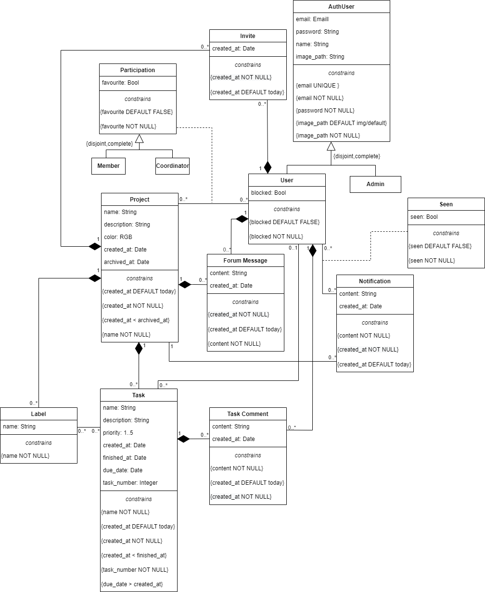

# EBD: Database Specification Component

With the development of toEaseManage we intend to create a useful and acessible platform that helps users to organize projects as well as grow as web developers throughout the curricular unit. 

 ## A4: Conceptual Data Model <!-- (CHECK IF THE DESCRIPTION BELLOW IS GOOD IDK)>

For this artefact, we built the UML diagram for toEaseManage showing all of the classes of the attributes for our website. We also mantain a group of business functionalities.

### 1. Class diagram <!-- CHECK IF ALL OF THE RELATIONS, SETAS E ASTERICOS ARE OK>

UML class diagram containing the classes, associations, multiplicity and constraints.  



### 2. Additional Business Rules <!-- ARE THERE MORE? I DON'T THINK SO, SO THIS PART IS OK (?)>

These are the business rules, from the previous component, that can't be explained and applied in the UML Class diagram. Its numbers refer to the previous ones. 

| Identifier | Name                    | Description  |
| ---------- | -----                   | -----------  | 
| BR01       | Account deletion        | Upon account deletion, all the shared social data must be kept as anonymous author |
| BR04       | Leave project with task | Upon being removed from a project, all the tasks assignments not finished assigned to the member must be deleted |
| BR06       | User Block              | Upon being blocked a User is removed from all his projects |
| BR08       | Member Comments         | A project member can comment on its own assigned or created tasks |

---

## A5: Relational Schema, validation and schema refinement

For this artefact our main objective was to convert the UML Class diagram to a Relational Schema that follows all the Forms to enhance performance of our databases. 

### 1. Relational Schema

Our relation schema for toEaseManage is presented below in a compact version that only shows the atributtes and some constraints concerning them. Note that some of the constraints refering two atributtes are only shown in the sql version of the schema.  

| Relation reference | Relation Compact Notation |
| ------------------ | ------------------------- |
| R01                | User(<u>id</u>, email __UK NN__, password __NN__, name __NN__, image_path __NN DF__ img/default, blocked __NN DF__ false) |
| R02                | Admin(<u>id</u>, email __UK NN__, password __NN__, name __NN__, image_path __NN DF__ img/default) |
| R03                | Project(<u>id</u>, name __NN__, description, color, created_at __NN DF__ today, archived_at __CK__ archived_at > created_at) |
| R04                | Participation(<u>id</u>, favourite __NN__, role __NN__ __CK__ role __IN__ Role, id_project → Project __NN__, id_user → User __NN__) |
| R05                | Task (<u>id</u>, name __NN__, description, priority __CK__ priority>=1 AND priority<=5, created_at __NN DF__ Today, finished_at __CK__ finished_at > created_at, task_number __NN__, id_project → Project __NN__, id_user → User) |
| R06                | Label(<u>id</u>, name __NN__, id_project → Project __NN__ ) |
| R07                | TaskLabel(<u>id</u>, id_label → Label __NN__, id_task →Task __NN__) |
| R08                | TaskComment(<u>id</u>, content __NN__, created_at __NN DF__ Today, id_task →Task __NN__, id_user → User __NN__) |
| R09                | ForumMessage(<u>id</u>, content __NN__, created_at __NN DF__ Today, id_project → Project __NN__, id_user → User __NN__) |
| R010               | Invite(<u>id</u>, created_at __NN DF__ Today, id_user → User __NN__, id_project → Project __NN__) |
| R011               | Notification(<u>id</u>, content __NN__, created_at __NN DF__ Today, id_project → Project __NN__) |
| R012               | Seen(<u>id</u>, id_user → User __NN__, id_notification → Notification __NN__, seen __NN DF__ FALSE) |

Legend:
* UK = UNIQUE KEY
* NN = NOT NULL
* DF = DEFAULT
* CK = CHECK
 
### 2. Domains

This are domains used in the relational schema above.   

| Domain Name | Domain Specification           |
| ----------- | ------------------------------ |
| Today	      | DATE DEFAULT CURRENT_DATE      |
| Role        | ENUM ('Member', 'Coordinator') |

### 3. Schema validation

For each table of the relational schema we excuted a validation of the Normal Form and the normalization is acomplished. Below we present the functional dependencies, keys an normal form for each table.

| **TABLE R01**   | User                                                  |
| --------------  | ---                                                   |
| **Keys**        | { id }, { email }                                     |
| **Functional Dependencies:**                                            |
| FD0101          | { id } → {email, password, name, image_path, blocked} |
| FD0102          | { email } → {id, password, name, image_path, blocked} |
| **NORMAL FORM** | BCNF                                                  |
| **Justication** | For each functional dependency, the group of atributtes of the left side are keys, therefore, this table is in the BCNF Form. |


| **TABLE R02**   | Admin                                           |
| --------------  | ---                                             |
| **Keys**        | { id }, { email }                               |
| **Functional Dependencies:**                                      |
| FD0201          | { id } → {email, password, name, image_path}    |
| FD0202          | { email } → {id, password, name, image_path}    |  
| **NORMAL FORM** | BCNF                                            |
| **Justication** | For each functional dependency, the group of atributtes of the left side are keys, therefore, this table is in the BCNF Form. |


| **TABLE R03**   | Project                                                       |
| --------------  | ---                                                           |
| **Keys**        | { id }                                                        |
| **Functional Dependencies:**                                                    |
| FD0301          | { id } → {name, description, color, created_at, archived_at}  |
| **NORMAL FORM** | BCNF                                                          |
| **Justication** | For each functional dependency, the group of atributtes of the left side are keys, therefore, this table is in the BCNF Form. |


| **TABLE R04**   | Participation                                       |
| --------------  | ---                                                 |
| **Keys**        | { id } , { id_project, id_user }                    |
| **Functional Dependencies:**                                          |
| FD0401          | { id } → {favourite, role, id_project, id_user}     |
| FD0402          | { id_project, id_user } → {id, favourite, role }    |
| **NORMAL FORM** | BCNF                                                |
| **Justication** | For each functional dependency, the group of atributtes of the left side are keys, therefore, this table is in the BCNF Form. |


| **TABLE R05**   | Task       |
| --------------  | ---        |
| **Keys**        | { id }     |
| **Functional Dependencies:** |
| FD0501          | { id } → {name, description, priority, created_at, finished_at, task_number, id_project} |
| FD0502          | { task_number, id_project } → {id, name, description, priority, created_at, finished_at, id_user}|
| **NORMAL FORM** | BCNF       |
| **Justication** | For each functional dependency, the group of atributtes of the left side are keys, therefore, this table is in the BCNF Form. |


| **TABLE R06**   | Label                       |
| --------------  | ---                         |
| **Keys**        | { id }                      |
| **Functional Dependencies:**                  |
| FD0601          | { id } → {name, id_project} |
| **NORMAL FORM** | BCNF                        |
| **Justication** | For each functional dependency, the group of atributtes of the left side are keys, therefore, this table is in the BCNF Form. |


| **TABLE R07**   | TaskLabel                       |
| --------------  | ---                             |
| **Keys**        | { id }, { id_label, id_task }   |
| **Functional Dependencies:**                      |
| FD0701          | { id } → {id_lable, id_task}    |
| FD0702          | { id_lable, id_task } → {id}    |
| **NORMAL FORM** | BCNF                            |
| **Justication** | For each functional dependency, the group of atributtes of the left side are keys, therefore, this table is in the BCNF Form. |


| **TABLE R08**   | TaskComment                                        |
| --------------  | ---                                                |
| **Keys**        | { id }                                             |
| **Functional Dependencies:**                                         |
| FD0801          | { id } → {content , created_at, id_task, id_user } |
| **NORMAL FORM** | BCNF                                               |
| **Justication** | For each functional dependency, the group of atributtes of the left side are keys, therefore, this table is in the BCNF Form. |


| **TABLE R09**   | ForumMessage                                         |
| --------------  | ---                                                  |
| **Keys**        | { id }                                               |
| **Functional Dependencies:**                                           |
| FD0901          | { id } → { content, created_at, id_project, id_user} |
| **NORMAL FORM** | BCNF                                                 |
| **Justication** | For each functional dependency, the group of atributtes of the left side are keys, therefore, this table is in the BCNF Form. |


| **TABLE R10**   | Invite                                      |
| --------------  | ---                                         |
| **Keys**        | { id } , {id_project, id_user}              |
| **Functional Dependencies:**                                  |
| FD01001         | { id } → { created_at, id_project, id_user} |
| FD01002         | {id_project, id_user} → { id, created_at}   |
| **NORMAL FORM** | BCNF                                        |
| **Justication** | For each functional dependency, the group of atributtes of the left side are keys, therefore, this table is in the BCNF Form. |


| **TABLE R11**   | Notification                                |
| --------------  | ---                                         |
| **Keys**        | { id }                                      |
| **Functional Dependencies:**                                  |
| FD01101         | { id } → { content, created_at, id_project} |
| **NORMAL FORM** | BCNF                                        |  
| **Justication** | For each functional dependency, the group of atributtes of the left side are keys, therefore, this table is in the BCNF Form. |


| **TABLE R12**   | Seen                                        |
| --------------  | ---                                         |
| **Keys**        | { id } , { id_user, id_notification}        |
| **Functional Dependencies:**                                  |
| FD1201          | { id } → { id_user, id_notification, seen}  |
| FD1202          | { id_user, id_notification } → {id, seen}   |  
| **NORMAL FORM** | BCNF                                        |  
| **Justication** | For each functional dependency, the group of atributtes of the left side are keys, therefore, this table is in the BCNF Form. |

---

## A6: Indexes, triggers, transactions and database population

This artefact main goal is to create a more solid and prepared database schema for our website. By starting to analyse the database workload (1.) we can make more correct decisions about triggers, transactions and indexes need to boost the performance of our database. 

### 1. Database Workload
 
This is a study and an estimative of the use of our website that is going to be important e some decisions we need to make after this.

| **Relation reference** | **Relation Name** | **Order of magnitude**        | **Estimated growth** |
| ---------------------- | ----------------- | ----------------------------- | -------------------- |
| R01                    | User              | 10 k (tens of thousands)      | 10 (tens) / day      |
| R02                    | Admin             | 1 (units)                     | no growth            |
| R03                    | Project           | 1 k (thousands)               | 1 (units) / day      |
| R04                    | Participation     | 10 k (tens of thousands)      | 1 (units) / day      |
| R05                    | Task              | 10 k (tens of thousands)      | 10 (tens) / day      |
| R06                    | Label             | 1 k (hundreds)                | 1 (units) / day      |
| R07                    | TaskLabel         | 10 k (thousands)              | 10 (units) / day     |
| R08                    | TaskComment       | 100 k (hundreds of thousands) | 100 (hundreds) / day |
| R09                    | ForumMessage      | 100 k (hundreds of thousands) | 100 (hundreds) / day |
| R10                    | Invite            | 100 (hundreds)                | 1 (units) / day      |
| R11                    | Notification      | 100 k (hundreds of thousands) | 100 (hundreds) / day |
| R12                    | Seen              | 100 k (hundreds of thousands) | 100 (hundreds) / day |

### 2. Proposed Indices

Note: SQL automatically creates indexes by key (in this case the tables id), and by unique constraints. So, the performance indexes below are the ones that complete the set of indexes for our database. 

#### 2.1. Performance Indices
 
Based on the workload we predicted for our tables, some indexes below were chosen to boost efficiency of some searching aspects of our database.

| **Index**           | IDX01                                  |
| ---                 | ---                                    |
| **Relation**        | Seen                                   |
| **Attribute**       | id_user, seen                          |
| **Type**            | B-Tree                                 |
| **Cardinality**     | Medium                                 |
| **Clustering**      | No                                     |
| **Justification**   | Table 'Seen' is very large. Seen tabel is frequentely accessed to obtain user's notifications, since we are only seeing notifications by user. Update frequency is medium, because each row of table must be updated only one time, changing the seen atributte value. We choose to create this index based on a b-tree that organizes and orders by id_user and then diferentiates between being or not seen.                                             |
| **SQL code**         | ```CREATE INDEX user_seen ON Seen USING btree (id_user, seen);```||                                                            

| **Index**           | IDX02                                  |
| ---                 | ---                                    |
| **Relation**        | TaskComment                            |
| **Attribute**       | id_task                                |
| **Type**            | Hash                                   |
| **Cardinality**     | Medium                                 |
| **Clustering**      | No                                     |
| **Justification**   | Table 'TaskComment' is very large. Several queries need to frequently filter access to task comments by task, since we are only seeing tasks comments in its task page. Filtering is done by exact match (id_task), thus an hash type index would be best suited since it groups task comments by task. It can be frequently updated, because users have the ability to change its content, though clustering is not an option.                                   |
| **SQL code**         | ```CREATE INDEX task_taskComment ON TaskComment USING hash (id_task);```||                                           

| **Index**           | IDX03                                  |
| ---                 | ---                                    |
| **Relation**        | ForumMessage                           |
| **Attribute**       | id_project                             |
| **Type**            | Hash                                   |
| **Cardinality**     | Medium                                 |
| **Clustering**      | No                                     |
| **Justification**   | Table 'ForumMessage' is very large. Several queries need to frequently filter access to forum messages by project, since we are only seeing forum messages in their project forum. This table can be frequently updated, because users have the ability to edit its content, though clustering is not an option. We came to the conclusion that this index should be an hash table that organizes forum messages by the project where they belong.                     |
| **SQL code**         | ```CREATE INDEX project_message ON ForumMessage USING hash (id_project);```||
       
| **Index**           | IDX04                                  |
| ---                 | ---                                    |
| **Relation**        | Task                                   |
| **Attribute**       | id_project                             |
| **Type**            | Hash                                   |
| **Cardinality**     | High                                   |
| **Clustering**      | No                                     |
| **Justification**   | Table 'Task' is large. Several queries need to frequently filter access to task by their project, since we are only seeing tasks in their project page. Therefore, we decided to use an hash index that arranges the tasks by the project where they belong. It can be frequently updated and new elements are also usually created, so clustering was not a good aproach.    |
| **SQL code**         | ```CREATE INDEX project_task ON Task USING hash (id_project);```||

| **Index**           | IDX05                                  |
| ---                 | ---                                    |
| **Relation**        | Participation                          |   
| **Attribute**       | id_user                                |
| **Type**            | Hash                                   |
| **Cardinality**     | Medium                                 |
| **Clustering**      | No                                     |
| **Justification**   | 'Participation' table is large. Participation tabel is frequentely accessed to obtain user's participation in projects, since we are only seeing the projects of an user in its users page. As it can be constantly updated (favourite atribute, as well as role) it is not a good candidate for clustering, due to the update frequency being high. Hence, the index type chosen was hash, that groups the participation rows from the same user.                         |
| **SQL code**         | ```CREATE INDEX user_participation ON Participation USING hash (id_user);```||
                                                      
#### 2.2. Full-text Search Indices 

toEaseManage website provides full-text search that habilitates the users to search for tasks, projects and users by their names. Below we present the implemented indexes, as well as some justification for its type and other decisions.   

| **Index**           | IDX06                                  |
| ---                 | ---                                    |
| **Relation**        | Users                                  |
| **Attribute**       | name                                   |
| **Type**            | GIN                                    |
| **Clustering**      | No                                     |
| **Justification**   | To search for a specific user based on his name we provide full-text search features to look for him based on matching names. The type of this index is GIN because we do not expect users to change name frequently.                               |
| `SQL code`                                                    
```
ALTER TABLE Users
ADD COLUMN tsvectors TSVECTOR;

CREATE FUNCTION user_search_update() RETURNS TRIGGER AS $$
BEGIN
 IF TG_OP = 'INSERT' THEN
        NEW.tsvectors = (
         setweight(to_tsvector('english', NEW.name), 'A')
        );
 END IF;
 IF TG_OP = 'UPDATE' THEN
         IF (NEW.name <> OLD.name) THEN
           NEW.tsvectors = (
             setweight(to_tsvector('english', NEW.name), 'A') 
           );
         END IF;
 END IF;
 RETURN NEW;
END $$
LANGUAGE plpgsql;

CREATE TRIGGER user_search_update
BEFORE INSERT OR UPDATE ON Users
FOR EACH ROW
EXECUTE PROCEDURE user_search_update();

CREATE INDEX search_name ON Users USING GIN (tsvectors);
```

| **Index**           | IDX07                                  |
| ---                 | ---                                    |
| **Relation**        | Project                                |
| **Attribute**       | name                                   |
| **Type**            | GIN                                    |
| **Clustering**      | No                                     |
| **Justification**   | To provide full-text search features to search for projects based on matching names or related description content we created an index, with type GIN, since the indexed fields (name and description) are not expected to change too often.         |
| `SQL code`     
```
ALTER TABLE Project
ADD COLUMN tsvectors TSVECTOR;

CREATE FUNCTION project_search_update() RETURNS TRIGGER AS $$
BEGIN
 IF TG_OP = 'INSERT' THEN
        NEW.tsvectors = (
         setweight(to_tsvector('english', NEW.name), 'A') ||
         setweight(to_tsvector('english', NEW.description), 'C')
        );
 END IF;
 IF TG_OP = 'UPDATE' THEN
         IF (NEW.name <> OLD.name OR NEW.description <> OLD.description) THEN
           NEW.tsvectors = (
             setweight(to_tsvector('english', NEW.name), 'A') ||
             setweight(to_tsvector('english', NEW.description), 'C')
           );
         END IF;
 END IF;
 RETURN NEW;
END $$
LANGUAGE plpgsql;

CREATE TRIGGER project_search_update
BEFORE INSERT OR UPDATE ON Project
FOR EACH ROW
EXECUTE PROCEDURE project_search_update();

CREATE INDEX search_project ON Project USING GIN (tsvectors);
```                                              

| **Index**           | IDX08                                  |
| ---                 | ---                                    |
| **Relation**        | Task                                   |
| **Attribute**       | name                                   |
| **Type**            | GIN                                    |
| **Clustering**      | No                                     |
| **Justification**   | Searching tasks for its name and description is easier with full-text search features with an index type GIN, since this atributtes are not expected to change often.   |
| `SQL code`     

```
ALTER TABLE Task
ADD COLUMN tsvectors TSVECTOR;

CREATE FUNCTION task_search_update() RETURNS TRIGGER AS $$
BEGIN
 IF TG_OP = 'INSERT' THEN
        NEW.tsvectors = (
         setweight(to_tsvector('english', NEW.name), 'A') ||
         setweight(to_tsvector('english', NEW.description), 'C')
        );
 END IF;
 IF TG_OP = 'UPDATE' THEN
         IF (NEW.name <> OLD.name OR NEW.description <> OLD.description) THEN
           NEW.tsvectors = (
             setweight(to_tsvector('english', NEW.name), 'A') ||
             setweight(to_tsvector('english', NEW.description), 'C')
           );
         END IF;
 END IF;
 RETURN NEW;
END $$
LANGUAGE plpgsql;

CREATE TRIGGER task_search_update
 BEFORE INSERT OR UPDATE ON Task
 FOR EACH ROW
 EXECUTE PROCEDURE task_search_update();

CREATE INDEX search_task ON Task USING GIN (tsvectors);
```  

### 3. Triggers
 
Our triggers below present functionalities that our database needs to have and follow to correctly work upon some user stories or business rules defined in the previous ER. Their description  

| **Trigger**      | TRIGGER01                               |
| ---              | ---------                               |
| **Description**  | Update task number when adding a task   |
| `SQL code`                  
```
CREATE FUNCTION task_number() RETURNS TRIGGER AS
$BODY$
BEGIN
        NEW.task_number := (SELECT count(*) 
                               FROM Task 
                               WHERE Task.id_project = NEW.id_project);
        RETURN NEW;
END
$BODY$
LANGUAGE plpgsql;

CREATE TRIGGER task_number
        BEFORE INSERT ON Task
        FOR EACH ROW
        EXECUTE PROCEDURE task_number();
```

| **Trigger**      | TRIGGER02  |
| ---              | ---------  |
| **Description**  | Update user's info to anonymous info upon account deletion, reference to business rule BR01.|
| `SQL code`       |            |
```
CREATE FUNCTION user_anonymous() RETURNS TRIGGER AS
$BODY$
BEGIN
        UPDATE Users
        SET OLD.name = "Anonymous",
            OLD.email = "anonymous@anonymous.pt"
        WHERE OLD.id = Users.id;

        RETURN NULL; -- check if this rely dont delete user
END
$BODY$
LANGUAGE plpgsql;

CREATE TRIGGER user_anonymous
        BEFORE DELETE ON Users
        FOR EACH ROW
        EXECUTE PROCEDURE user_anonymous();
```

| **Trigger**      | TRIGGER03   |
| ---              | ---         |
| **Description**  | Remove user assignment to a task when he leaves project, reference to business rule BR04. |
| `SQL code`       |             |
```
CREATE FUNCTION remove_task() RETURNS TRIGGER AS
$BODY$
BEGIN

        UPDATE Task
        SET Task.id_user = NULL
        WHERE OLD.id_user = Task.id_user AND Task.finished_at = NULL;
           
        RETURN VOID;
END
$BODY$
LANGUAGE plpgsql;

CREATE TRIGGER remove_task
        AFTER DELETE ON Participation
        FOR EACH ROW
        EXECUTE PROCEDURE remove_task();
```

| **Trigger**      | TRIGGER04 |
| ---              | ---       |
| **Description**  | Remove user from project when he is blocked, reference to business rule BR06. |
| `SQL code`       |           |
```
CREATE FUNCTION block_user() RETURNS TRIGGER AS
$BODY$
BEGIN
        DELETE FROM Participation
        WHERE Participation.id_user = OLD.id; 
           
        RETURN VOID;
END
$BODY$
LANGUAGE plpgsql;

CREATE TRIGGER block_user
        AFTER UPDATE OF blocked
        ON Users
        FOR EACH ROW
        WHEN (OLD.blocked = FALSE)
        EXECUTE PROCEDURE block_user();
```

| **Trigger**      | TRIGGER05 |
| ---              | ---       |
| **Description**  | Send notification to Project Coordinator and Assigned Member when a task is finished, references FR.601. |
| `SQL code`       |           |
```
CREATE FUNCTION finished_task() RETURNS TRIGGER AS
$BODY$
BEGIN
        
        INSERT INTO Notification (content, id_project)
        VALUES ('Task ' || OLD.task_number || ' completed!', OLD.id_project)
        RETURNING id AS notification_id;

        IF (OLD.id_user IS NOT NULL) THEN 
            INSERT INTO Seen (seen, id_user, id_notification)
            Select False, OLD.id_user, notification_id.id
            FROM notification_id;
        END IF;
        
        INSERT INTO Seen (seen, id_user, id_notification)
		SELECT (False, id_user, notificationid_notification)
		FROM Participation 
		WHERE Participation.id_project = OLD.id_project AND Participation.role = 'Coordinator';
           
        RETURN VOID;

END
$BODY$
LANGUAGE plpgsql;

CREATE TRIGGER notification_finished_task
        AFTER UPDATE OF finished_at 
        ON Task
        FOR EACH ROW
        WHEN (OLD.finished_at = NULL)
        EXECUTE PROCEDURE finished_task();
```

| **Trigger**      | TRIGGER06                                  |
| ---              | ---                                        |
| **Description**  | Notification creation on task assignment, references FR.602.   |
| `SQL code`       |                                            |
```
CREATE FUNCTION assign_task() RETURNS TRIGGER AS
$BODY$
BEGIN
        WITH notification_id AS (INSERT INTO Notification (content, id_project)
        VALUES ('New task ' || NEW.task_number || ' assigned to you!', NEW.id_project)
        RETURNING id)
        
        INSERT INTO Seen (seen, id_user, id_notification)
        VALUES (False, NEW.id_user, notification_id.id);
           
        RETURN VOID;
END
$BODY$
LANGUAGE plpgsql;

CREATE TRIGGER assign_task
        AFTER INSERT OR UPDATE
        ON Task
        FOR EACH ROW
        WHEN (NEW.id_user <> NULL)
        EXECUTE PROCEDURE assign_task();
```

| **Trigger**      | TRIGGER07 |
| ---              | ---       |
| **Description**  | Notification for Project Coordinator when a member accepts invitation, references FR.603.  |
| `SQL code`       |           |
```
CREATE FUNCTION accept_invite() RETURNS TRIGGER AS
$BODY$
BEGIN

        WITH notification_id AS (INSERT INTO Notification (content, id_project)
        VALUES ('New ' || NEW.role || ' in your project!', NEW.id_project)
        RETURNING id)

        INSERT INTO Seen (seen, id_user, id_notification)
		SELECT False, Participation.id_user, notification_id.id
		FROM Participation, notification_id
		WHERE Participation.id_project = NEW.id_project AND Participation.role = 'Coordinator';
           
        RETURN NEW;
END
$BODY$
LANGUAGE plpgsql;

CREATE TRIGGER notification_accept_invite
        AFTER INSERT 
        ON Participation
        FOR EACH ROW
        EXECUTE PROCEDURE accept_invite();
```

| **Trigger**      | TRIGGER08                                                  |
| ---              | ---                                                        |
| **Description**  | Notification for a member when he is invited to a project, references FR.501.  |
| `SQL code`       |                                                            |
```
CREATE FUNCTION notify_invitation() RETURNS TRIGGER AS
$BODY$
BEGIN
        WITH notification_id AS (INSERT INTO Notification (content, id_project)
        VALUES ('Invite to a new project!', NEW.id_project)
        RETURNING id)
        
        INSERT INTO Seen (seen, id_user, id_notification)
        SELECT False, NEW.id_user, notification_id.id
        FROM notification_id;
           
        RETURN NEW;
END
$BODY$
LANGUAGE plpgsql;

CREATE TRIGGER invite_notification
        AFTER INSERT
        ON Invite
        FOR EACH ROW
        EXECUTE PROCEDURE notify_invitation();
```

| **Trigger**      | TRIGGER09                             |
| ---              | ---                                   |
| **Description**  | Add other coordinator to the project, references FR.502.  |
| `SQL code`       |                                       |
```
CREATE FUNCTION coordinator_change() RETURNS TRIGGER AS
$BODY$
BEGIN
        WITH notification_id AS (INSERT INTO Notification (content, id_project)
        VALUES ('Your project has a new Coordinator!', NEW.id_project)
        RETURNING id)
        
        INSERT INTO Seen (seen, id_user, id_notification)
		SELECT False, id_user, notification_id.id
		FROM Participation, notification_id
		WHERE Participation.id_project = NEW.id_project;
           
        RETURN VOID;
END
$BODY$
LANGUAGE plpgsql;

CREATE TRIGGER coordinator_change
        AFTER UPDATE
        ON Participation
        FOR EACH ROW
        WHEN (NEW.role = 'Coordinator' AND OLD.role = 'Member')
        EXECUTE PROCEDURE coordinator_change();
```

| **Trigger**      | TRIGGER10 |
| ---              | ---       |
| **Description**  | Restrict deletion of a coordinator of a project if he is the only coordinator.   |
| `SQL code`       |           |
```
CREATE FUNCTION no_delete_coordinator() RETURNS TRIGGER AS
$BODY$
BEGIN
        IF EXISTS(SELECT *
                   FROM Participation 
                   WHERE Participation.role = 'Coordinator' 
				  		 AND Participation.id_project = OLD.id_project
				 		 AND Participation.id_user <> OLD.id_user) 
		THEN RAISE EXCEPTION 'You can not have a project(%) without a coordinator(%)',OLD.id_project,OLD.id_user;
        END IF;
        RETURN OLD;

END
$BODY$
LANGUAGE plpgsql;

CREATE TRIGGER no_delete_coordinator
        BEFORE DELETE
        ON Participation
        FOR EACH ROW
        WHEN (OLD.role = 'Coordinator')
        EXECUTE PROCEDURE no_delete_coordinator();
```

| **Trigger**      | TRIGGER11 |
| ---              | ---       |
| **Description**  | Restrict invite if the user is already participating. |
| `SQL code`       |           |
```
CREATE FUNCTION no_invite_participant() RETURNS TRIGGER AS
$BODY$
BEGIN
        IF EXISTS(SELECT *
                   FROM Participation 
                   WHERE Participation.id_project = NEW.id_project
			 AND Participation.id_user = NEW.id_user) 
		THEN RAISE EXCEPTION 'You can not invite a participant(%) of the project(%)',NEW.id_user, NEW.id_project ;
        END IF;
        RETURN NEW;

END
$BODY$
LANGUAGE plpgsql;

CREATE TRIGGER no_invite_participant
        BEFORE INSERT
        ON Invite
        FOR EACH ROW
        EXECUTE PROCEDURE no_invite_participant();

```

### 4. Transactions
 
> Transactions needed to assure the integrity of the data.  

| SQL Reference   | Accept invite                       |
| --------------- | ----------------------------------- |
| Justification   | When a invite is accepted it bust be deleted and a participation row must be created without any interruption |
| Isolation level | REATABLE READ                       |
| `Complete SQL Code`  ||

```
BEGIN TRANSACTION;

SET TRANSACTION ISOLATION LEVEL REATABLE READ

DELETE FROM Invite
WHERE Invite.id_user = $user_id
      AND Invite.id_project = $project_id

INSERT INTO Participation (role,id_project,id_user)
VALUES ('Member',$project_id,$user_id)

END TRANSACTION;
```

| SQL Reference   | Coordinator assignement             |
| --------------- | ----------------------------------- |
| Justification   | We must turn a member into a coordinator inside a transaction not allowing him to leave the project in the middle of it, only beeing able to leave at the end, if there is another coordinator allocated to the project            |
| Isolation level | READ COMMITED                       |
| `Complete SQL Code`  ||

```
BEGIN TRANSACTION;

SET TRANSACTION ISOLATION LEVEL READ COMMITED

UPDATE Participation 
SET Participation.role = 'Coordinator'
WHERE Participation.id_user = $user_id

END TRANSACTION;
```


## Annex A. SQL Code

> The database scripts are included in this annex to the EBD component.
> 
> The database creation script and the population script should be presented as separate elements.
> The creation script includes the code necessary to build (and rebuild) the database.
> The population script includes an amount of tuples suitable for testing and with plausible values for the fields of the database.
>
> This code should also be included in the group's git repository and links added here.

### A.1. Database schema

### A.2. Database population


---


## Revision history

Changes made to the first submission:
1. Added a small description for whom the website is for.
2. Order high and low, and functionalities that we think are most relevant on the tables.
3. Justification of the highlighted technical requires.
4. Search in sitemap
5. Footer on the wireframe

***

GROUP2102, 29/11/2021
 
* André Pereira, up201905650@up.pt
* Beatriz Lopes dos Santos, up201906888@up.pt
* Matilde Oliveira, up201906954@up.pt
* Ricardo Ferreira, up201907835@up.pt
