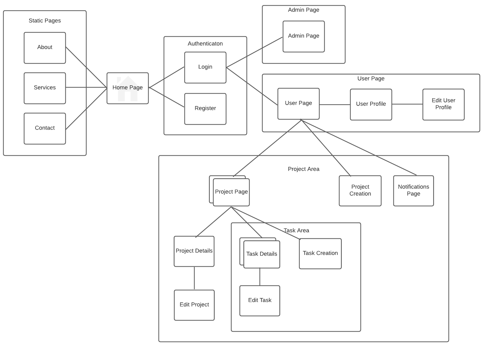
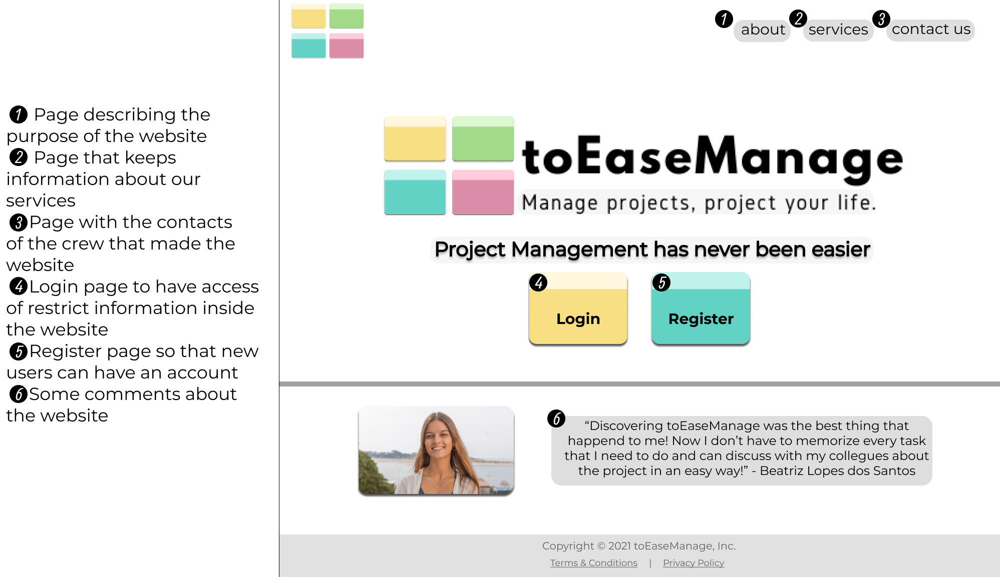

# ER: Requirements Specification Component

With the development of toEaseManage we intend to create a useful and acessible platform that helps users to organize projects as well as grow as web developers throughout the curricular unit. The website is for everyone, it can be used personally, for business, school, or even among friends.

## A1: toEaseManage

The main goal of toEaseManage is to create a web application to help with project development management. This is a tool that can be used by work teams in every project areas, by allowing the creation of a project, assigning teams and tasks and enabling discussion in a forum.

A project is formed by a project coordinator and a group of project members. The coordinator is responsible for inviting members to his project as well as assigning a new coordinator. Every team member is able to create, assign and complete tasks, as well as, to usufruit of the project discussion forum.

Users are only able to see the projects which they are allocated to. On the other hand, the team of administrators can browse and view details of every project, however they can not create or participate in them.

This plataform will allow multiple project work, since you can work simultaneously in different projects and be either member ou project coordinator in different ones. Each project will have a variety of tasks with its main goal, description, due-to date, comments and members assigned to it, that can check the task when done. Futhermore, each project will also have a specific discussion forum to discuss project ideas. 

To be a toEaseManage user you can authenticate yourself in the login page linked from the Home page. The Home page has all information about the platform and website: our services, contacts to reach when there is a problema and information about toEaseManage. This is the only information available for users not authenticated. Only after being authenticated you can browse inside your profile and project. 

toEaseManage will provide easy navigation and a great user experience to boost your projects results. 

### Editor
Matilde Oliveira
  
---

## A2: Actors and User stories

This artefact specifies the content of the actors and user stories of the project: toEaseManage.

### 1. Actors

The actors for toEaseManage are presented below (Image 1) and described in Table 1. 

> Image 1: toEaseManage Actors

| Identifier | Description |
| - | - |
| User | Generic user that has access to public information |
| Visitor | Unauthenticated user that can register itself (sign-up) or sign-in in the system |
| AuthUser | Authenticated user that can manage project invitation, create new projects as well as view them |
| Member | Authenticated user that is assigned to projects. Has access to all the project information, can manage tasks inside the project and is able to discuss in the forum
| Coordinator | Project member responsible for the project with permissions to choose other coordinator and deal with member’s permissions |
| PostAuthor | Project member that has already sent a message to the discussion forum and is now able to delete it or edit it |
| Admin | Authenticated user that is responsible for the management of the platform being able to browse projects and see their information |
| OAuth API | External OAuth API that can be used to register or authenticate into the system |
> Table 1: toEaseManage Actors description

### 2. User Stories

In the following tables we present the user stories for the actors described above. 

#### 2.0. User

| Identifier | Name | Priority | Description |
| - | - | - | - |
| US0.1 | See Home | high | As a User, I want to access the home page, so that I can see a brief presentation of the website |
| US0.2 | See About | high | As a User, I want to access the about page, so that I can see a complete description of the website as well as its creators |
| US0.3 | Consult Contacts | medium | As a User, I want to access contacts, so that I can come in touch with the platform creators |
| US0.4 | Consult Services | medium | As a User, I want to access the services information, so that I can see the website’s services |
> Table 2: User User Stories

#### 2.1. Visitor

| Identifier | Name | Priority | Description |
| - | - | - | - |
| US1.1 | Sign-in | high | As a Visitor, I want to authenticate into the system, so that I can access privileged information |
| US1.2 | Sign-up | high | As a Visitor, I want to register myself into the system, so that I can authenticate myself into the system |
| US1.3 | OAuth API Sign-up | very low | As a Visitor, I want to register a new account linked to my Google account, so that I do not need to create a whole new account to use the platform  |
| US1.4 | OAuth API Sign-in | very low | As a Visitor, I want to sign-in through my Google account, so that I can authenticate myself into the system |
> Table 3: Visitor User Stories

#### 2.2. AuthUser

| Identifier | Name | Priority | Description |
| - | - | - | - |
| US2.1 | Create projects | high | As a AuthUser, I want to create my own projects, so that the users can work on the project |
| US2.2 | View projects | high | As a AuthUser, I want to view the projects that are allocated to me, so that I can work on them |
| US2.3 | Mark project as favorite | high | As a AuthUser, I want to mark the projects as favorite, so that I can easily find the projects that interests me the most |
| US2.4 | Logout | high | As a AuthUser, I want to log out of my account, so that I can leave the website safely  |
| US2.5 | Delete account | high | As a AuthUser, I want to be able to delete my account, so that I can remove my information from the website |
| US2.6 | View profile | high | As a AuthUser, I want to view my profile information, so that I can check it  |
| US2.7 | Edit profile | high | As a AuthUser, I want to edit my profile information, so that I can update it |
| US2.8 | Upload Profile Pictures | high | As a AuthUser, I want to upload a profile picture for me account, so that users can identify me |
| US2.9 | View notifications | high | As a AuthUser, I want to be able to see the notifications, so that informs me of some changes |
| US2.10 | Appeal for unblock | high | As a AuthUser, I want to be able to ask for the Administrators to unblock my account, so that I can continue with my work  |
| US2.11 | Receive Notifications | high | As a AuthUser, I want to receive notifications relevant to me, so that I can be aware of what is appening |
| US2.12 | Accept project invitations | high | As a AuthUser, I want to be able to accept project invitations, so that i can be part of them | 
| US2.13 | Project Invitation | low | As a AuthUser, I want to manage my project invitations, so that I can accept or refuse the invites |
| US2.14 | Order Project | low | As a AuthUser, I want to be able to go through my project in an order of my choice (alphabetical, cronological), so that I can find it easily |
> Table 4: AuthUser User Stories

#### 2.3. Member

| Identifier | Name | Priority | Description |
| - | - | - | - |
| US3.1 | Create Tasks | high | As a Member, I want to create tasks, so that I can add to dos to the project  |
| US3.2 | Manage Tasks | high | As a Member, I want to manage tasks details, so that I can change task information such as due date |
| US3.3 | Assign Tasks | high | As a Member, I want to assign tasks to members of the project, so that everyone knows what to do |
| US3.4 | View Tasks | high | As a Member, I want to view all the tasks, so that I can see what everyone needed to do |
| US3.5 | Comment Tasks | high | As a Member, I want to comment on tasks, so that I can complete it with additional information |
| US3.6 | Complete Tasks | high | As a Member, I want to be able to check the tasks I have done, so that everyone knows it is completed  |
| US3.7 | Search Tasks | high | As a Member, I want to be able to search tasks by keywords, so that I can easily find what I want|
| US3.8 | Leave Project | high | As a Member, I want to be able to leave a project , so that I stop being part of the that project team |
| US3.9 | View Project Details | high | As a Member, I want to be able to check project information, so that I can know the members of the project along with other relevant information  |
| US3.10 | View Team Profiles | high | As a Member, I want to be able to see other team members profiles , so that I can have more information about them|
| US3.11 | Browse the Project Forum | medium | As a Member, I want to be able to navigate in the project forum so that I can be part of current discussions |
| US3.12 | Post messages to Project Forum | medium | As a Member, I want to be able to publish messages, so that I can participate in any forum discussion |
| US3.13 | View Project Timeline | medium | As a Member, I want to be able to see project tasks done, so that I can have more understanding about the development of the project|
> Table 5: Member User Stories

#### 2.4. Coordinator

| Identifier | Name | Priority | Description |
| - | - | - | - |
| US4.1 | Assign Coordinator | high | As a Coordinator, I want to be able to assign new coordinators to the project, so that I can have other Users helping me in the project management |
| US4.2 | Edit Project Details | high | As a Coordinator, I want to edit current project information, so that I can update information referent to the project|
| US4.3 | Remove Member | high | As a Coordinator, I want to be able to remove some member from the project , so that I can decide wich persons are working in the project |
| US4.4 | Archive Project | high | As a Coordinator, I want store all data relative to the project, so that I can safely record finished projects|
| US4.5 | Invite Users | low | As a Coordinator, I want to invite other persons to my project by email , so that I can have more members in my project|
| US4.6 | Manage Members Permissions | low | As a Coordinator, I want manage project Members permissions, so that I can control what members can manage|
> Table 6: Coordinator User Stories

#### 2.5. PostAuthor

| Identifier | Name | Priority | Description |
| - | - | - | - |
| US5.1 | Edit Post | low | As a PostAuthor, I want to edit the post that I had made , so that I can rectify what I had wrote before|
| US5.2 | Delete Post | low | As a PostAuthor, I want to delete post that I had made , so that I can erase some mistaken post |
> Table 7: PostAuthor User Stories

#### 2.6. Admin

| Identifier | Name | Priority | Description |
| - | - | - | - |
| US6.1 | Login Admin Account | high | As an Admin, I want to be able to login in to my account, so that I can have an administrator profile|
| US6.2 | Administer User | high | As an Admin, I want to search through the existing users, so that I can view, edit and create them|
| US6.3 | Block User | high | As an Admin, I want to be able to block some User account, so that I can prevent them from using the website wrongly|
| US6.4 | Unblock User | high | As an Admin, I want to unblock Users, so that I can give their permissions back|
| US6.5 | Delete User | high | As a Admin, I want erase User accounts, so that I can remove there working history from the website|
| US6.6 | Browse Projects | high | As an Admin, I want to be able to browse through projects, so that I can iterate through the existing projects |
| US6.7 | View Project | high | As an Admin, I want view project details, so that I can validate the curret usage of the given features|
> Table 8: Admin User Stories

#### 2.7. OAuth API
| Identifier | Name | Priority | Description |
| - | - | - | - |
| US7.1 | Get Information | high | As a OAuth API, I want to get information related to the User, so that all the information is updated |
> Table 9: OAuth API User Stories

### 3. Supplementary Requirements

This section contains the Business Rules, Technical Requirements and Restrictions for the system we are developing. 

#### 3.1. Business rules

A business rule defines actions the website may follow to function properly.

| Identifier | Name | Description |
| - | - | - | 
| BR01 | Account deletion | Upon account deletion, all the shared social data must be kept as anonymous author |
| BR02 | Admin accounts access | Administrator accounts are independent from the User accounts, so that they can not create neither participate in projects |
| BR03 | Notifications target | Notifications must only be delivered to those who are related to them. If a User is not in a project he must not receive any of it notifications |
| BR04 | Leave project with task | Upon being removed from a project, all the tasks assignments related to the member must be deleted |
| BR05 | Task ending | When a task is closed it must be kept as finished, so that project members can know the work has already been done |
| BR06 | User Block | Upon being blocked a User is removed from all his projects |
| BR07 | Task Dates | The task completion date must be greater than the task creation date |
| BR08 | Member Comments | A project member can comment on its own assigned or created tasks |
> Table 10: toEaseManage Business Rules

#### 3.2. Technical requirements

The technical requirements listed below are the necessary aspects the system needs to operate. The three most critical requirements are marked in bold. 

| Identifier | Name | Description |
| - | - | - | 
|TR01 | **Accessibility** | The system must ensure that everyone can access the pages no matter when and where they are reaching out for the website |
|TR02 | **Usability** | toEaseManage website is designed to help the users manage their projects so its a requirement that every one can easily navigate and work in it |
|TR03 | **Robustness** | The system continue operating when runtime errors occur |
|TR04 | Performance | The website should have response times shorter than 2s to be appealing to its users |
|TR05 | Web application | The system should be implemented as a web application with dynamic and static pages so that users of toEaseManage must not have the need to install new applications |
|TR06 | Portability | The toEaseManage website is meant to all users regardless of the platform or operating system they are using |
|TR07 | Security | The platform must protect information from unauthorised access through the use of an authentication system |
|TR08 | Ethics | The system must respect the ethical principles of software development |
> Table 11: toEaseManage Technical Requirements

Due to the short time for the development of the website, we consider that the technical requires highlighted are the most important, since they guarantee that for a user, toEaseManage will work properly and no unexpected errors will occur.

#### 3.3. Restrictions

A restriction limits the freedom of how the project website is developed.

| Identifier | Name | Description |
| - | - | - | 
| C01 | Deadline | The systems should be ready to be used at the end of the semester, to be able to be evaluated |
> Table 12: toEaseManage project Restrictions

### Editor
André Pereira

---

## A3: Information Architecture

toEaseManage is a project managing platform that helps users to organize their projects.

This artefact includes an overview of the user interface and some features, an overview about the Sitemap and a description of the main interactions with the web application.

### 1. Sitemap

The toEaseManage system is organized in six main areas, the static pages that provide general information about the system (Static Pages),the pages used to authenticate in the system (Authentication), the individual user pages that provide information related to the User (User Pages), the pages with administration features (Admin Pages), the pages used to explore and access the Project collection (Project Area) and the pages that provide information related to the tasks (Task Area).

> Figure 2: toEaseManage sitemap

### 2. Wireframes

For the toEaseManage system, the wireframes for the home page (UI1), the user page (UI2) and the project page (UI3) are presented in Figures 3, 4 and 5, respectively.

#### UI1: Home Page

> Figure 3: Home Page (UI1) wireframe

#### UI2: User Page

> Figure 4: User Page (UI2) wireframe

#### UI3: Project Page

> Figure 5: Project Page (UI3) wireframe

### Editor
Beatriz Lopes dos Santos

---

## Revision history

08/11/2021:
First Version

28/11/2021:
Changes made to the first submission:
1. Added a small description for whom the website is for.
2. Order high and low, and functionalities that we think are most relevant on the tables.
3. Justification of the highlighted technical requires.
4. Search in sitemap
5. Footer on the wireframe
6. Search in project wireframe

---

This component, ER, was completed by every member of the group and each one of us contributed to diferent parts of the three Artifacts. Therefore, everyone edited the present document. 

---

GROUP2102, 08/11/2021

* André Pereira, up201905650@up.pt
* Beatriz Lopes dos Santos, up201906888@up.pt
* Matilde Oliveira, up201906954@up.pt
* Ricardo Ferreira, up201907835@up.pt
