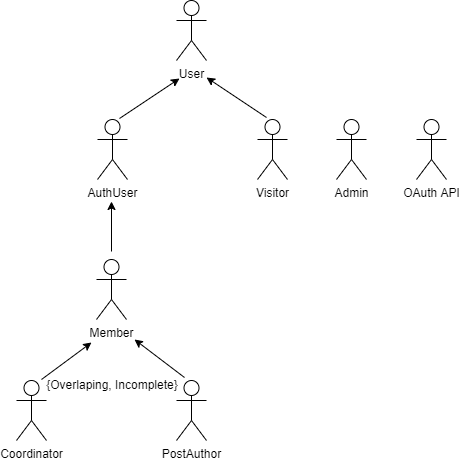

# ER: Requirements Specification Component

> Project vision.

## A1: Project Name

> Goals, business context and environment.  
> Motivation.  
> Main features.  
> User profiles.

The main goal of toEaseManage is to create a web application to help with project development management. This is a tool that can be used by work teams in every project areas, by allowing the creation of a project, assigning teams and task and enabling discussion in the forum.
A project is formed by a project coordinator and a group of project members. The coordinator is responsible for inviting members to his project as well as assigning a new coordinator. Every team member is able to create, assign and complete tasks, as well as, to usufruit of the project discussion forum.

Users are only able to see the projects wich they are allocated to. On the other hand, the team of administrators can browse and view details of every project, however they can not create or participate in them.

toEaseManage will provide easy navigation and a great user experience to boost your projects results. 
  

---

## A2: Actors and User stories

> Brief presentation of the artefact goals.

### 1. Actors

> Diagram identifying actors and their relationships.  

> Image 1: toEaseManage Actors

> Table identifying actors, including a brief description.

| Identifier | Description |
| - | - |
| User | Generic user that has access to public information |
| Visitor | Unauthenticated user that can register itself (sign-up) or sign-in in the system |
| AuthUser | Authenticated user that can manage project invitation, create new projects as well as view them |
| Member | Authenticated user that is assigned to projects. Has access to all the project information, can manage tasks inside the project and is able to discuss in the forum
| Coordinator | Project member responsible for the project with permissions to choose other coordinator and deal with member’s permissions |
| PostAuthor | Project member that has already sent a message to the discussion forum and is now able to delete it or edit it |
| Admin | Authenticated user that is responsible for the management of the platform being able to browse projects and see their information |
| OAuth API | External OAuth API that can be used to register or authenticate into the system |
> Table 1: toEaseManage actors description

### 2. User Stories

> User stories organized by actor.  
> For each actor, a table containing a line for each user story, and for each user story: an identifier, a name, a priority, and a description (following the recommended pattern).

#### 2.0. User

| Identifier | Name | Priority | Description |
| - | - | - | - |
| US0.1 | See Home | high | As a User, I want to access the home page, so that I can see a brief presentation of the website |
| US0.2 | See About | high | As a User, I want to access the about page, so that I can see a complete description of the website as well as its creators |
| US0.3 | Consult Contacts | medium | As a User, I want to access contacts, so that I can come in touch with the platform creators |
| US0.4 | Consult Services | medium | As a User, I want to access the services information, so that I can see the website’s services |
> Table 2: User user stories

#### 2.1. Visitor

| Identifier | Name | Priority | Description |
| - | - | - | - |
| US1.1 | Sign-in | high | As a Visitor, I want to authenticate into the system, so that I can access privileged information |
| US1.2 | Sign-up | high | As a Visitor, I want to register myself into the system, so that I can authenticate myself into the system |
| US1.3 | OAuth API Sign-up | very low | As a Visitor, I want to register a new account linked to my Google account, so that I do not need to create a whole new account to use the platform  |
| US1.4 | OAuth API Sign-in | very low | As a Visitor, I want to sign-in through my Google account, so that I can authenticate myself into the system |
> Table 3: Visitor user stories

#### 2.2. AuthUser

| Identifier | Name | Priority | Description |
| - | - | - | - |
| US2.1 | Create projects | high | As a AuthUser, I want to create my own projects, so that the users can work on the project |
| US2.2 | View projects | high | As a AuthUser, I want to view the projects that are allocated to me, so that I can work on them |
| US2.3 | Project Invitation | high | As a AuthUser, I want to view the projects that are allocated to me, so that I can work on them |
| US2.4 | Project Invitation | high | As a AuthUser, I want to manage my project invitations, so that I can accept or refuse the invites |
| US2.5 | Mark project as favorite | high | As a AuthUser, I want to mark the projects as favorite, so that I can easily find the projects that interests me the most |
| US2.6 | Logout | high | As a AuthUser, I want to log out of my account, so that I can leave the website safely  |
| US2.7 | Delete account | high | As a AuthUser, I want to be able to delete my account, so that I can remove my information from the website |
| US2.8 | View profile | high | As a AuthUser, I want to view my profile information, so that I can check it  |
| US2.9 | Edit profile | high | As a AuthUser, I want to edit my profile information, so that I can update it |
| US2.10 | Upload Profile Pictures | high | As a AuthUser, I want to upload a profile picture for me account, so that users can identify me |
| US2.11 | View notifications | high | As a AuthUser, I want to be able to see the notifications, so that informs me of some changes |
| US2.12 | Appeal for unblock | high | As a AuthUser, I want to be able to ask for the Administrators to unblock my account, so that I can continue with my work  |
| US2.13 | Order Project | low | As a AuthUser, I want to be able to go through my project in an order of my choice (alphabetical, cronological), so that I can find it easily |
> Table 4: AuthUser user stories

#### 2.3. Member

| Identifier | Name | Priority | Description |
| - | - | - | - |
| US3.1 | Create Tasks | high | As a Member, I want to create tasks, so that I can add to dos to the project  |
| US3.2 | Manage Tasks | high | As a Member, I want to manage tasks details, so that I can change task information such as due date |
| US3.3 | Assign Tasks (User) ?????  | high | As a Member, I want to assign tasks to members of the project, so that everyone knows what to do |
| US3.4 | View Tasks | high | As a Member, I want to view all the tasks, so that I can see what everyone needed to do |
| US3.5 | Comment Tasks | high | As a Member, I want to comment on tasks, so that I can complete it with additional information |
| US3.6 | Complete Tasks | high | As a Member, I want to be able to check the tasks I have done, so that everyone knows it is completed  |
| US3.7 | Search Tasks | high | As a Member, I want to be able to search tasks by keywords, so that I can easily find what I want|
| US3.8 | Browse the Project Forum | high | As a Member, I want to be able to navigate in the project forum so that I can be part of current discussions |
| US3.9 | Post messages to Project Forum | high | As a Member, I want to be able to publish messages, so that I can participate in any forum discussion |
| US3.10 | Leave Project | high | As a Member, I want to be able to leave a project , so that I stop being part of the that project team |
| US3.11 | View Project Details | high | As a Member, I want to be able to check project information, so that I can know the members of the project along with other relevant information  |
| US3.12 | View Team Profiles | high | As a Member, I want to be able to see other team members profiles , so that I can have more information about them|
> Table 5: Member user stories

#### 2.4. Coordinator

| Identifier | Name | Priority | Description |
| - | - | - | - |
| US4.1 | Invite Users | high | As a Coordinator, I want to invite other persons to my project by email , so that I can have more members in my project|
| US4.2 | Assign Coordinator | high | As a Coordinator, I want to be able to assign new coordinators to the project, so that I can have other Users helping me in the project management |
| US4.3 | Edit Project Details | high | As a Coordinator, I want to edit current project information, so that I can update information referent to the project|
| US4.4 | Assign Tasks (Members) ?????  | high | As a Coordinator, I want to assign tasks to members of the project, so that everyone knows what to do | 
| US4.5 | Remove Member | high | As a Coordinator, I want to be able to remove some member from the project , so that I can decide wich persons are working in the project |
| US4.6 | Archive Project | high | As a Coordinator, I want store all data relative to the project, so that I can safely record finished projects|
| US4.7 | Manage Members Permissions | low | As a Coordinator, I want manage project Members permissions, so that I can control what members can manage|
> Table 6: Coordinator user stories

#### 2.5. PostAuthor

| Identifier | Name | Priority | Description |
| - | - | - | - |
| US5.1 | Edit Post | high | As a PostAuthor, I want to edit the post that I had made , so that I can rectify what I had wrote before|
| US5.2 | Delete Post | high | As a PostAuthor, I want to delete post that I had made , so that I can erase some mistaken post |
> Table 7: PostAuthor user stories

#### 2.6. Admin

| Identifier | Name | Priority | Description |
| - | - | - | - |
| US6.1 | Login Admin Account | high | As an Admin, I want to be able to login in to my account, so that I can have an administrator profile|
| US6.2 | Administer User | high | As an Admin, I want to search through the existing users, so that I can view, edit and create them|
| US6.3 | Block User | high | As an Admin, I want to be able to block some User account, so that I can prevent them from using the website wrongly|
| US6.4 | Unblock User | high | As an Admin, I want to unblock Users, so that I can give their permissions back|
| US6.5 | Delete User | high | As a Admin, I want erase User accounts, so that I can remove there working history from the website|
| US6.6 | Browse Projects | high | As an Admin, I want to be able to browse through projects, so that I can iterate through the existing projects |
| US6.7 | View Project | high | As an Admin, I want view project details, so that I can validate the curret usage of the given features|
> Table 8: Admin user stories

#### 2.7. OAuth API
| Identifier | Name | Priority | Description |
| - | - | - | - |
| US7.1 | Get Information | high | As a OAuth API, I want to get information related to User, so that all the information is updated |
> Table 9: OAuth API user stories

### 3. Supplementary Requirements

> Section including business rules, technical requirements, and restrictions.  
> For each subsection, a table containing identifiers, names, and descriptions for each requirement.

#### 3.1. Business rules

#### 3.2. Technical requirements

#### 3.3. Restrictions

---

## A3: Information Architecture

> Brief presentation of the artefact goals.

### 1. Sitemap

> Sitemap presenting the overall structure of the web application.  
> Each page must be identified in the sitemap.  
> Multiple instances of the same page (e.g. student profile in SIGARRA) are presented as page stacks.

### 2. Wireframes

> Wireframes for, at least, two main pages of the web application.
> Do not include trivial use cases.

#### UIxx: Page Name

#### UIxx: Page Name

---

## Revision history

Changes made to the first submission:
1. Item 1
1. ...

***
GROUP21gg, DD/MM/2021

* Group member 1 name, email (Editor)
* Group member 2 name, email
* ...
