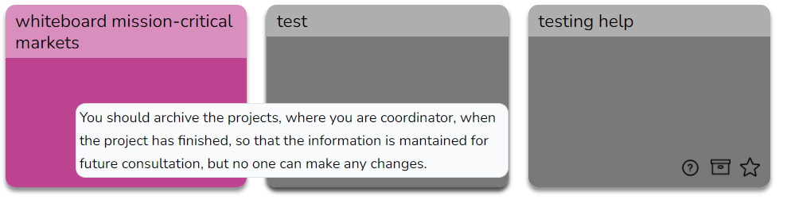
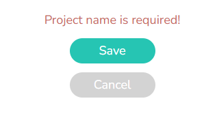
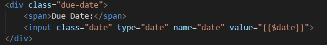
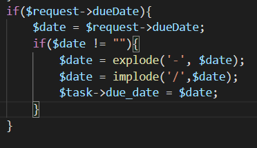
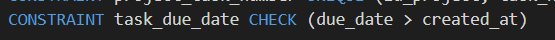
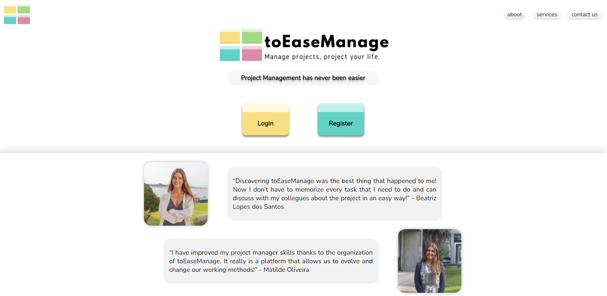
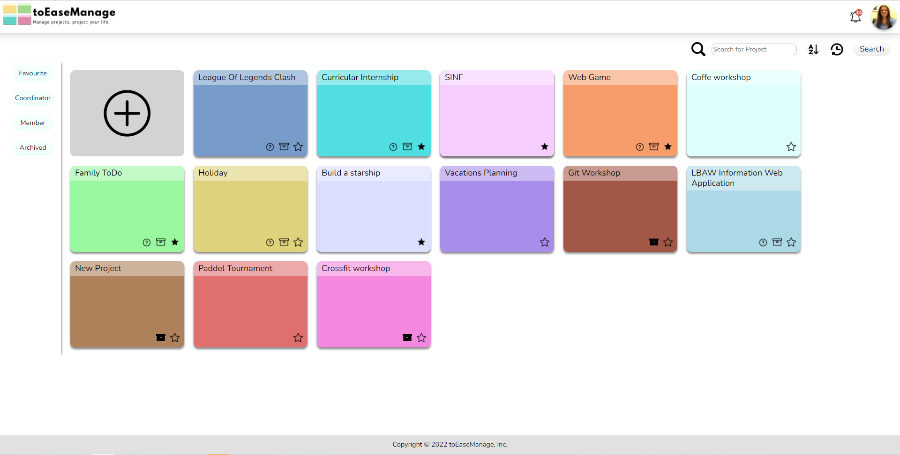

# PA: Product and Presentation

With the development of toEaseManage we intend to create a useful and acessible platform that helps users to organize projects as well as grow as web developers throughout the curricular unit. The website is for everyone, it can be used personally, for business, school, or even among friends.

## A9: Product

This artefact has the final version of product developed. All features implemented are identified below as well as the main usage, administration credentials and application help. 

### 1. Installation

Source code final release can be seen [here](https://git.fe.up.pt/lbaw/lbaw2122/lbaw2102/-/tree/master/src)

In order to test our docker image locally the following comand must be executed: 
```
docker run -it -p 8000:80 --name=lbaw2102 -e DB_DATABASE="lbaw2102" -e DB_SCHEMA="lbaw2102" -e DB_USERNAME="lbaw2102" -e DB_PASSWORD="LqprwisN" git.fe.up.pt:5050/lbaw/lbaw2122/lbaw2102
```

### 2. Usage

URL to the product: http://lbaw2102.lbaw.fe.up.pt  

#### 2.1. Administration Credentials

Administration URL: http://lbaw2102.lbaw.fe.up.pt

| Email | Password |
| ----- | -------- |
| admin@admin.com | 123456 |

#### 2.2. User Credentials

| Type          | Email  | Password |
| ------------- | --------- | -------- |
| Coordinator/Member | sbennallck2@is.gd | 123456 |
| Member | mferries0@yellowpages.com | 123456 |

### 3. Application Help

Contextual help was implemented in our project with the addition of small question marks that can be hovered to give extra information about a certain button action. 


Aditionaly error messages are presented to the user if some invalid action is made.


### 4. Input Validation

In our project we use both client-side and server-side validation for example while receiving date inputs from the user:

In our blade.php we have created a date type input:



In the controller we are verifing the existance of a data attribute: 



In our database we check if the given date is valid in that context: 



### 5. Check Accessibility and Usability

The usability and accessibility tests were done following the checklists provided below. Plase check the two links in case of doubts. 

Accessibility: [link to the checklist](./Docs/acessibilidade-sapo.pdf)

Usability: [link to the checklist](./Docs/usabilidade-sapo.pdf)

### 6. HTML & CSS Validation
   
HTML: [link](./Docs/toEaseManageHTML.pdf) to the html validation pdf that concatenates the validation to the pages of the web application with https://validator.w3.org/nu/ 

CSS: [link](./Docs/toEaseManageCss.pdf) to the css validation

### 7. Revisions to the Project

The final product abled us to finally be aware of some user stories that we did not explicitate in the first documents.
In ER we added user stories related to labels and other concerning the reset password feature. 
In EAP the yaml document was review and edited to be in agreement with the requests and routes that we effectivelly implemented having corrected some requests, deleted others that were not implemented as we expected. 

### 8. Implementation Details

#### 8.1. Libraries Used

In our project we use [Bootstrap](https://getbootstrap.com/), to implement our popups. The usage of this library can be seen when the pop up is [created](https://git.fe.up.pt/lbaw/lbaw2122/lbaw2102/-/blob/master/src/resources/views/partials/popup_delete.blade.php), [declared](https://git.fe.up.pt/lbaw/lbaw2122/lbaw2102/-/blob/master/src/resources/views/pages/user.blade.php#L9) and [toggled](https://git.fe.up.pt/lbaw/lbaw2122/lbaw2102/-/blob/master/src/resources/views/pages/user.blade.php#L22-23).

#### 8.2 User Stories

| US Identifier | Name    | Module | Priority                       | Team Members               | State  |
| - | - | - | - | - | - |
| US1.1 | Sign-in | M01: Authentication and Individual Profile | high | __Beatriz Santos__ | 100% |
| US1.2 | Sign-up | M01: Authentication and Individual Profile | high | __Beatriz Santos__ | 100% |
| US2.2 | View projects | M02: Project | high | __André Pereira__, Beatriz Santos, Matilde Oliveira | 100% |
| US2.4 | Logout | M01: Authentication and Individual Profile | high | __Beatriz Santos__ | 100% |
| US2.6 | View profile | M01: Authentication and Individual Profile | high | __Beatriz Santos__ | 100% |
| US6.7 | View Project | M02: Project | high | __Matilde Oliveira__ | 100% |
| US3.9 | View Project Details | M02: Project | high | __André Pereira__ | 100% |
| US3.4 | View Tasks | M03: Tasks and Comments | high | __Matilde Oliveira__ | 100% |
| US3.13 | View Project Timeline | M02: Project | medium | __Matilde Oliveira__ | 100% |
| US2.7 | Edit profile | M01: Authentication and Individual Profile | high | __Beatriz Santos__ | 100% |
| US2.3 | Mark project as favorite | M02: Project | high | __André Pereira__ | 100% |
| US2.1 | Create projects | M02: Project | high | __André Pereira__,Matilde Oliveira | 100% |
| US3.1 | Create Tasks | M03: Tasks and Comments | high | __Matilde Oliveira__ | 100% |
| US3.2 | Manage Tasks | M03: Tasks and Comments | high | __Matilde Oliveira__ | 100% |
| US3.7 | Search Tasks | M03: Tasks and Comments | high | __André Pereira__ | 100% |
| US3.10 | View Team Profiles | M02: Project | high | __André Pereira__, Matilde Oliveira | 100% |
| US4.2 | Edit Project Details | M02: Project | high | __André Pereira__, Beatriz Santos, Matilde Oliveira | 100% |
| US2.14 | Order Projects | M02: Project | low | __André Pereira__ | 100% |
| US3.6 | Complete Tasks | M03: Tasks and Comments | high | __Matilde Oliveira__ | 100% |
| US2.5 | Delete account | M01: Authentication and Individual Profile | high | __Beatriz Santos__, André Pereira | 100% |
| US3.8 | Leave Project | M02: Project | high | __André Pereira__ | 100% |
| US4.1 | Assign Coordinator | M02: Project | high | __André Pereira__ | 100% |
| US6.1 | Login Admin Account | M06: User Administration | high | __André Pereira__ | 100% |
| US6.2 | Administer User | M06: User Administration | high | __André Pereira__ | 100% |
| US6.6 | Browse Projects | M06: User Administration | high | __André Pereira__ | 100% |
| US6.5 | Delete User | M06: User Administration | high | __André Pereira__ | 100% |
| US0.1 | See Home | M07: Static Pages | high | __Beatriz Santos__ | 100% |
| US0.2 | See About| M07: Static Pages | high | __Ricardo Ferreira__ | 100% |
| US0.3 | Contact Team | M07: Static Pages | medium | __Ricardo Ferreira__ | 100% |
| US0.4 | Consult Services | M07: Static Pages | medium | __Ricardo Ferreira__ | 100% |
| US4.5 | Invite Users | M05: Invites and Notifications | low | __André Pereira__ | 100% |
| US2.9 | View notifications | M05: Invites and Notifications | high | __Beatriz Santos__ | 100% |
| US2.11 | Receive Notifications | M05: Invites and Notifications | high | __Beatriz Santos__ | 100% |
| US4.3 | Remove Member | M02: Project | high | __André Pereira__ | 100% |
| US3.3 | Assign Tasks | M03: Tasks and Comments | high | __André Pereira__ | 100% |
| US3.11 | Browse the Project Forum | M04: Project Forum and Labels | medium | __Matilde Oliveira__ | 100% |
| US3.12 | Post messages to Project Forum | M04: Project Forum and Labels | medium | __Matilde Oliveira__ | 100% |
| US3.5 | Comment Tasks | M03: Tasks and Comments | high | __Matilde Oliveira__ | 100% |
| US4.4 | Archive Project | M02: Project | high | __André Pereira__, Matilde Oliveira | 100% |
| US4.7 | Create Label | M04: Project Forum and Labels | low | __Matilde Oliveira__, Beatriz Santos | 100% |
| US4.8 | Delete Label | M04: Project Forum and Labels | low | __Beatriz Santos__,Matilde Oliveira | 100% |
| US3.14 | Assign Label to Task | M04: Project Forum and Labels | low | __Matilde Oliveira__, Beatriz Santos | 100% |
| US3.15 | Delete Label from Task | M04: Project Forum and Labels | low | __Beatriz Santos__,Matilde Oliveira | 100% |
| US6.3 | Block User | M06: User Administration | high | __André Pereira__ | 100% |
| US6.4 | Unblock User | M06: User Administration | high | __André Pereira__ | 100% |
| US2.8 | Upload Profile Pictures | M01: Authentication and Individual Profile | high | __André Pereira__, Beatriz Santos | 100% |
| US2.12 | Accept project invitations | M05: Invites and Notifications | high | __Ricardo Ferreira__ | 100% |
| US2.13 | Project Invitation | M05: Invites and Notifications | low | __Ricardo Ferreira__ | 100% |
| US1.5 | Reset Password | M01: Authentication and Individual Profile | low | __André Pereira__ | 100% |
| US4.6 | Manage Members Permissions | M02: Project | low || 0% |
| US2.10 | Appeal for unblock | M06: User Administration | high || 0% |
| US5.1 | Edit Post | M04: Project Forum and Labels | low || 0% |
| US5.2 | Delete Post | M04: Project Forum and Labels | low || 0% |
| US1.3 | OAuth API Sign-up | M01: Authentication and Individual Profile | very low | | 0% |
| US1.4 | OAuth API Sign-in | M01: Authentication and Individual Profile | very low | | 0% |

## A10: Presentation
 
In this artefact we will leave some information about the presentation of the product as well as a small video demonstrating the main features.

### 1. Product presentation

toEaseManage is a web application that helps project management. The website is for everyone, it can be used personally, for business, school, or even among friends. This is a tool that can be used by teams in every project areas, by allowing the creation of a project, assigning teams and tasks and enabling discussion in a forum inside a project. A project is formed by a project coordinator and a group of project members. The coordinator is responsible for inviting members to his project as well as assigning a new coordinators. Every team member is able to create, assign and complete tasks, as well as, to usufruit of the project discussion forum.

This plataform will allow multiple project work, since you can work simultaneously in different projects and be either member ou project coordinator in different ones. Each project will have a variety of tasks with its main goal, description, due-to date, comments and members assigned to it, that can check the task when done. Futhermore, each project will also have a specific discussion forum to discuss project ideas. 

URL to the product: http://lbaw2102.lbaw.fe.up.pt  


### 2. Video presentation

toEaseManage Home Page
 

toEaseManage Project Page


Video Link: [here](https://drive.google.com/file/d/1viz5Zm4sYsBQ5r1ImrFswNIL61Xn3inm/view?usp=sharing).

---
***

GROUP2102, 28/02/2022

* André Pereira, up201905650@up.pt
* Beatriz Lopes dos Santos, up201906888@up.pt
* Matilde Oliveira, up201906954@up.pt (editor)
* Ricardo Ferreira, up201907835@up.pt
